# NFL Simulation Game: Comprehensive Feature Expansion Master Plan

## Executive Summary

This master plan presents a complete transformation of the existing `simulation_orchestrator.py` into a deeply immersive NFL simulation game experience. The expansion focuses on seven core pillars:

1. **Advanced Roster Management** - Player development, scouting, and franchise building
2. **Realistic Play-by-Play** - Advanced decision making and situational awareness
3. **Live Environmental Effects** - Dynamic weather, venue impacts, and crowd influence
4. **Statistical Realism** - Advanced analytics and historical context
5. **Franchise Longevity** - Multi-season progression and legacy systems
6. **Social Interaction** - Media narratives, fan engagement, and social dynamics
7. **Immersive Presentation** - Broadcast-quality visuals and storytelling

## Complete System Architecture

```mermaid
classDiagram
    class SimulationOrchestrator {
        +AdvancedPlayResolver play_resolver
        +EnhancedPlayCaller play_caller
        +DynamicMatchContext match_context
        +SeasonalNarrativeEngine narrative_engine
        +FranchiseProgressionSystem progression_system
        +SocialInteractionHub social_hub
        +BroadcastPresentationLayer presentation_layer
    }

    class AdvancedPlayResolver {
        +resolve_advanced_play(play_context)
        +apply_environmental_effects()
        +calculate_statistical_realism()
    }

    class EnhancedPlayCaller {
        +call_play_with_ai_personality()
        +adaptive_game_planning()
        +opponent_scouting_analysis()
    }

    class DynamicMatchContext {
        +real_time_roster_management()
        +player_development_tracking()
        +environmental_effects_engine()
    }

    class SeasonalNarrativeEngine {
        +generate_season_story_arcs()
        +create_emotional_narratives()
        +manage_legacy_storytelling()
    }

    class FranchiseProgressionSystem {
        +multi_season_development()
        +contract_management_system()
        +legacy_tracking_system()
    }

    class SocialInteractionHub {
        +media_narrative_system()
        +fan_engagement_system()
        +community_features()
    }

    class BroadcastPresentationLayer {
        +broadcast_quality_visualization()
        +interactive_storytelling()
        +adaptive_ui_framework()
    }

    SimulationOrchestrator --> AdvancedPlayResolver : resolves plays
    SimulationOrchestrator --> EnhancedPlayCaller : calls plays
    SimulationOrchestrator --> DynamicMatchContext : manages game state
    SimulationOrchestrator --> SeasonalNarrativeEngine : creates narratives
    SimulationOrchestrator --> FranchiseProgressionSystem : handles progression
    SimulationOrchestrator --> SocialInteractionHub : manages social features
    SimulationOrchestrator --> BroadcastPresentationLayer : presents experience
```



## Integrated Feature Implementation Plan

### Phase 1: Core Gameplay Transformation (8-10 weeks)

#### 1.1 Advanced Play Resolution System

```python
class AdvancedPlayResolver:
    def __init__(self):
        self.play_types = {
            'Standard': ['Run', 'PassShort', 'PassMid', 'PassDeep'],
            'Advanced': ['RPO', 'PlayAction', 'Screen', 'TrickPlay'],
            'Situational': ['HailMary', 'VictoryFormation', 'Qneel']
        }
        self.environmental_engine = AdvancedWeatherSystem()
        self.statistical_engine = AdvancedAnalyticsSystem()

    def resolve_play(self, play_context: PlayContext):
        # Apply environmental effects
        environmental_modifiers = self.environmental_engine.apply_effects(play_context)

        # Calculate base play resolution
        base_result = self._resolve_base_play(play_context, environmental_modifiers)

        # Apply statistical realism
        statistical_adjustments = self.statistical_engine.apply_realism(base_result)

        # Finalize play result
        final_result = self._finalize_play_result(base_result, statistical_adjustments)

        return final_result
```

#### 1.2 Enhanced AI Play Calling

```python
class EnhancedPlayCaller:
    def __init__(self):
        self.coach_personalities = {
            'BillBelichick': {'aggression': 0.6, 'adaptability': 0.9, 'creativity': 0.7},
            'AndyReid': {'aggression': 0.8, 'adaptability': 0.7, 'creativity': 0.9},
            'SeanMcVay': {'aggression': 0.7, 'adaptability': 0.8, 'creativity': 0.9}
        }
        self.opponent_scouting = OpponentScoutingSystem()
        self.adaptive_strategy = AdaptiveStrategyEngine()

    def call_play(self, game_situation: GameSituation):
        # Analyze opponent tendencies
        opponent_analysis = self.opponent_scouting.analyze_opponent(game_situation.opponent_id)

        # Apply coach personality
        coach_adjustments = self._apply_coach_personality(game_situation.coach_id)

        # Generate adaptive strategy
        adaptive_play = self.adaptive_strategy.generate_play(
            game_situation,
            opponent_analysis,
            coach_adjustments
        )

        return adaptive_play
```

### Phase 2: Franchise Depth Expansion (10-12 weeks)

#### 2.1 Complete Player Development System

```python
class CompletePlayerDevelopmentSystem:
    def __init__(self):
        self.development_paths = {
            'QB': ['Accuracy', 'ArmStrength', 'DecisionMaking', 'Mobility'],
            'WR': ['RouteRunning', 'Speed', 'Hands', 'Release'],
            'RB': ['Vision', 'Power', 'Agility', 'PassBlocking'],
            'OL': ['PassBlocking', 'RunBlocking', 'Strength', 'Footwork'],
            'DL': ['PassRush', 'RunDefense', 'Strength', 'Quickness'],
            'LB': ['Tackling', 'Coverage', 'Instincts', 'Speed'],
            'DB': ['ManCoverage', 'ZoneCoverage', 'BallSkills', 'Tackling']
        }
        self.training_regimens = {
            'Offseason': {'intensity': 0.9, 'xp_multiplier': 1.5},
            'InSeason': {'intensity': 0.6, 'xp_multiplier': 0.8},
            'Playoffs': {'intensity': 0.7, 'xp_multiplier': 1.0}
        }

    def develop_player(self, player_id: int, focus_area: str, regimen_type: str):
        # Get player development path
        dev_path = self.development_paths[player.position]

        # Apply training regimen
        training_results = self._apply_training_regimen(player_id, focus_area, regimen_type)

        # Update player attributes
        updated_attributes = self._update_player_attributes(player_id, training_results)

        # Track progression
        progression_report = self._track_progression(player_id, updated_attributes)

        return progression_report
```

#### 2.2 Comprehensive Scouting & Draft System

```python
class ComprehensiveScoutingSystem:
    def __init__(self):
        self.college_database = CollegePlayerDatabase()
        self.scouting_accuracy_models = {
            'EliteScout': {'accuracy': 0.9, 'cost': 'high'},
            'VeteranScout': {'accuracy': 0.75, 'cost': 'medium'},
            'RookieScout': {'accuracy': 0.6, 'cost': 'low'}
        }
        self.draft_strategies = {
            'BestPlayerAvailable': {'focus': 'overall_talent', 'risk_tolerance': 'high'},
            'PositionalNeed': {'focus': 'team_needs', 'risk_tolerance': 'medium'},
            'BoomOrBust': {'focus': 'high_ceiling', 'risk_tolerance': 'very_high'}
        }

    def scout_prospect(self, prospect_id: int, scout_level: str, focus_areas: list):
        # Get prospect data
        prospect_data = self.college_database.get_prospect(prospect_id)

        # Apply scouting accuracy
        scouting_report = self._apply_scouting_accuracy(prospect_data, scout_level, focus_areas)

        # Generate comparables
        comparables = self._find_nfl_comparables(scouting_report)

        # Calculate draft value
        draft_value = self._calculate_draft_value(scouting_report)

        return {
            'scouting_report': scouting_report,
            'comparables': comparables,
            'draft_value': draft_value,
            'risk_assessment': self._assess_risk(scouting_report)
        }
```

### Phase 3: Immersive Experience Layer (8-10 weeks)

#### 3.1 Broadcast-Quality Presentation System

```python
class BroadcastPresentationSystem:
    def __init__(self):
        self.camera_systems = {
            'Standard': {'position': (0, 15, 30), 'fov': 45, 'movement': 'smooth'},
            'Skycam': {'position': (0, 50, 0), 'fov': 60, 'movement': 'dynamic'},
            'Sideline': {'position': (-20, 5, 10), 'fov': 35, 'movement': 'cinematic'},
            'Endzone': {'position': (0, 5, -30), 'fov': 50, 'movement': 'tracking'}
        }
        self.commentary_styles = {
            'Classic': {'tone': 'traditional', 'depth': 'statistical'},
            'Modern': {'tone': 'analytical', 'depth': 'strategic'},
            'Storytelling': {'tone': 'narrative', 'depth': 'emotional'}
        }

    def generate_broadcast(self, play_data: PlayData, context: BroadcastContext):
        # Select camera angles
        camera_sequence = self._select_camera_sequence(play_data.play_type)

        # Generate commentary
        commentary = self._generate_commentary(play_data, context, self.commentary_styles[context.style])

        # Create visual elements
        visual_elements = self._create_visual_elements(play_data, context)

        return {
            'camera_sequence': camera_sequence,
            'commentary': commentary,
            'visual_elements': visual_elements,
            'broadcast_metadata': self._generate_metadata(play_data)
        }
```

#### 3.2 Interactive Storytelling Engine

```python
class InteractiveStorytellingEngine:
    def __init__(self):
        self.story_arcs = {
            'UnderdogJourney': {'structure': 'struggle_to_success', 'emotional_beats': ['doubt', 'growth', 'triumph']},
            'DynastyDefense': {'structure': 'dominance_under_threat', 'emotional_beats': ['confidence', 'challenge', 'resilience']},
            'RebuildingProject': {'structure': 'foundation_to_contender', 'emotional_beats': ['hope', 'setbacks', 'breakthrough']}
        }
        self.user_preference_models = UserPreferenceTracker()

    def generate_story_content(self, game_state: GameState, user_id: int):
        # Get user preferences
        preferences = self.user_preference_models.get_preferences(user_id)

        # Select appropriate story arc
        story_arc = self._select_story_arc(game_state, preferences)

        # Generate narrative content
        narrative_content = self._generate_narrative_content(game_state, story_arc)

        # Create interactive elements
        interactive_elements = self._create_interactive_elements(game_state, preferences)

        return {
            'story_arc': story_arc,
            'narrative_content': narrative_content,
            'interactive_elements': interactive_elements,
            'personalization_metrics': self._calculate_personalization_metrics(preferences)
        }
```

## Complete Implementation Roadmap


## Technical Integration Strategy

### Modular Integration Approach

```python
class SimulationOrchestratorIntegration:
    def __init__(self):
        self.feature_modules = {
            'CoreGameplay': CoreGameplayModule(),
            'FranchiseManagement': FranchiseManagementModule(),
            'ImmersiveExperience': ImmersiveExperienceModule(),
            'SocialFeatures': SocialFeaturesModule()
        }
        self.integration_sequence = [
            'CoreGameplay',
            'FranchiseManagement',
            'ImmersiveExperience',
            'SocialFeatures'
        ]

    def integrate_features(self, current_system: SimulationOrchestrator):
        # Validate current system compatibility
        compatibility_report = self._check_compatibility(current_system)

        # Integrate modules in sequence
        for module_name in self.integration_sequence:
            module = self.feature_modules[module_name]
            integration_result = self._integrate_module(current_system, module)

            # Validate integration
            validation_result = self._validate_integration(integration_result)

            if not validation_result['success']:
                return {'status': 'failed', 'module': module_name, 'errors': validation_result['errors']}

        # Perform system-wide testing
        test_results = self._perform_system_testing(current_system)

        return {
            'status': 'success',
            'integration_report': self._generate_integration_report(),
            'test_results': test_results,
            'performance_metrics': self._calculate_performance_metrics(current_system)
        }
```

### Performance Optimization Framework

```python
class PerformanceOptimizationFramework:
    def __init__(self):
        self.optimization_targets = {
            'PlayResolution': {'target_time': 50, 'unit': 'ms'},
            'GameStateUpdate': {'target_time': 20, 'unit': 'ms'},
            'NarrativeGeneration': {'target_time': 100, 'unit': 'ms'},
            'BroadcastRendering': {'target_time': 30, 'unit': 'fps'}
        }
        self.optimization_techniques = {
            'Caching': {'strategy': 'LRU_cache', 'scope': 'frequent_calculations'},
            'BatchProcessing': {'strategy': 'async_batching', 'scope': 'statistical_analysis'},
            'LazyLoading': {'strategy': 'on_demand_loading', 'scope': 'historical_data'}
        }

    def optimize_system_performance(self, system: SimulationOrchestrator):
        # Analyze current performance
        performance_analysis = self._analyze_current_performance(system)

        # Identify optimization opportunities
        optimization_opportunities = self._identify_opportunities(performance_analysis)

        # Apply optimization techniques
        optimization_results = self._apply_optimizations(system, optimization_opportunities)

        # Validate performance improvements
        validation_results = self._validate_improvements(system)

        return {
            'performance_analysis': performance_analysis,
            'optimization_results': optimization_results,
            'validation_results': validation_results,
            'recommended_settings': self._generate_recommended_settings(validation_results)
        }
```

## Complete Success Metrics Framework

### Technical Success Metrics

```python
class TechnicalSuccessMetrics:
    def __init__(self):
        self.performance_targets = {
            'SystemStability': {'target': 99.9, 'unit': 'percent_uptime'},
            'ResponseTime': {'target': 100, 'unit': 'ms_max'},
            'ConcurrentUsers': {'target': 10000, 'unit': 'users'},
            'DataAccuracy': {'target': 95, 'unit': 'percent_realism'}
        }
        self.quality_targets = {
            'CodeCoverage': {'target': 85, 'unit': 'percent'},
            'DefectRate': {'target': 0.1, 'unit': 'defects_per_feature'},
            'IntegrationSuccess': {'target': 98, 'unit': 'percent'}
        }

    def measure_technical_success(self, system: SimulationOrchestrator):
        # Measure performance metrics
        performance_metrics = self._measure_performance_metrics(system)

        # Measure quality metrics
        quality_metrics = self._measure_quality_metrics(system)

        # Calculate overall technical score
        technical_score = self._calculate_technical_score(performance_metrics, quality_metrics)

        return {
            'performance_metrics': performance_metrics,
            'quality_metrics': quality_metrics,
            'technical_score': technical_score,
            'improvement_recommendations': self._generate_improvement_recommendations(technical_score)
        }
```

### User Engagement Success Metrics

```python
class UserEngagementSuccessMetrics:
    def __init__(self):
        self.engagement_targets = {
            'SessionFrequency': {'target': 5, 'unit': 'sessions_per_week'},
            'SessionDuration': {'target': 45, 'unit': 'minutes_per_session'},
            'FeatureDepth': {'target': 75, 'unit': 'percent_users_using_advanced_features'},
            'RetentionRate': {'target': 70, 'unit': 'percent_30_day_retention'}
        }
        self.satisfaction_targets = {
            'OverallSatisfaction': {'target': 4.5, 'unit': 'out_of_5'},
            'RealismRating': {'target': 4.3, 'unit': 'out_of_5'},
            'FeatureSatisfaction': {'target': 4.2, 'unit': 'out_of_5'}
        }

    def measure_engagement_success(self, user_data: UserEngagementData):
        # Measure engagement metrics
        engagement_metrics = self._measure_engagement_metrics(user_data)

        # Measure satisfaction metrics
        satisfaction_metrics = self._measure_satisfaction_metrics(user_data)

        # Calculate overall engagement score
        engagement_score = self._calculate_engagement_score(engagement_metrics, satisfaction_metrics)

        return {
            'engagement_metrics': engagement_metrics,
            'satisfaction_metrics': satisfaction_metrics,
            'engagement_score': engagement_score,
            'user_segmentation': self._perform_user_segmentation(engagement_score)
        }
```

## Complete Risk Management Framework

### Technical Risk Management

```python
class TechnicalRiskManagement:
    def __init__(self):
        self.technical_risks = {
            'PerformanceBottlenecks': {'likelihood': 0.6, 'impact': 0.7, 'mitigation': 'incremental_rollout'},
            'DataIntegrationIssues': {'likelihood': 0.5, 'impact': 0.8, 'mitigation': 'mock_data_fallback'},
            'ComplexityManagement': {'likelihood': 0.4, 'impact': 0.6, 'mitigation': 'modular_architecture'}
        }
        self.mitigation_strategies = {
            'IncrementalRollout': {'approach': 'phased_feature_introduction', 'testing': 'load_testing'},
            'FallbackSystems': {'approach': 'graceful_degradation', 'testing': 'failure_scenario_testing'},
            'MonitoringSystems': {'approach': 'real_time_performance_monitoring', 'testing': 'stress_testing'}
        }

    def manage_technical_risks(self, project_plan: ProjectPlan):
        # Identify project-specific risks
        project_risks = self._identify_project_risks(project_plan)

        # Develop mitigation plans
        mitigation_plans = self._develop_mitigation_plans(project_risks)

        # Implement monitoring systems
        monitoring_systems = self._implement_monitoring_systems(project_plan)

        return {
            'project_risks': project_risks,
            'mitigation_plans': mitigation_plans,
            'monitoring_systems': monitoring_systems,
            'risk_register': self._generate_risk_register(project_risks, mitigation_plans)
        }
```

### User Experience Risk Management

```python
class UXRiskManagement:
    def __init__(self):
        self.ux_risks = {
            'FeatureOverload': {'likelihood': 0.7, 'impact': 0.6, 'mitigation': 'progressive_complexity'},
            'RealismVsFunBalance': {'likelihood': 0.5, 'impact': 0.8, 'mitigation': 'user_testing_segments'},
            'NarrativeFatigue': {'likelihood': 0.4, 'impact': 0.5, 'mitigation': 'multiple_storytelling_styles'}
        }
        self.ux_validation_approaches = {
            'UserTesting': {'method': 'segmented_user_groups', 'frequency': 'biweekly'},
            'A/BTesting': {'method': 'feature_variants', 'frequency': 'continuous'},
            'AnalyticsMonitoring': {'method': 'behavioral_analysis', 'frequency': 'real_time'}
        }

    def manage_ux_risks(self, feature_design: FeatureDesign):
        # Identify UX risks in design
        design_risks = self._identify_design_risks(feature_design)

        # Develop UX validation plan
        validation_plan = self._develop_validation_plan(design_risks)

        # Implement user feedback systems
        feedback_systems = self._implement_feedback_systems(feature_design)

        return {
            'design_risks': design_risks,
            'validation_plan': validation_plan,
            'feedback_systems': feedback_systems,
            'ux_improvement_plan': self._generate_ux_improvement_plan(design_risks, validation_plan)
        }
```

## Final Implementation Recommendations

### Phased Rollout Strategy

```python
class PhasedRolloutStrategy:
    def __init__(self):
        self.rollout_phases = {
            'Alpha': {'users': 'internal_team', 'features': 'core_gameplay', 'duration': '4_weeks'},
            'Beta': {'users': 'selected_community', 'features': 'core+franchise', 'duration': '6_weeks'},
            'PublicPreview': {'users': 'early_adopters', 'features': 'complete_system', 'duration': '8_weeks'},
            'FullRelease': {'users': 'general_public', 'features': 'all_features', 'duration': 'ongoing'}
        }
        self.feedback_integration = {
            'Alpha': {'frequency': 'daily', 'channels': ['direct', 'surveys']},
            'Beta': {'frequency': 'weekly', 'channels': ['forums', 'surveys', 'analytics']},
            'PublicPreview': {'frequency': 'biweekly', 'channels': ['analytics', 'social', 'support']}
        }

    def execute_rollout(self, system: SimulationOrchestrator):
        # Prepare rollout plan
        rollout_plan = self._prepare_rollout_plan(system)

        # Execute phased rollout
        rollout_results = {}
        for phase_name, phase_config in self.rollout_phases.items():
            phase_results = self._execute_phase(phase_name, phase_config, system)
            rollout_results[phase_name] = phase_results

            # Collect and integrate feedback
            feedback_results = self._collect_integrate_feedback(phase_name, phase_results)
            rollout_results[f'{phase_name}_feedback'] = feedback_results

        # Final validation
        final_validation = self._perform_final_validation(system, rollout_results)

        return {
            'rollout_plan': rollout_plan,
            'phase_results': rollout_results,
            'final_validation': final_validation,
            'launch_recommendations': self._generate_launch_recommendations(final_validation)
        }
```

### Continuous Improvement Framework

```python
class ContinuousImprovementFramework:
    def __init__(self):
        self.improvement_cycles = {
            'Rapid': {'frequency': 'weekly', 'focus': 'bug_fixes', 'scope': 'minor_adjustments'},
            'Iterative': {'frequency': 'monthly', 'focus': 'feature_enhancements', 'scope': 'moderate_changes'},
            'Major': {'frequency': 'quarterly', 'focus': 'new_features', 'scope': 'significant_additions'}
        }
        self.feedback_sources = {
            'DirectUserFeedback': {'weight': 0.4, 'channels': ['surveys', 'support', 'social']},
            'BehavioralAnalytics': {'weight': 0.3, 'channels': ['usage_data', 'session_metrics']},
            'CommunitySentiment': {'weight': 0.2, 'channels': ['forums', 'social_media']},
            'ExpertReview': {'weight': 0.1, 'channels': ['internal_review', 'industry_analysis']}
        }

    def manage_continuous_improvement(self, live_system: SimulationOrchestrator):
        # Collect comprehensive feedback
        comprehensive_feedback = self._collect_comprehensive_feedback(live_system)

        # Analyze improvement opportunities
        improvement_opportunities = self._analyze_improvement_opportunities(comprehensive_feedback)

        # Prioritize development efforts
        development_priorities = self._prioritize_development_efforts(improvement_opportunities)

        # Execute improvement cycles
        improvement_results = self._execute_improvement_cycles(live_system, development_priorities)

        return {
            'comprehensive_feedback': comprehensive_feedback,
            'improvement_opportunities': improvement_opportunities,
            'development_priorities': development_priorities,
            'improvement_results': improvement_results,
            'system_evolution_plan': self._generate_system_evolution_plan(improvement_results)
        }
```

## Conclusion

This comprehensive feature expansion plan transforms the existing NFL simulation framework into a deeply immersive, authentic, and engaging football experience that combines:

1. **Authentic NFL Realism** - Advanced gameplay mechanics, statistical accuracy, and environmental effects
2. **Deep Franchise Management** - Player development, scouting, contracts, and multi-season progression
3. **Immersive Presentation** - Broadcast-quality visualization, interactive storytelling, and adaptive UI
4. **Social Engagement** - Media narratives, fan interaction, community features, and social recognition
5. **Long-term Investment** - Legacy systems, emotional storytelling, and progressive challenge systems

The phased implementation approach ensures technical feasibility while maintaining the core authenticity that makes NFL simulations compelling. The comprehensive risk management and continuous improvement frameworks provide robust support for long-term system evolution.

By integrating these advanced features with the existing kernel architecture (Genesis, Cortex, Empire), the simulation will deliver both immediate gameplay excitement and sustained long-term engagement, creating a complete professional football ecosystem from scouting to halftime adjustments to post-game analysis and franchise development.
