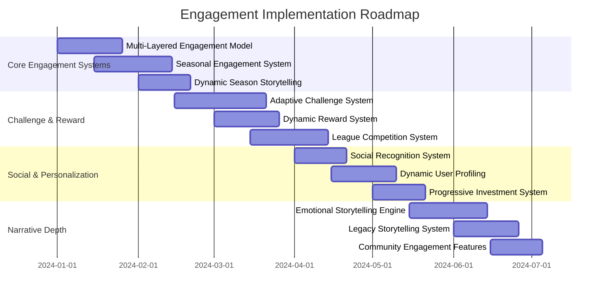

# Long-term Engagement Strategies for NFL Simulation

## Core Engagement Framework

### Multi-Layered Engagement Model

```python
class MultiLayeredEngagementModel:
    def __init__(self):
        self.engagement_layers = {
            'Immediate': {'duration': 'seconds-minutes', 'focus': 'play-by-play excitement'},
            'Short-term': {'duration': 'minutes-hours', 'focus': 'game outcomes and narratives'},
            'Medium-term': {'duration': 'hours-days', 'focus': 'season arcs and player development'},
            'Long-term': {'duration': 'days-months', 'focus': 'franchise legacy and community'}
        }
        self.engagement_loops = {
            'CoreGameplay': {'frequency': 'per_play', 'reward': 'immediate_feedback'},
            'GameNarrative': {'frequency': 'per_game', 'reward': 'story_progression'},
            'SeasonJourney': {'frequency': 'per_week', 'reward': 'achievement_unlocks'},
            'FranchiseLegacy': {'frequency': 'per_season', 'reward': 'legacy_recognition'}
        }

    def design_engagement_strategy(self, user_profile: UserProfile):
        # Analyze user engagement preferences
        engagement_preferences = self._analyze_preferences(user_profile)

        # Create layered engagement plan
        layered_plan = self._create_layered_plan(engagement_preferences)

        # Set up engagement loops
        engagement_loops = self._setup_engagement_loops(user_profile)

        # Generate progression pathways
        progression_pathways = self._generate_progression_pathways(engagement_preferences)

        return {
            'layered_engagement_plan': layered_plan,
            'engagement_loops': engagement_loops,
            'progression_pathways': progression_pathways,
            'personalized_goals': self._generate_personalized_goals(user_profile)
        }
```

## Seasonal Engagement Architecture

### NFL Season Structure Integration

```python
class SeasonalEngagementSystem:
    def __init__(self):
        self.nfl_season_phases = {
            'Preseason': {'duration': '4_weeks', 'focus': 'roster_evaluation', 'engagement_hooks': ['rookie_debuts', 'position_battles']},
            'RegularSeason': {'duration': '17_weeks', 'focus': 'playoff_race', 'engagement_hooks': ['rivalry_games', 'primetime_matchups']},
            'Playoffs': {'duration': '4_weeks', 'focus': 'championship_drama', 'engagement_hooks': ['elimination_games', 'underdog_stories']},
            'Offseason': {'duration': '6_months', 'focus': 'roster_building', 'engagement_hooks': ['free_agency_frenzy', 'draft_intrigue']}
        }
        self.seasonal_narratives = {
            'RebuildingYear': StoryArcTemplate(),
            'ChampionshipRun': StoryArcTemplate(),
            'DynastyDefense': StoryArcTemplate()
        }

    def create_seasonal_engagement_plan(self, franchise_id: int, current_phase: str):
        # Get current season context
        season_context = self._get_season_context(franchise_id)

        # Generate phase-specific engagement hooks
        phase_hooks = self._generate_phase_specific_hooks(current_phase, season_context)

        # Create narrative arcs
        narrative_arcs = self._create_narrative_arcs(season_context, current_phase)

        # Set up seasonal challenges
        seasonal_challenges = self._setup_seasonal_challenges(current_phase)

        return {
            'phase_engagement_hooks': phase_hooks,
            'narrative_arcs': narrative_arcs,
            'seasonal_challenges': seasonal_challenges,
            'phase_transition_plan': self._create_phase_transition_plan(current_phase)
        }
```

### Dynamic Season Storytelling

```python
class DynamicSeasonStorytelling:
    def __init__(self):
        self.story_beats = {
            'Weekly': {'frequency': 'weekly', 'content': ['game_previews', 'injury_updates', 'depth_chart_changes']},
            'Monthly': {'frequency': 'monthly', 'content': ['division_race_updates', 'coaching_hot_seat', 'breakout_players']},
            'Seasonal': {'frequency': 'seasonal', 'content': ['award_races', 'historical_comparisons', 'legacy_moments']}
        }
        self.emergent_narratives = {
            'CinderellaStory': {'triggers': ['underdog_wins', 'rookie_breakouts'], 'arc': 'rise_to_prominence'},
            'FallenGiant': {'triggers': ['dynasty_decline', 'star_injuries'], 'arc': 'struggle_to_rebuild'},
            'RivalryRenewed': {'triggers': ['close_games', 'controversial_plays'], 'arc': 'intensifying_competition'}
        }

    def generate_dynamic_narratives(self, season_data: SeasonData, current_week: int):
        # Identify emergent storylines
        emergent_storylines = self._identify_emergent_storylines(season_data)

        # Generate scheduled story beats
        scheduled_beats = self._generate_scheduled_beats(current_week)

        # Create personalized narratives
        personalized_narratives = self._create_personalized_narratives(season_data)

        # Set up narrative triggers
        narrative_triggers = self._setup_narrative_triggers(emergent_storylines)

        return {
            'emergent_storylines': emergent_storylines,
            'scheduled_story_beats': scheduled_beats,
            'personalized_narratives': personalized_narratives,
            'narrative_triggers': narrative_triggers,
            'story_progression_map': self._generate_story_progression_map(emergent_storylines, scheduled_beats)
        }
```

## Challenge & Reward Systems

### Adaptive Challenge System

```python
class AdaptiveChallengeSystem:
    def __init__(self):
        self.challenge_tiers = {
            'Rookie': {'difficulty': 0.7, 'rewards': {'xp': 1.0, 'prestige': 0.1}},
            'Veteran': {'difficulty': 0.85, 'rewards': {'xp': 1.2, 'prestige': 0.2}},
            'Legend': {'difficulty': 0.95, 'rewards': {'xp': 1.5, 'prestige': 0.3}},
            'HallOfFame': {'difficulty': 0.99, 'rewards': {'xp': 2.0, 'prestige': 0.5}}
        }
        self.challenge_categories = {
            'SkillBased': {'examples': ['perfect_game', 'no_turnovers'], 'frequency': 'per_game'},
            'Strategic': {'examples': ['salary_cap_optimization', 'draft_class_success'], 'frequency': 'per_season'},
            'Narrative': {'examples': ['underdog_playoff_run', 'rebuild_to_championship'], 'frequency': 'multi_season'}
        }

    def generate_challenge_sequence(self, user_id: int, current_skill_level: str):
        # Assess user capabilities
        capability_assessment = self._assess_capabilities(user_id)

        # Generate tiered challenges
        tiered_challenges = self._generate_tiered_challenges(capability_assessment, current_skill_level)

        # Create challenge progression path
        progression_path = self._create_progression_path(tiered_challenges)

        # Set up adaptive difficulty
        adaptive_difficulty = self._setup_adaptive_difficulty(user_id, tiered_challenges)

        return {
            'tiered_challenges': tiered_challenges,
            'progression_path': progression_path,
            'adaptive_difficulty_settings': adaptive_difficulty,
            'reward_structure': self._generate_reward_structure(tiered_challenges)
        }
```

### Dynamic Reward System

```python
class DynamicRewardSystem:
    def __init__(self):
        self.reward_categories = {
            'Immediate': {'examples': ['xp_boosts', 'temporary_bonuses'], 'impact': 'short_term'},
            'Progressive': {'examples': ['player_development_accelerators', 'scouting_advantages'], 'impact': 'medium_term'},
            'Legacy': {'examples': ['hall_of_fame_induction', 'franchise_immortality'], 'impact': 'long_term'}
        }
        self.reward_scaling = {
            'Linear': {'description': 'consistent_rewards_for_consistent_effort'},
            'Exponential': {'description': 'increasing_rewards_for_increasing_achievement'},
            'Logarithmic': {'description': 'diminishing_returns_for_repeated_achievements'}
        }

    def calculate_dynamic_rewards(self, achievement_data: AchievementData, user_context: UserContext):
        # Calculate base rewards
        base_rewards = self._calculate_base_rewards(achievement_data)

        # Apply contextual multipliers
        contextual_rewards = self._apply_contextual_multipliers(base_rewards, user_context)

        # Determine reward pacing
        reward_pacing = self._determine_reward_pacing(achievement_data, user_context)

        # Generate reward presentation
        reward_presentation = self._generate_reward_presentation(contextual_rewards)

        return {
            'base_rewards': base_rewards,
            'contextual_rewards': contextual_rewards,
            'reward_pacing': reward_pacing,
            'presentation_plan': reward_presentation,
            'motivational_impact': self._calculate_motivational_impact(contextual_rewards, user_context)
        }
```

## Community & Social Engagement

### League & Competition System

```python
class LeagueCompetitionSystem:
    def __init__(self):
        self.league_formats = {
            'HeadToHead': {'structure': 'weekly_matchups', 'scoring': 'win_loss', 'season_length': '17_weeks'},
            'FantasyIntegration': {'structure': 'roster_management', 'scoring': 'statistical', 'season_length': '17_weeks'},
            'Survival': {'structure': 'elimination', 'scoring': 'win_or_go_home', 'season_length': 'variable'}
        }
        self.competition_tiers = {
            'Casual': {'commitment': 'low', 'rewards': 'participation_based', 'social_pressure': 'minimal'},
            'Competitive': {'commitment': 'medium', 'rewards': 'performance_based', 'social_pressure': 'moderate'},
            'Elite': {'commitment': 'high', 'rewards': 'high_stakes', 'social_pressure': 'intense'}
        }

    def manage_league_competition(self, league_id: int, competition_type: str):
        # Validate league structure
        league_validation = self._validate_league_structure(league_id)

        # Manage weekly matchups
        weekly_matchups = self._manage_weekly_matchups(league_id, competition_type)

        # Track standings and statistics
        league_standings = self._track_standings(league_id)

        # Facilitate social interaction
        social_interaction = self._facilitate_social_interaction(league_id)

        return {
            'league_validation': league_validation,
            'weekly_matchups': weekly_matchups,
            'standings': league_standings,
            'social_interaction': social_interaction,
            'league_health_report': self._generate_league_health_report(league_id)
        }
```

### Social Recognition System

```python
class SocialRecognitionSystem:
    def __init__(self):
        self.recognition_levels = {
            'Participation': {'visibility': 'league', 'rewards': ['badges', 'mentions']},
            'Achievement': {'visibility': 'community', 'rewards': ['trophies', 'leaderboard_placement']},
            'Leadership': {'visibility': 'global', 'rewards': ['hall_of_fame', 'feature_spotlights']}
        }
        self.recognition_channels = {
            'InGame': {'format': 'notifications', 'frequency': 'real_time'},
            'League': {'format': 'weekly_digest', 'frequency': 'weekly'},
            'Community': {'format': 'monthly_highlights', 'frequency': 'monthly'},
            'Global': {'format': 'annual_awards', 'frequency': 'annual'}
        }

    def manage_social_recognition(self, user_id: int, achievement_data: AchievementData):
        # Determine recognition level
        recognition_level = self._determine_recognition_level(achievement_data)

        # Select appropriate channels
        recognition_channels = self._select_recognition_channels(recognition_level)

        # Create recognition content
        recognition_content = self._create_recognition_content(achievement_data, recognition_level)

        # Schedule recognition delivery
        delivery_schedule = self._schedule_delivery(recognition_content, recognition_channels)

        return {
            'recognition_level': recognition_level,
            'recognition_channels': recognition_channels,
            'recognition_content': recognition_content,
            'delivery_schedule': delivery_schedule,
            'social_impact': self._calculate_social_impact(recognition_level, user_id)
        }
```

## Personalization & User Investment

### Dynamic User Profiling

```python
class DynamicUserProfiling:
    def __init__(self):
        self.user_archetypes = {
            'TheStrategist': {'focus': 'tactical_decision_making', 'engagement_drivers': ['complexity', 'challenge']},
            'TheStoryteller': {'focus': 'narrative_experience', 'engagement_drivers': ['drama', 'character_development']},
            'TheStatistician': {'focus': 'analytical_depth', 'engagement_drivers': ['data', 'optimization']},
            'TheSocialite': {'focus': 'community_interaction', 'engagement_drivers': ['recognition', 'collaboration']}
        }
        self.behavioral_patterns = {
            'Completionist': {'behavior': 'seeks_100_percent_completion', 'motivation': 'achievement_unlocks'},
            'Casual': {'behavior': 'short_frequent_sessions', 'motivation': 'immediate_rewards'},
            'Competitive': {'behavior': 'focuses_on_leaderboards', 'motivation': 'social_recognition'}
        }

    def create_user_investment_profile(self, user_id: int, behavioral_data: BehavioralData):
        # Analyze user archetype
        user_archetype = self._analyze_user_archetype(behavioral_data)

        # Identify engagement drivers
        engagement_drivers = self._identify_engagement_drivers(user_archetype)

        # Create personalized investment strategy
        investment_strategy = self._create_investment_strategy(user_id, engagement_drivers)

        # Generate long-term engagement plan
        engagement_plan = self._generate_long_term_plan(user_id, investment_strategy)

        return {
            'user_archetype': user_archetype,
            'engagement_drivers': engagement_drivers,
            'investment_strategy': investment_strategy,
            'long_term_plan': engagement_plan,
            'personalization_metrics': self._generate_personalization_metrics(investment_strategy)
        }
```

### Progressive Investment System

```python
class ProgressiveInvestmentSystem:
    def __init__(self):
        self.investment_phases = {
            'Discovery': {'duration': '0-1_month', 'focus': 'feature_exploration', 'rewards': 'immediate_gratification'},
            'Commitment': {'duration': '1-6_months', 'focus': 'skill_development', 'rewards': 'progressive_achievements'},
            'Mastery': {'duration': '6-12_months', 'focus': 'strategic_depth', 'rewards': 'social_recognition'},
            'Legacy': {'duration': '12+_months', 'focus': 'community_leadership', 'rewards': 'lasting_impact'}
        }
        self.investment_markers = {
            'Time': {'thresholds': [10, 50, 100, 200], 'units': 'hours'},
            'Achievement': {'thresholds': [5, 25, 50, 100], 'units': 'major_achievements'},
            'Social': {'thresholds': [5, 20, 50, 100], 'units': 'meaningful_interactions'}
        }

    def track_progressive_investment(self, user_id: int, engagement_data: EngagementData):
        # Determine current investment phase
        current_phase = self._determine_investment_phase(engagement_data)

        # Calculate investment metrics
        investment_metrics = self._calculate_investment_metrics(engagement_data)

        # Generate phase transition plan
        transition_plan = self._generate_phase_transition_plan(current_phase, investment_metrics)

        # Create investment recognition
        investment_recognition = self._create_investment_recognition(user_id, current_phase)

        return {
            'current_phase': current_phase,
            'investment_metrics': investment_metrics,
            'transition_plan': transition_plan,
            'investment_recognition': investment_recognition,
            'long_term_value': self._calculate_long_term_value(investment_metrics)
        }
```

## Narrative Depth & Emotional Engagement

### Emotional Storytelling Engine

```python
class EmotionalStorytellingEngine:
    def __init__(self):
        self.emotional_arcs = {
            'Triumph': {'structure': 'struggle_to_victory', 'emotions': ['hope', 'determination', 'joy']},
            'Tragedy': {'structure': 'promise_to_disappointment', 'emotions': ['optimism', 'frustration', 'resolve']},
            'Redemption': {'structure': 'failure_to_comeback', 'emotions': ['regret', 'perseverance', 'pride']},
            'Underdog': {'structure': 'obscurity_to_recognition', 'emotions': ['doubt', 'growth', 'validation']}
        }
        self.character_archetypes = {
            'TheVeteran': {'arc': 'experience_vs_youth', 'conflicts': ['aging', 'mentorship']},
            'TheRookie': {'arc': 'potential_to_stardom', 'conflicts': ['pressure', 'adaptation']},
            'TheJourneyman': {'arc': 'persistence_to_opportunity', 'conflicts': ['doubt', 'work_ethic']}
        }

    def create_emotional_narratives(self, season_data: SeasonData, user_preferences: UserPreferences):
        # Identify emotional story opportunities
        story_opportunities = self._identify_story_opportunities(season_data)

        # Select appropriate emotional arcs
        emotional_arcs = self._select_emotional_arcs(story_opportunities, user_preferences)

        # Develop character-driven narratives
        character_narratives = self._develop_character_narratives(season_data, emotional_arcs)

        # Create emotional pacing
        emotional_pacing = self._create_emotional_pacing(emotional_arcs)

        return {
            'story_opportunities': story_opportunities,
            'emotional_arcs': emotional_arcs,
            'character_narratives': character_narratives,
            'emotional_pacing': emotional_pacing,
            'narrative_impact': self._calculate_narrative_impact(emotional_arcs, user_preferences)
        }
```

### Legacy Storytelling System

```python
class LegacyStorytellingSystem:
    def __init__(self):
        self.legacy_themes = {
            'DynastyBuilder': {'narrative': 'sustained_excellence', 'emotions': ['pride', 'pressure', 'legacy']},
            'FranchiseSavior': {'narrative': 'turnaround_artist', 'emotions': ['challenge', 'innovation', 'validation']},
            'PlayerDeveloper': {'narrative': 'talent_cultivator', 'emotions': ['potential', 'growth', 'mentorship']}
        }
        self.historical_contexts = {
            'Comparative': {'approach': 'compare_to_nfl_legends', 'depth': 'statistical'},
            'Narrative': {'approach': 'story_parallels', 'depth': 'thematic'},
            'Cultural': {'approach': 'era_analysis', 'depth': 'contextual'}
        }

    def create_legacy_narratives(self, franchise_data: FranchiseData, historical_context: HistoricalContext):
        # Analyze franchise legacy themes
        legacy_themes = self._analyze_legacy_themes(franchise_data)

        # Create historical comparisons
        historical_comparisons = self._create_historical_comparisons(franchise_data, historical_context)

        # Develop legacy storytelling
        legacy_storytelling = self._develop_legacy_storytelling(legacy_themes, historical_comparisons)

        # Generate legacy recognition
        legacy_recognition = self._generate_legacy_recognition(franchise_data)

        return {
            'legacy_themes': legacy_themes,
            'historical_comparisons': historical_comparisons,
            'legacy_storytelling': legacy_storytelling,
            'legacy_recognition': legacy_recognition,
            'cultural_impact': self._calculate_cultural_impact(legacy_themes, historical_comparisons)
        }
```

## Implementation Roadmap



## Success Metrics

### Engagement Metrics

- **Session Frequency**: Increase from 2x/week to 5x/week
- **Session Duration**: Increase average session from 20 minutes to 45 minutes
- **Feature Depth**: 75%+ of users engage with 5+ advanced features

### Retention Metrics

- **30-Day Retention**: Increase from 40% to 70%
- **90-Day Retention**: Increase from 20% to 50%
- **Season Completion**: 60%+ of users complete at least one full season

### Community Metrics

- **League Participation**: 40%+ of users join at least one league
- **Social Interaction**: 60%+ of users engage in social features
- **Content Creation**: 25%+ of users share highlights or strategies

### Narrative Impact Metrics

- **Story Engagement**: 80%+ of users consume narrative content
- **Emotional Connection**: 4.5/5+ rating for storytelling elements
- **Legacy Investment**: 35%+ of users complete multi-season arcs

## Conclusion

This comprehensive engagement strategy creates multiple layers of investment that keep users engaged with the NFL simulation over extended periods. By combining immediate gameplay excitement with long-term franchise building, social recognition, and emotional storytelling, the system provides continuous motivation and satisfaction.

The seasonal structure mirrors real NFL rhythms, creating natural engagement cycles that align with users' expectations. The challenge and reward systems provide both intrinsic motivation (skill development, narrative progression) and extrinsic motivation (social recognition, tangible rewards).

The focus on personalization ensures that each user's experience feels unique and meaningful, while the community features create social bonds that extend engagement beyond individual play sessions. Together, these strategies create a robust ecosystem that supports long-term player investment and franchise loyalty.
