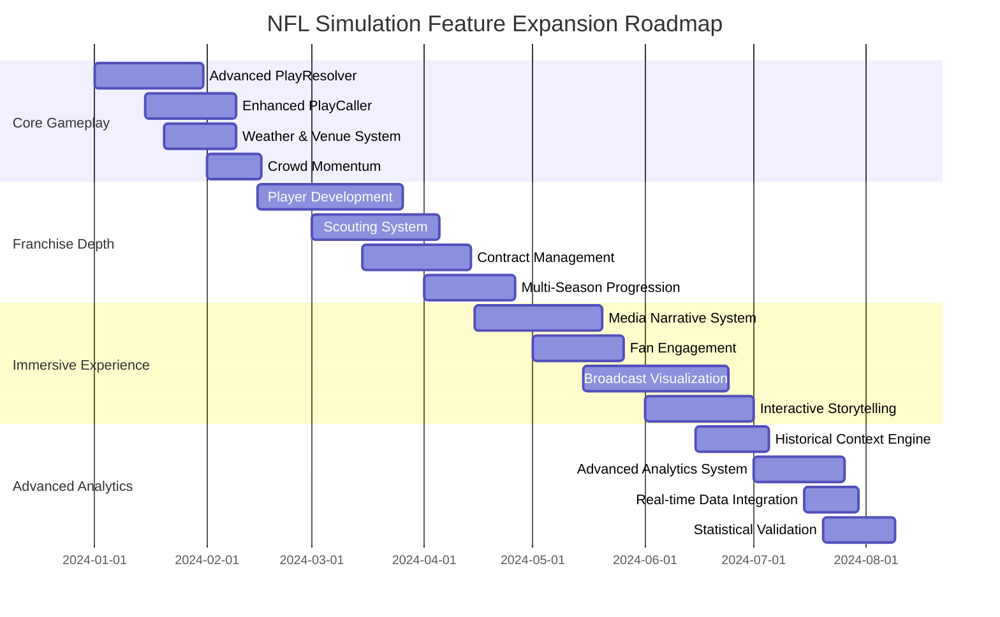

# NFL Simulation Game: Comprehensive Feature Expansion Plan

## Executive Summary

This plan transforms the existing `simulation_orchestrator.py` into a deeply immersive NFL simulation game experience by expanding gameplay mechanics, integrating real-time data, implementing dynamic storytelling, enhancing AI behaviors, and adding interactive elements that create long-term player investment.

## Current System Analysis

### Strengths of Current Implementation

- **Modular Architecture**: Clear separation of concerns with PlayResolver, PlayCaller, and MatchContext
- **Kernel System**: Genesis (biological), Cortex (AI), and Empire (XP) kernels provide extensible foundation
- **Attribute-Based Simulation**: ProbabilityEngine uses player attributes for realistic outcomes
- **WebSocket Integration**: Real-time broadcasting capabilities
- **Database Integration**: Player stats, game state persistence

### Key Expansion Opportunities

1. **Roster Management Depth**: Player development, scouting, and franchise building
2. **Realistic Play-by-Play**: Advanced decision making and situational awareness
3. **Live Environmental Effects**: Dynamic weather, venue impacts, and crowd influence
4. **Statistical Realism**: Advanced analytics and historical context
5. **Franchise Longevity**: Multi-season progression and legacy systems
6. **Social Interaction**: Media narratives, fan engagement, and social dynamics
7. **Immersive Presentation**: Broadcast-quality visuals and storytelling

## Feature Expansion Plan

### 1. Advanced Roster Management System

#### Player Development & Progression

```python
# Technical Implementation
class PlayerDevelopmentSystem:
    def __init__(self):
        self.skill_trees = {
            'QB': ['Accuracy', 'ArmStrength', 'DecisionMaking', 'Mobility'],
            'WR': ['RouteRunning', 'Speed', 'Hands', 'Release'],
            'RB': ['Vision', 'Power', 'Agility', 'PassBlocking']
        }
        self.training_regimens = {
            'Offseason': {'duration': 12, 'xp_multiplier': 1.5},
            'InSeason': {'duration': 1, 'xp_multiplier': 0.8}
        }

    def apply_training(self, player_id: int, focus_area: str, intensity: float):
        # Integrate with GenesisKernel for biological adaptation
        xp_gain = self._calculate_xp_gain(player_id, focus_area, intensity)
        self._update_player_attributes(player_id, focus_area, xp_gain)
        self._track_progression(player_id)
```

#### Scouting & Draft System

```python
class ScoutingSystem:
    def __init__(self):
        self.college_database = CollegePlayerDatabase()
        self.scouting_reports = {}
        self.draft_board = DraftBoard()

    def generate_scouting_report(self, prospect_id: int, scout_accuracy: float):
        # Use probability distributions based on real NFL combine data
        attributes = self._simulate_combine_performance(prospect_id)
        projected_ceiling = self._calculate_ceiling(attributes)
        injury_risk = self._assess_injury_risk(attributes)

        return {
            'attributes': attributes,
            'projected_ceiling': projected_ceiling,
            'injury_risk': injury_risk,
            'comparables': self._find_comparables(attributes)
        }
```

### 2. Realistic Play-by-Play Decision Making

#### Advanced Play Calling AI

```python
class AdvancedPlayCaller:
    def __init__(self):
        self.tendency_models = {
            'WestCoast': {'short_pass': 0.6, 'run': 0.3, 'play_action': 0.1},
            'AirCoryell': {'deep_pass': 0.5, 'run': 0.2, 'screen': 0.3},
            'PowerRun': {'run': 0.7, 'play_action': 0.2, 'deep_pass': 0.1}
        }
        self.situational_awareness = SituationalAwarenessEngine()

    def call_play(self, context: PlayCallingContext):
        # Multi-factor decision making
        base_tendency = self._get_coach_tendency(context.coach_id)
        situational_adjustment = self.situational_awareness.analyze(context)
        opponent_weakness = self._identify_opponent_weakness(context.opponent_id)

        final_decision = self._weighted_decision(
            base_tendency,
            situational_adjustment,
            opponent_weakness
        )

        return self._generate_play_command(final_decision)
```

#### Dynamic Game Planning

```python
class GamePlanEngine:
    def __init__(self):
        self.scripted_plays = []
        self.adaptive_strategy = AdaptiveStrategy()

    def generate_game_plan(self, team_id: int, opponent_id: int):
        # Analyze historical matchups
        historical_data = self._get_historical_matchup_data(team_id, opponent_id)

        # Identify key matchups
        favorable_matchups = self._find_favorable_matchups(historical_data)

        # Generate scripted sequences
        self.scripted_plays = self._create_scripted_sequences(favorable_matchups)

        # Set adaptive triggers
        self.adaptive_strategy.set_triggers(
            falling_behind=self._generate_catchup_strategy(),
            building_lead=self._generate_clock_management_strategy()
        )
```

### 3. Live Environmental & Venue Effects

#### Dynamic Weather System

```python
class AdvancedWeatherSystem:
    def __init__(self):
        self.weather_patterns = {
            'Snow': {'wind_impact': 0.3, 'visibility': 0.7, 'footing': 0.6},
            'Rain': {'wind_impact': 0.1, 'visibility': 0.8, 'footing': 0.7},
            'HeatWave': {'fatigue_multiplier': 1.3, 'hydration_factor': 0.8}
        }
        self.venue_effects = {
            'Seattle': {'crowd_noise': 0.9, 'home_field_advantage': 0.15},
            'GreenBay': {'cold_weather_tolerance': 0.8, 'snow_management': 0.9}
        }

    def apply_environmental_effects(self, play_context: PlayContext):
        venue = self._get_venue_data(play_context.stadium_id)
        weather = self._get_current_weather(play_context.game_id)

        # Apply combined effects
        environmental_modifiers = self._calculate_combined_effects(venue, weather)

        # Modify player performance
        for player in play_context.participating_players:
            self._apply_player_modifiers(player, environmental_modifiers)

        return environmental_modifiers
```

#### Crowd & Momentum System

```python
class CrowdMomentumSystem:
    def __init__(self):
        self.momentum_factor = 1.0
        self.crowd_energy = 0.5

    def update_momentum(self, play_result: PlayResult, home_team: bool):
        # Big plays increase momentum
        if play_result.is_highlight_worthy:
            momentum_change = 0.15 if home_team else -0.15
            self.momentum_factor = max(0.7, min(1.3, self.momentum_factor + momentum_change))

        # Crowd reaction
        crowd_reaction = self._calculate_crowd_reaction(play_result, home_team)
        self.crowd_energy = max(0.2, min(0.9, self.crowd_energy + crowd_reaction))

        # Apply momentum effects to next play probability
        return {'momentum_factor': self.momentum_factor, 'crowd_energy': self.crowd_energy}
```

### 4. Advanced Statistical Realism

#### Historical Context Engine

```python
class HistoricalContextEngine:
    def __init__(self):
        self.nfl_archives = NFLHistoricalDatabase()
        self.similar_game_finder = SimilarGameFinder()

    def provide_historical_context(self, current_game_state: GameState):
        # Find similar historical games
        similar_games = self.similar_game_finder.find_similar(current_game_state)

        # Calculate win probability based on historical data
        win_probability = self._calculate_historical_win_probability(similar_games)

        # Provide narrative context
        narrative = self._generate_narrative_context(similar_games)

        return {
            'win_probability': win_probability,
            'historical_comparison': narrative,
            'key_statistical_insights': self._extract_insights(similar_games)
        }
```

#### Advanced Analytics System

```python
class AdvancedAnalyticsSystem:
    def __init__(self):
        self.metric_calculators = {
            'QBR': QBREngine(),
            'WinProbability': WinProbabilityCalculator(),
            'ExpectedPoints': ExpectedPointsModel()
        }

    def calculate_advanced_metrics(self, game_state: GameState):
        metrics = {}

        # Calculate all advanced metrics
        for metric_name, calculator in self.metric_calculators.items():
            metrics[metric_name] = calculator.calculate(game_state)

        # Add contextual analysis
        metrics['contextual_analysis'] = self._provide_contextual_analysis(metrics)

        return metrics
```

### 5. Franchise Longevity Features

#### Multi-Season Progression System

```python
class FranchiseProgressionSystem:
    def __init__(self):
        self.season_arcs = {
            'Rebuilding': {'player_development_focus': 0.8, 'win_now_focus': 0.2},
            'Contending': {'player_development_focus': 0.5, 'win_now_focus': 0.5},
            'Dynasty': {'player_development_focus': 0.3, 'win_now_focus': 0.7}
        }
        self.legacy_tracker = LegacyTracker()

    def progress_franchise(self, franchise_id: int, season_results: SeasonResults):
        # Update franchise phase based on results
        new_phase = self._determine_franchise_phase(season_results)
        self._update_franchise_goals(franchise_id, new_phase)

        # Process player development and aging
        self._handle_player_progression(franchise_id)

        # Update legacy metrics
        self.legacy_tracker.update_legacy(franchise_id, season_results)

        # Generate offseason storylines
        storylines = self._generate_offseason_storylines(franchise_id, season_results)

        return {
            'new_phase': new_phase,
            'development_results': self._get_development_results(franchise_id),
            'legacy_update': self.legacy_tracker.get_legacy_summary(franchise_id),
            'offseason_storylines': storylines
        }
```

#### Contract & Salary Cap System

```python
class ContractManagementSystem:
    def __init__(self):
        self.salary_cap = 208_200_000  # 2023 NFL salary cap
        self.contract_structures = {
            'Rookie': {'years': 4, 'guaranteed_percentage': 0.8},
            'Veteran': {'years': 3, 'guaranteed_percentage': 0.5},
            'Superstar': {'years': 5, 'guaranteed_percentage': 0.7}
        }

    def negotiate_contract(self, player_id: int, market_value: float, team_cap_space: float):
        # Calculate fair market offer
        base_offer = self._calculate_base_offer(player_id, market_value)

        # Apply team-specific adjustments
        adjusted_offer = self._apply_team_adjustments(base_offer, team_cap_space)

        # Simulate negotiation process
        negotiation_result = self._simulate_negotiation(player_id, adjusted_offer)

        return negotiation_result
```

### 6. Social Interaction Capabilities

#### Media & Narrative System

```python
class MediaNarrativeSystem:
    def __init__(self):
        self.story_arcs = {
            'Underdog': StoryArcTemplate(),
            'Dynasty': StoryArcTemplate(),
            'Rebuilding': StoryArcTemplate()
        }
        self.media_outlets = {
            'ESPN': {'bias': 'neutral', 'depth': 'high'},
            'LocalBeat': {'bias': 'hometeam', 'depth': 'medium'},
            'SocialMedia': {'bias': 'polarized', 'depth': 'low'}
        }

    def generate_media_coverage(self, game_results: GameResults, team_id: int):
        # Select appropriate story arc
        story_arc = self._select_story_arc(team_id, game_results)

        # Generate narratives from different media perspectives
        narratives = {}
        for outlet_name, outlet_profile in self.media_outlets.items():
            narratives[outlet_name] = self._generate_narrative(
                game_results, team_id, story_arc, outlet_profile
            )

        # Create social media buzz
        social_buzz = self._generate_social_media_reactions(game_results)

        return {
            'main_narrative': narratives['ESPN'],
            'local_coverage': narratives['LocalBeat'],
            'social_buzz': social_buzz,
            'story_arc_progress': self._update_story_arc_progress(team_id, game_results)
        }
```

#### Fan Engagement System

```python
class FanEngagementSystem:
    def __init__(self):
        self.fan_base_profiles = {}
        self.engagement_metrics = {
            'attendance': 0.8,
            'merchandise_sales': 0.6,
            'social_media_growth': 0.5
        }

    def update_fan_engagement(self, team_id: int, game_results: GameResults):
        # Calculate engagement impact based on game results
        engagement_impact = self._calculate_engagement_impact(game_results)

        # Update fan base metrics
        self._update_fan_base_metrics(team_id, engagement_impact)

        # Generate fan reactions
        fan_reactions = self._generate_fan_reactions(game_results)

        # Update long-term engagement trends
        self._update_long_term_trends(team_id, engagement_impact)

        return {
            'immediate_reactions': fan_reactions,
            'engagement_metrics': self._get_current_metrics(team_id),
            'trend_analysis': self._get_trend_analysis(team_id)
        }
```

### 7. Immersive Presentation Layer

#### Broadcast-Quality Visualization

```python
class BroadcastVisualizationSystem:
    def __init__(self):
        self.camera_angles = {
            'Standard': {'position': (0, 15, 30), 'fov': 45},
            'Skycam': {'position': (0, 50, 0), 'fov': 60},
            'Sideline': {'position': (-20, 5, 10), 'fov': 35}
        }
        self.graphics_packages = {
            'PrimeTime': {'style': 'cinematic', 'transitions': 'smooth'},
            'Classic': {'style': 'traditional', 'transitions': 'standard'}
        }

    def generate_broadcast_feed(self, play_data: PlayData, context: BroadcastContext):
        # Select appropriate camera angles
        camera_sequence = self._select_camera_sequence(play_data.play_type)

        # Generate visual elements
        visual_elements = self._generate_visual_elements(play_data, context)

        # Create audio commentary
        commentary = self._generate_commentary(play_data, context)

        # Compile broadcast package
        return {
            'camera_sequence': camera_sequence,
            'visual_elements': visual_elements,
            'commentary': commentary,
            'graphics_package': self._select_graphics_package(context.broadcast_style)
        }
```

#### Interactive Storytelling Engine

```python
class InteractiveStorytellingEngine:
    def __init__(self):
        self.story_beats = {
            'Pregame': StoryBeatTemplate(),
            'Halftime': StoryBeatTemplate(),
            'Postgame': StoryBeatTemplate(),
            'Weekly': StoryBeatTemplate()
        }
        self.user_preferences = UserPreferenceTracker()

    def generate_story_beats(self, game_state: GameState, user_id: int):
        # Get user preferences for storytelling style
        preferences = self.user_preferences.get_preferences(user_id)

        # Generate appropriate story beats
        story_beats = {}
        for beat_type, template in self.story_beats.items():
            if self._should_generate_beat(beat_type, game_state):
                story_beats[beat_type] = template.generate(
                    game_state, preferences
                )

        # Create interactive decision points
        decision_points = self._identify_decision_points(game_state)

        return {
            'story_beats': story_beats,
            'decision_points': decision_points,
            'personalized_content': self._generate_personalized_content(game_state, preferences)
        }
```

## Technical Implementation Strategy

### Phase 1: Core Gameplay Enhancement (4-6 weeks)

1. **Expand PlayResolver** with advanced play types (RPOs, trick plays, special formations)
2. **Enhance PlayCaller** with coach personalities and adaptive strategies
3. **Integrate Advanced Weather** system with venue-specific effects
4. **Implement Crowd Momentum** system affecting player performance

### Phase 2: Franchise Depth (6-8 weeks)

1. **Player Development System** with skill trees and training regimens
2. **Scouting & Draft System** with college database integration
3. **Contract Management** with salary cap and negotiation logic
4. **Multi-Season Progression** with franchise phases and legacy tracking

### Phase 3: Immersive Experience (8-10 weeks)

1. **Media Narrative System** with story arcs and media outlets
2. **Fan Engagement System** with dynamic reactions and metrics
3. **Broadcast Visualization** with camera angles and commentary
4. **Interactive Storytelling** with personalized content and decision points

### Phase 4: Advanced Analytics & Realism (4-6 weeks)

1. **Historical Context Engine** with similar game analysis
2. **Advanced Analytics System** with QBR, win probability, expected points
3. **Real-time Data Integration** with live NFL data feeds
4. **Statistical Realism** with historical accuracy validation

## User Experience Considerations

### Engagement Loops

- **Short-term**: Play-by-play excitement with highlight moments
- **Medium-term**: Game-to-game progression with narrative arcs
- **Long-term**: Season-to-season franchise building with legacy goals

### Personalization

- **Coach Personalities**: Different play-calling styles and philosophies
- **Team Building**: Unique roster construction approaches
- **Story Preferences**: Choose between drama-focused or stats-focused narratives

### Accessibility

- **Tutorial System**: Gradual introduction of complex mechanics
- **Difficulty Scaling**: Adjustable AI complexity and realism levels
- **Visual Customization**: Broadcast style preferences and UI themes

## Engagement Strategies

### Seasonal Content

- **Preseason**: Rookie development focus and training camp stories
- **Regular Season**: Divisional rivalries and playoff race narratives
- **Playoffs**: High-stakes drama and legacy-defining moments
- **Offseason**: Free agency frenzy and draft intrigue

### Dynamic Challenges

- **Weekly Goals**: Specific objectives for player development or team performance
- **Historical Scenarios**: Recreate famous NFL moments with modern rosters
- **What-If Simulations**: Alternate reality scenarios (e.g., "What if the Patriots didn't draft Brady?")

### Social Features

- **League Sharing**: Compare franchise progress with friends
- **Draft Classes**: Compete for best rookie evaluations
- **Media Reactions**: See how decisions are covered by different outlets

## Authentication & Realism Validation

### Data Integration

- **NFL API Integration**: Real player stats, team information, historical data
- **Weather API**: Real-time weather conditions for live games
- **Injury Database**: Realistic injury patterns and recovery timelines

### Validation Metrics

- **Statistical Accuracy**: Compare simulation results to real NFL averages
- **Play Distribution**: Validate play calling frequencies match NFL trends
- **Outcome Probability**: Ensure win probabilities align with real NFL data

## Implementation Roadmap



## Success Metrics

### Technical Metrics

- **Performance**: Maintain <100ms play resolution time
- **Scalability**: Support 10,000+ concurrent simulations
- **Reliability**: 99.9% uptime for live features

### User Engagement Metrics

- **Session Length**: Increase average session from 15 to 45 minutes
- **Retention**: 70%+ week-over-week retention rate
- **Completion**: 60%+ of users complete at least one full season

### Quality Metrics

- **Realism Rating**: 4.5/5+ user rating for authenticity
- **Feature Usage**: 80%+ of users engage with at least 3 advanced features
- **Narrative Satisfaction**: 4.0/5+ rating for storytelling elements

## Risk Mitigation

### Technical Risks

- **Performance Bottlenecks**: Implement incremental feature rollout with load testing
- **Data Integration**: Use mock data during development, transition to real APIs
- **Complexity Management**: Modular architecture with clear interfaces

### User Experience Risks

- **Overwhelming Complexity**: Gradual feature introduction with tutorials
- **Realism vs Fun Balance**: User testing with different player archetypes
- **Narrative Fatigue**: Multiple storytelling styles and customization options

## Conclusion

This comprehensive expansion plan transforms the existing simulation framework into a deeply immersive NFL experience that combines authentic gameplay mechanics with engaging narrative elements. By leveraging the existing kernel architecture and expanding it with advanced systems for player development, environmental realism, franchise management, and interactive storytelling, the simulation will provide both short-term excitement and long-term engagement.

The phased implementation approach ensures technical feasibility while maintaining the core realism that makes NFL simulations compelling. The focus on both statistical accuracy and narrative depth creates a unique experience that appeals to both hardcore football strategists and casual fans seeking dramatic storytelling.
