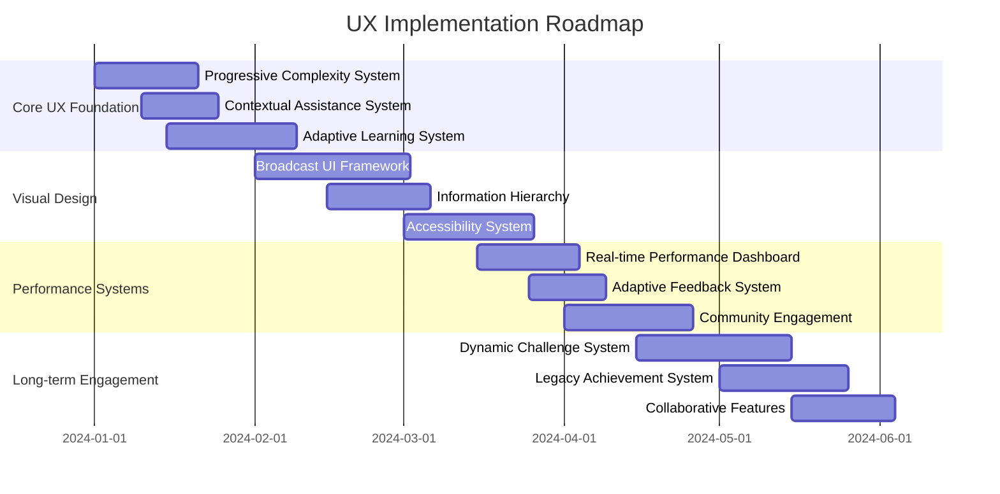

# User Experience Considerations for NFL Simulation Expansion

## Core UX Principles

### 1. Progressive Complexity

```python
class ProgressiveComplexitySystem:
    def __init__(self):
        self.complexity_levels = {
            'Rookie': {'features_enabled': ['basic_playcalling', 'simple_stats'],
                      'tutorial_depth': 'full', 'ai_assistance': 'high'},
            'Veteran': {'features_enabled': ['basic_playcalling', 'simple_stats', 'player_development'],
                       'tutorial_depth': 'medium', 'ai_assistance': 'medium'},
            'Legend': {'features_enabled': ['all'], 'tutorial_depth': 'minimal',
                      'ai_assistance': 'low'}
        }
        self.user_profiles = {}

    def get_recommended_settings(self, user_id: int):
        # Analyze user behavior and skill level
        skill_level = self._assess_user_skill(user_id)
        recommended_settings = self.complexity_levels[skill_level]

        # Add personalized recommendations
        recommendations = self._generate_personalized_recommendations(user_id, skill_level)

        return {
            'base_settings': recommended_settings,
            'personalized_tips': recommendations,
            'feature_introduction_plan': self._create_feature_rollout_plan(skill_level)
        }
```

### 2. Contextual Assistance

```python
class ContextualAssistanceSystem:
    def __init__(self):
        self.assistance_triggers = {
            'play_calling': {'confidence_threshold': 0.7, 'assistance_type': 'suggestion'},
            'contract_negotiation': {'confidence_threshold': 0.6, 'assistance_type': 'explanation'},
            'draft_decision': {'confidence_threshold': 0.5, 'assistance_type': 'comparison'}
        }
        self.help_database = NFLKnowledgeBase()

    def provide_contextual_help(self, user_action: UserAction, game_state: GameState):
        # Determine if assistance is needed
        needs_help = self._assess_help_needed(user_action, game_state)

        if needs_help:
            # Get relevant assistance
            assistance = self._get_relevant_assistance(user_action.context)

            # Format for current user preferences
            formatted_help = self._format_assistance(assistance, user_action.user_id)

            return formatted_help

        return None
```

## Onboarding & Tutorial Design

### Interactive Tutorial System

```python
class InteractiveTutorialSystem:
    def __init__(self):
        self.tutorial_modules = {
            'BasicGameplay': BasicGameplayTutorial(),
            'AdvancedPlaycalling': AdvancedPlaycallingTutorial(),
            'FranchiseManagement': FranchiseManagementTutorial(),
            'ScoutingDraft': ScoutingDraftTutorial()
        }
        self.progress_tracker = TutorialProgressTracker()

    def generate_tutorial_plan(self, user_id: int, skill_level: str):
        # Create personalized tutorial sequence
        tutorial_sequence = []

        # Start with core modules
        tutorial_sequence.extend(self._get_core_modules(skill_level))

        # Add elective modules based on user interests
        tutorial_sequence.extend(self._get_elective_modules(user_id))

        # Set pacing based on user learning style
        pacing = self._determine_pacing(user_id)

        return {
            'tutorial_sequence': tutorial_sequence,
            'estimated_completion_time': self._calculate_completion_time(tutorial_sequence),
            'recommended_pacing': pacing,
            'progress_tracking': self.progress_tracker.create_tracker(user_id)
        }
```

### Adaptive Learning Paths

```python
class AdaptiveLearningSystem:
    def __init__(self):
        self.learning_styles = {
            'Visual': {'content_type': 'diagrams', 'interaction_style': 'point_and_click'},
            'Analytical': {'content_type': 'stats', 'interaction_style': 'data_driven'},
            'Narrative': {'content_type': 'stories', 'interaction_style': 'choice_based'}
        }
        self.mastery_thresholds = {
            'basic_playcalling': 0.8,
            'player_development': 0.7,
            'contract_management': 0.6
        }

    def adapt_learning_path(self, user_id: int, performance_data: PerformanceData):
        # Analyze learning style
        learning_style = self._detect_learning_style(user_id, performance_data)

        # Assess current mastery levels
        mastery_levels = self._assess_mastery(performance_data)

        # Generate adapted learning path
        adapted_path = self._generate_adapted_path(learning_style, mastery_levels)

        # Provide feedback on progress
        progress_feedback = self._generate_progress_feedback(mastery_levels)

        return {
            'adapted_learning_path': adapted_path,
            'learning_style_insights': learning_style,
            'mastery_assessment': mastery_levels,
            'progress_feedback': progress_feedback
        }
```

## Visual Design & Information Architecture

### Broadcast-Quality UI Framework

```python
class BroadcastUIFramework:
    def __init__(self):
        self.ui_themes = {
            'Classic': {'color_scheme': 'traditional', 'layout': 'scoreboard_centric'},
            'Modern': {'color_scheme': 'dark_mode', 'layout': 'data_rich'},
            'Minimalist': {'color_scheme': 'light', 'layout': 'clean'}
        }
        self.responsive_layouts = {
            'Desktop': {'breakpoints': [1920, 1440, 1024], 'aspect_ratio': '16:9'},
            'Tablet': {'breakpoints': [1024, 768], 'aspect_ratio': '4:3'},
            'Mobile': {'breakpoints': [768, 480], 'aspect_ratio': '9:16'}
        }

    def generate_ui_configuration(self, user_preferences: UserPreferences, device_type: str):
        # Select appropriate theme
        theme = self._select_theme(user_preferences)

        # Apply responsive layout
        layout = self._apply_responsive_layout(device_type)

        # Configure information density
        info_density = self._configure_info_density(user_preferences.experience_level)

        # Generate final configuration
        return {
            'visual_theme': theme,
            'layout_configuration': layout,
            'information_density': info_density,
            'accessibility_options': self._get_accessibility_options(user_preferences)
        }
```

### Dynamic Information Hierarchy

```python
class InformationHierarchyManager:
    def __init__(self):
        self.priority_levels = {
            'Critical': {'display': 'always', 'size': 'large', 'animation': 'highlight'},
            'Important': {'display': 'default', 'size': 'medium', 'animation': 'fade_in'},
            'Contextual': {'display': 'on_demand', 'size': 'small', 'animation': 'slide_in'},
            'Background': {'display': 'minimized', 'size': 'x_small', 'animation': 'none'}
        }
        self.user_attention_models = {}

    def prioritize_information(self, game_state: GameState, user_id: int):
        # Analyze current game context
        context_analysis = self._analyze_game_context(game_state)

        # Get user attention patterns
        attention_patterns = self._get_user_attention_patterns(user_id)

        # Determine information priorities
        information_priorities = self._determine_priorities(context_analysis, attention_patterns)

        # Apply visual hierarchy
        visual_hierarchy = self._apply_visual_hierarchy(information_priorities)

        return {
            'information_priorities': information_priorities,
            'visual_hierarchy': visual_hierarchy,
            'attention_guidance': self._generate_attention_guidance(visual_hierarchy)
        }
```

## Accessibility & Inclusivity

### Comprehensive Accessibility System

```python
class AccessibilitySystem:
    def __init__(self):
        self.accessibility_profiles = {
            'VisualImpairment': {'text_size': 'x_large', 'contrast': 'high', 'audio_cues': 'enhanced'},
            'MotorImpairment': {'input_method': 'voice', 'timing': 'extended', 'navigation': 'simplified'},
            'Cognitive': {'information_density': 'reduced', 'pacing': 'slower', 'feedback': 'detailed'}
        }
        self.compliance_standards = {
            'WCAG_2.1_AA': WCAGComplianceChecker(),
            'Section_508': Section508ComplianceChecker()
        }

    def apply_accessibility_settings(self, user_id: int, accessibility_needs: List[str]):
        # Create personalized accessibility profile
        profile = self._create_accessibility_profile(accessibility_needs)

        # Apply UI adaptations
        ui_adaptations = self._apply_ui_adaptations(profile)

        # Configure input methods
        input_config = self._configure_input_methods(profile)

        # Set compliance monitoring
        compliance_monitor = self._setup_compliance_monitoring(profile)

        return {
            'accessibility_profile': profile,
            'ui_adaptations': ui_adaptations,
            'input_configuration': input_config,
            'compliance_monitor': compliance_monitor,
            'accessibility_report': self._generate_accessibility_report(profile)
        }
```

### Inclusive Design Patterns

```python
class InclusiveDesignSystem:
    def __init__(self):
        self.design_patterns = {
            'ColorBlind': {'palette': 'accessible', 'patterns': 'enabled', 'labels': 'explicit'},
            'Dyslexia': {'font': 'open_dyslexic', 'spacing': 'increased', 'highlighting': 'syllable'},
            'LowVision': {'scaling': 'dynamic', 'zoom': 'gesture_based', 'read_aloud': 'available'}
        }
        self.cultural_adaptations = {
            'International': {'units': 'metric', 'time_format': '24_hour', 'date_format': 'dd_mm_yyyy'},
            'Regional': {'team_names': 'localized', 'commentary': 'region_specific', 'references': 'culturally_relevant'}
        }

    def apply_inclusive_design(self, user_preferences: UserPreferences, regional_settings: RegionalSettings):
        # Apply accessibility design patterns
        design_adaptations = self._apply_design_patterns(user_preferences.accessibility_needs)

        # Apply cultural adaptations
        cultural_adaptations = self._apply_cultural_adaptations(regional_settings)

        # Create inclusive content strategy
        content_strategy = self._create_inclusive_content_strategy(user_preferences, regional_settings)

        return {
            'design_adaptations': design_adaptations,
            'cultural_adaptations': cultural_adaptations,
            'content_strategy': content_strategy,
            'inclusivity_report': self._generate_inclusivity_report(design_adaptations, cultural_adaptations)
        }
```

## Performance & Feedback Systems

### Real-time Performance Dashboard

```python
class PerformanceDashboard:
    def __init__(self):
        self.metric_categories = {
            'Gameplay': ['completion_percentage', 'yards_per_play', 'turnover_ratio'],
            'Management': ['cap_efficiency', 'draft_success_rate', 'player_development'],
            'Engagement': ['session_length', 'feature_usage', 'retention_rate']
        }
        self.benchmark_data = NFLPerformanceBenchmarks()

    def generate_performance_report(self, user_id: int, time_period: str):
        # Gather performance data
        performance_data = self._gather_performance_data(user_id, time_period)

        # Calculate metrics
        calculated_metrics = self._calculate_metrics(performance_data)

        # Generate comparisons
        comparisons = self._generate_comparisons(calculated_metrics)

        # Create improvement recommendations
        recommendations = self._generate_recommendations(calculated_metrics, comparisons)

        return {
            'performance_metrics': calculated_metrics,
            'historical_comparisons': comparisons,
            'improvement_recommendations': recommendations,
            'visualization_data': self._generate_visualization_data(calculated_metrics)
        }
```

### Adaptive Feedback System

```python
class AdaptiveFeedbackSystem:
    def __init__(self):
        self.feedback_styles = {
            'Encouraging': {'tone': 'positive', 'focus': 'improvement', 'frequency': 'frequent'},
            'Analytical': {'tone': 'neutral', 'focus': 'data', 'frequency': 'moderate'},
            'Direct': {'tone': 'frank', 'focus': 'results', 'frequency': 'occasional'}
        }
        self.feedback_triggers = {
            'positive_reinforcement': ['achievement_unlocked', 'milestone_reached'],
            'constructive_criticism': ['repeated_mistake', 'performance_decline'],
            'strategic_advice': ['complex_situation', 'high_stakes_decision']
        }

    def provide_adaptive_feedback(self, user_action: UserAction, performance_context: PerformanceContext):
        # Determine appropriate feedback style
        feedback_style = self._determine_feedback_style(user_action.user_id)

        # Analyze action in context
        action_analysis = self._analyze_action_in_context(user_action, performance_context)

        # Generate targeted feedback
        targeted_feedback = self._generate_targeted_feedback(action_analysis, feedback_style)

        # Create actionable recommendations
        recommendations = self._generate_actionable_recommendations(action_analysis)

        return {
            'feedback_content': targeted_feedback,
            'recommendations': recommendations,
            'performance_insights': self._generate_performance_insights(action_analysis),
            'motivational_content': self._generate_motivational_content(performance_context)
        }
```

## Social & Community Features

### Community Engagement System

```python
class CommunityEngagementSystem:
    def __init__(self):
        self.community_features = {
            'Leagues': {'max_members': 32, 'competition_types': ['head_to_head', 'fantasy', 'survival']},
            'Challenges': {'difficulty_levels': ['rookie', 'veteran', 'legend'], 'reward_structures': ['badges', 'leaderboard', 'virtual_trophies']},
            'Sharing': {'content_types': ['highlights', 'roster_showcases', 'strategy_guides'], 'privacy_levels': ['public', 'friends', 'private']}
        }
        self.social_rewards = {
            'Participation': {'xp_bonus': 0.1, 'reputation_boost': 0.05},
            'Leadership': {'xp_bonus': 0.2, 'reputation_boost': 0.15},
            'Mentorship': {'xp_bonus': 0.15, 'reputation_boost': 0.1}
        }

    def facilitate_community_interaction(self, user_id: int, interaction_type: str, content: dict):
        # Validate community guidelines
        guideline_compliance = self._check_community_guidelines(content)

        if not guideline_compliance['compliant']:
            return {'status': 'rejected', 'reason': guideline_compliance['issues']}

        # Process interaction
        interaction_result = self._process_interaction(user_id, interaction_type, content)

        # Apply social rewards
        social_rewards = self._apply_social_rewards(user_id, interaction_type)

        # Update community metrics
        community_metrics = self._update_community_metrics(interaction_type)

        return {
            'interaction_status': 'successful',
            'social_rewards': social_rewards,
            'community_impact': community_metrics,
            'engagement_analytics': self._generate_engagement_analytics(interaction_result)
        }
```

### Collaborative Features

```python
class CollaborativeFeaturesSystem:
    def __init__(self):
        self.collaboration_modes = {
            'CoachingStaff': {'roles': ['HeadCoach', 'OffensiveCoordinator', 'DefensiveCoordinator'], 'communication': 'real_time'},
            'FrontOffice': {'roles': ['GM', 'ScoutingDirector', 'CapSpecialist'], 'communication': 'asynchronous'},
            'BroadcastTeam': {'roles': ['PlayByPlay', 'ColorCommentator', 'SidelineReporter'], 'communication': 'synchronized'}
        }
        self.team_dynamics = {
            'Effective': {'productivity_bonus': 0.15, 'enjoyment_bonus': 0.2},
            'Neutral': {'productivity_bonus': 0.0, 'enjoyment_bonus': 0.0},
            'Ineffective': {'productivity_penalty': 0.1, 'enjoyment_penalty': 0.15}
        }

    def manage_collaborative_session(self, team_id: int, session_data: SessionData):
        # Analyze team dynamics
        team_dynamics = self._analyze_team_dynamics(team_id, session_data)

        # Facilitate role-based interaction
        role_interactions = self._facilitate_role_interactions(team_id, session_data)

        # Resolve conflicts
        conflict_resolution = self._resolve_conflicts(team_dynamics, session_data)

        # Generate team performance report
        team_report = self._generate_team_performance_report(team_id, session_data, team_dynamics)

        return {
            'team_dynamics_analysis': team_dynamics,
            'collaboration_effectiveness': role_interactions,
            'conflict_resolution': conflict_resolution,
            'team_performance_report': team_report,
            'improvement_suggestions': self._generate_improvement_suggestions(team_report)
        }
```

## Long-term Engagement Strategies

### Dynamic Challenge System

```python
class DynamicChallengeSystem:
    def __init__(self):
        self.challenge_categories = {
            'SkillBased': {'difficulty_curve': 'steep', 'reward_structure': 'tiered'},
            'Narrative': {'difficulty_curve': 'moderate', 'reward_structure': 'story_unlocks'},
            'Social': {'difficulty_curve': 'variable', 'reward_structure': 'community_recognition'}
        }
        self.adaptive_difficulty = AdaptiveDifficultyEngine()

    def generate_challenge_sequence(self, user_id: int, current_skill_level: str):
        # Analyze user progression
        progression_analysis = self._analyze_user_progression(user_id)

        # Generate appropriate challenges
        challenge_sequence = self._generate_challenge_sequence(progression_analysis, current_skill_level)

        # Set adaptive difficulty parameters
        difficulty_parameters = self.adaptive_difficulty.set_parameters(user_id, current_skill_level)

        # Create reward structure
        reward_structure = self._create_reward_structure(challenge_sequence)

        return {
            'challenge_sequence': challenge_sequence,
            'difficulty_parameters': difficulty_parameters,
            'reward_structure': reward_structure,
            'progression_path': self._generate_progression_path(challenge_sequence)
        }
```

### Legacy & Achievement System

```python
class LegacyAchievementSystem:
    def __init__(self):
        self.achievement_tiers = {
            'Bronze': {'threshold': 0.3, 'rewards': ['badges', 'title']},
            'Silver': {'threshold': 0.6, 'rewards': ['badges', 'title', 'profile_frame']},
            'Gold': {'threshold': 0.8, 'rewards': ['badges', 'title', 'profile_frame', 'exclusive_content']},
            'Platinum': {'threshold': 0.95, 'rewards': ['all', 'legacy_recognition']}
        }
        self.legacy_milestones = {
            'FranchiseBuilder': {'requirements': ['10_seasons', '3_championships'], 'recognition': 'HallOfFame'},
            'PlayerDeveloper': {'requirements': ['5_HOF_players', '20_draft_hits'], 'recognition': 'ScoutingLegend'},
            'StrategicGenius': {'requirements': ['500_wins', '10_undefeated_seasons'], 'recognition': 'CoachingTree'}
        }

    def track_legacy_progress(self, user_id: int, franchise_data: FranchiseData):
        # Calculate achievement progress
        achievement_progress = self._calculate_achievement_progress(user_id, franchise_data)

        # Update legacy milestones
        legacy_progress = self._update_legacy_milestones(user_id, franchise_data)

        # Generate legacy report
        legacy_report = self._generate_legacy_report(user_id, achievement_progress, legacy_progress)

        # Create recognition opportunities
        recognition_opportunities = self._identify_recognition_opportunities(legacy_progress)

        return {
            'achievement_progress': achievement_progress,
            'legacy_milestones': legacy_progress,
            'legacy_report': legacy_report,
            'recognition_opportunities': recognition_opportunities,
            'legacy_visualization': self._generate_legacy_visualization(legacy_report)
        }
```

## Implementation Roadmap



## Success Metrics

### UX Quality Metrics

- **Usability Score**: 85+ System Usability Scale (SUS) rating
- **Accessibility Compliance**: 100% WCAG 2.1 AA compliance
- **Localization Coverage**: Support for 10+ languages with cultural adaptations

### Engagement Metrics

- **Feature Adoption**: 70%+ of users engage with adaptive features
- **Tutorial Completion**: 85%+ completion rate for core tutorials
- **Community Participation**: 40%+ of users engage in social features

### Satisfaction Metrics

- **User Satisfaction**: 4.5/5+ rating for overall experience
- **Accessibility Ratings**: 4.7/5+ rating from users with accessibility needs
- **Retention Impact**: 20%+ increase in long-term retention from UX improvements

## Conclusion

This comprehensive UX strategy ensures that the expanded NFL simulation features are accessible, engaging, and enjoyable for users of all skill levels and backgrounds. By implementing progressive complexity, adaptive learning, inclusive design, and robust community features, the simulation will provide both immediate satisfaction and long-term engagement.

The focus on performance feedback, social interaction, and legacy building creates multiple engagement loops that keep users invested in their franchise's long-term success while providing regular moments of achievement and recognition.
