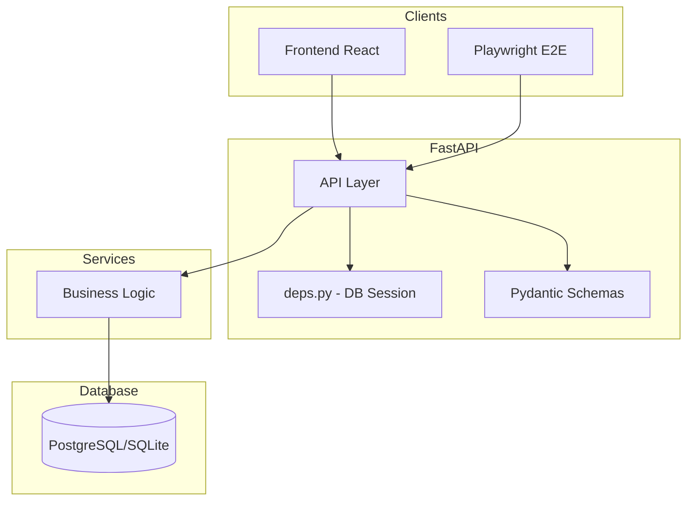
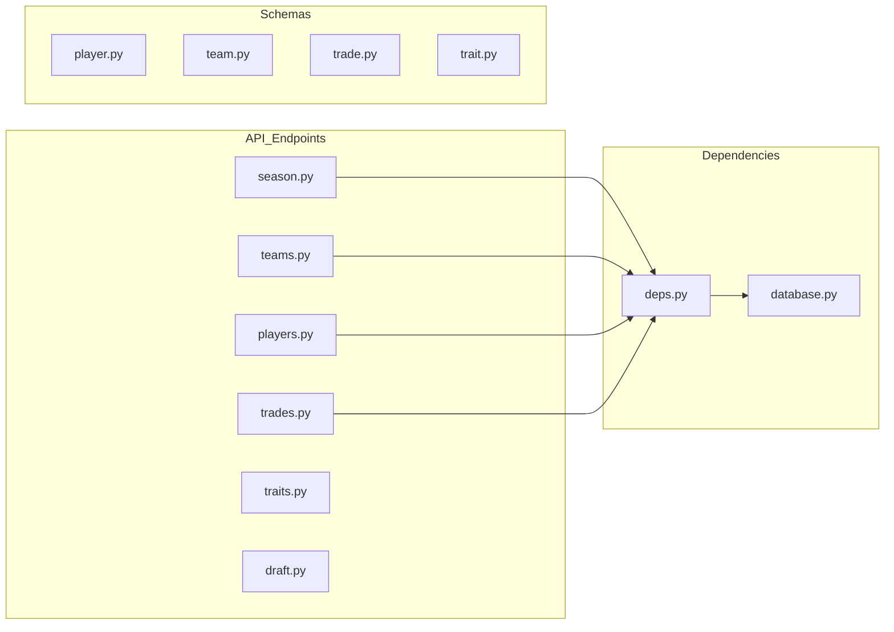

# API Reference Dossier

**Last Updated:** 2025-12-11
**Status:** Living Document
**Base URL:** `http://localhost:8000`

---

## 1. API Architecture



---

## 2. Endpoint Reference

### 2.1 Season (`/api/season`)

**File:** [season.py](file:///c:/Users/cweir/Documents/GitHub/THE%20NFL%20SIM/backend/app/api/endpoints/season.py) (1154 lines)

| Method | Endpoint                                | Purpose                                  |
| ------ | --------------------------------------- | ---------------------------------------- |
| GET    | `/api/season/summary`                   | Season dashboard with standings, leaders |
| POST   | `/api/season/`                          | Initialize new season                    |
| GET    | `/api/season/current`                   | Get active season                        |
| GET    | `/api/season/{id}`                      | Get season by ID                         |
| GET    | `/api/season/{id}/schedule`             | Get schedule (optional week filter)      |
| GET    | `/api/season/{id}/standings`            | Get standings                            |
| POST   | `/api/season/{id}/advance`              | Advance to next week                     |
| POST   | `/api/season/{id}/simulate-week`        | Simulate all games in week               |
| POST   | `/api/season/games/{id}/simulate`       | Simulate single game                     |
| POST   | `/api/season/{id}/simulate-to-playoffs` | Fast-forward to playoffs                 |
| GET    | `/api/seasons/{id}/current-pick`        | Get current draft pick                   |
| POST   | `/api/seasons/{id}/playoffs/bracket`    | Get playoff bracket                      |
| GET    | `/api/seasons/{id}/awards`              | Get season awards                        |

---

### 2.2 Teams (`/api/teams`)

**File:** [teams.py](file:///c:/Users/cweir/Documents/GitHub/THE%20NFL%20SIM/backend/app/api/endpoints/teams.py) (154 lines)

| Method | Endpoint                      | Purpose                    |
| ------ | ----------------------------- | -------------------------- |
| GET    | `/api/teams/`                 | List all teams (paginated) |
| GET    | `/api/teams/{id}`             | Get team by ID             |
| GET    | `/api/teams/{id}/roster`      | Get team roster            |
| PUT    | `/api/teams/{id}/depth-chart` | Update depth chart         |
| GET    | `/api/teams/{id}/chemistry`   | Get OL chemistry analysis  |

---

### 2.3 Players (`/api/players`)

**File:** [players.py](file:///c:/Users/cweir/Documents/GitHub/THE%20NFL%20SIM/backend/app/api/endpoints/players.py) (346 lines)

| Method | Endpoint                    | Purpose                           |
| ------ | --------------------------- | --------------------------------- |
| GET    | `/api/players/{id}`         | Basic player info                 |
| GET    | `/api/players/{id}/stats`   | Career statistics                 |
| GET    | `/api/players/{id}/profile` | Enhanced profile (traits, morale) |

---

### 2.4 Trades (`/api/trades`)

**File:** [trades.py](file:///c:/Users/cweir/Documents/GitHub/THE%20NFL%20SIM/backend/app/api/endpoints/trades.py) (438 lines)

| Method | Endpoint                         | Purpose                 |
| ------ | -------------------------------- | ----------------------- |
| POST   | `/api/trades/evaluate`           | Evaluate trade fairness |
| POST   | `/api/trades/offer`              | Submit formal offer     |
| GET    | `/api/trades/pending/{team_id}`  | Get pending offers      |
| POST   | `/api/trades/{offer_id}/respond` | Accept/reject/auto      |
| POST   | `/api/trades/{offer_id}/counter` | Counter-offer           |

#### Trade Evaluation Request

```json
{
  "proposing_team_id": 1,
  "target_team_id": 2,
  "offered_player_ids": [101, 102],
  "requested_player_ids": [201],
  "offered_picks": [{ "round": 2, "year": 2025 }],
  "requested_picks": []
}
```

#### Trade Evaluation Response

```json
{
  "decision": "ACCEPT",
  "score": 15.5,
  "reasoning": "Good value for positional need...",
  "value_breakdown": {
    "offered_value": 85.0,
    "requested_value": 70.0
  }
}
```

---

### 2.5 Traits (`/api/traits`)

**File:** [traits.py](file:///c:/Users/cweir/Documents/GitHub/THE%20NFL%20SIM/backend/app/api/endpoints/traits.py) (111 lines)

| Method | Endpoint                          | Purpose                   |
| ------ | --------------------------------- | ------------------------- |
| GET    | `/api/traits/`                    | List all available traits |
| GET    | `/api/traits/players/{id}`        | Get player's traits       |
| POST   | `/api/traits/players/{id}`        | Assign trait to player    |
| POST   | `/api/traits/players/{id}/unlock` | Unlock coaching trait     |

---

### 2.6 Draft (`/api/draft`)

**File:** [draft.py](file:///c:/Users/cweir/Documents/GitHub/THE%20NFL%20SIM/backend/app/api/endpoints/draft.py)

| Method | Endpoint                  | Purpose         |
| ------ | ------------------------- | --------------- |
| GET    | `/api/draft/board`        | Get draft board |
| GET    | `/api/draft/order`        | Get draft order |
| POST   | `/api/draft/pick`         | Make draft pick |
| GET    | `/api/draft/suggest-pick` | AI suggestion   |

---

### 2.7 Additional Endpoints

| Router            | File          | Key Endpoints             |
| ----------------- | ------------- | ------------------------- |
| `/api/data`       | data.py       | Database stats, health    |
| `/api/genesis`    | genesis.py    | Hidden player data reveal |
| `/api/news`       | news.py       | League news feed          |
| `/api/simulation` | simulation.py | Live game sim controls    |
| `/api/settings`   | settings.py   | App settings              |
| `/api/feedback`   | feedback.py   | User feedback             |
| `/ws`             | websocket.py  | Real-time updates         |

---

## 3. Common Schemas

### PaginatedResponse

```python
class PaginatedResponse(Generic[T]):
    items: List[T]
    total: int
    page: int
    page_size: int
    total_pages: int
```

### TeamSchema

```python
class TeamSchema:
    id: int
    city: str
    name: str
    abbreviation: str
    conference: str
    division: str
    wins: int
    losses: int
    logo_url: str | None
    primary_color: str | None
    secondary_color: str | None
```

### PlayerSchema

```python
class PlayerSchema:
    id: int
    first_name: str
    last_name: str
    position: str
    jersey_number: int
    overall_rating: int
    age: int
    experience: int
```

---

## 4. Error Handling

All endpoints return standard HTTP status codes:

| Code | Meaning                        |
| ---- | ------------------------------ |
| 200  | Success                        |
| 201  | Created                        |
| 400  | Bad Request (validation error) |
| 404  | Not Found                      |
| 500  | Internal Server Error          |

Error response format:

```json
{
  "detail": "Error message here"
}
```

---

## 5. File Linkage Map



---

## 6. Changelog

| Date       | Change                   | Files |
| ---------- | ------------------------ | ----- |
| 2025-12-11 | Initial dossier creation | N/A   |
