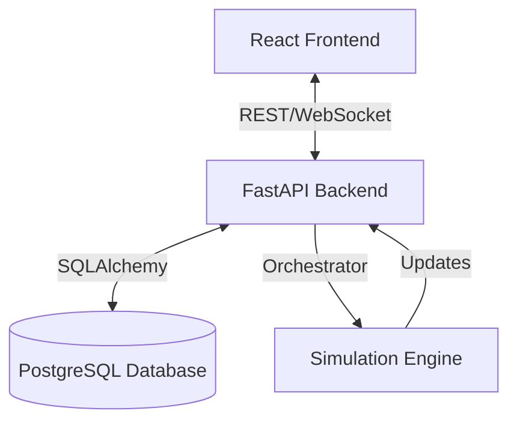

# System Architecture

The NFL Simulation Engine is designed as a modular, full-stack application. It separates concerns between the simulation logic, data management, and user interface.

## High-Level Overview



## Components

### 1. Frontend (`/frontend`)

- **Framework**: React with Vite.
- **Language**: TypeScript.
- **State Management**: React Context / Hooks.
- **Styling**: CSS Modules / Vanilla CSS.
- **Responsibility**: Displays game state, stats, and provides controls for the simulation.

### 2. Backend (`/backend`)

- **Framework**: FastAPI (Python 3.11).
- **Responsibility**:
  - **API Layer**: Exposes REST endpoints and WebSockets.
  - **Orchestrator**: Manages the flow of the simulation (game loop, season progression).
  - **Kernels**: Specialized modules for specific game logic (e.g., `GameKernel`, `SeasonKernel`).
  - **Data Layer**: Handles database interactions using SQLAlchemy.

### 3. Database

- **System**: PostgreSQL 15.
- **ORM**: SQLAlchemy.
- **Migrations**: Alembic.
- **Responsibility**: Persists team data, player stats, game results, and simulation state.

## Key Concepts

### The Simulation Loop

The core of the application is the simulation loop, which runs in the backend. It processes game ticks, resolves plays based on player attributes and RNG, and updates the game state.

### Data Models

- **Team**: Represents an NFL franchise.
- **Player**: Represents an individual player with attributes (speed, strength, skill).
- **Game**: A match between two teams.
- **Season**: A collection of games and standings.

## Directory Structure

```text
/
├── backend/
│   ├── app/
│   │   ├── api/          # API Routes
│   │   ├── core/         # Config and Error Handling
│   │   ├── models/       # Database Models
│   │   ├── orchestrator/ # Simulation Logic
│   │   └── services/     # Business Logic
│   ├── tests/            # Pytest Suite
│   └── Dockerfile
├── frontend/
│   ├── src/
│   │   ├── components/   # React Components
│   │   ├── pages/        # Route Pages
│   │   └── services/     # API Client
│   └── Dockerfile
├── docs/                 # Documentation
└── docker-compose.yml    # Container Orchestration
```

### 4. AI & Integration Layer

- **MCP (Model Context Protocol)**: Standardized protocol for connecting to external AI tools and data sources.

  - **Registry**: Manages connections to MCP servers (`nfl_stats`, `weather`, `sports_news`).
  - **Client**: Handles communication and tool execution.
  - **Cache**: In-memory caching layer (`MCPCache`) to optimize performance and reduce external calls.

- **AI Agents**:

  - **Draft Assistant**: Analyzes team needs and prospect value to suggest draft picks.
  - **GM Agent**: Evaluates trade proposals using player value and external news sentiment.

- **Feedback System**:
  - **Collector**: Frontend component for gathering user feedback on AI recommendations.
  - **Analysis**: Data is stored for future tuning of AI models.
