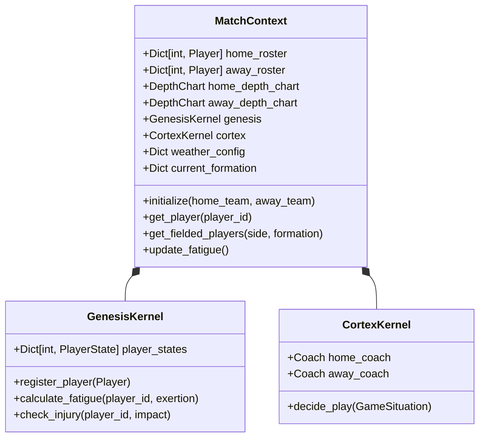

# Match Context Architecture Design

## Overview
The `MatchContext` is the central data structure for a running game simulation. It acts as the "source of truth" for the current state of all players, coaches, and environmental factors during a match. It bridges the gap between the static database models and the dynamic simulation kernels.

## Responsibility
1.  **Data Hydration:** Loads full player and coach objects from the database at the start of a match.
2.  **State Management:** Tracks dynamic state that changes *during* the game (Fatigue, Injury, Morale, Substitutions).
3.  **Kernel Access:** Provides a unified interface for the Orchestrator to access simulation kernels (Genesis, Cortex) configured for this specific match.
4.  **Lookup Efficiency:** Provides O(1) access to player data via ID-based lookups.

## Class Structure



## Data Flow

1.  **Initialization (`start_new_game_session`)**:
    *   `SimulationOrchestrator` fetches `home_team` and `away_team` (with players) from DB.
    *   `MatchContext` is instantiated with these lists.
    *   `MatchContext` converts lists to ID-mapped dictionaries.
    *   `MatchContext` initializes `GenesisKernel` and registers all players (setting initial fatigue to 0).
    *   `MatchContext` initializes `CortexKernel` with team coaches.

2.  **Pre-Play (`_execute_single_play`)**:
    *   `Orchestrator` asks `MatchContext` for `get_fielded_players(side="offense")`.
    *   `MatchContext` checks `DepthChart` and `Substitutions`.
    *   Returns list of `Player` objects.
    *   `Orchestrator` asks `MatchContext.cortex` for a play call.

3.  **Play Resolution (`PlayResolver`)**:
    *   `PlayResolver` receives `Player` objects.
    *   Calculates outcomes using attributes (e.g., `player.speed`).
    *   Reports exertion to `MatchContext.genesis` to update fatigue.

4.  **Post-Play**:
    *   `Orchestrator` updates game state (score, yard line).
    *   `MatchContext` updates any injuries or substitutions based on the play result.

## Detailed Component Specifications

### 1. Roster Management
*   **Current:** Lists `[Player]`.
*   **New:** Dictionaries `{player_id: Player}`.
*   **Benefit:** Fast lookup when processing events by player ID.

### 2. Genesis System (Fatigue & Biology)
*   **Current:** `FatigueRegulator` created in `MatchContext` but logic in `GenesisKernel`.
*   **New:** `GenesisKernel` instance *owned* by `MatchContext`.
*   **State:** `GenesisKernel` holds `player_states` (Fatigue, Health).
*   **Integration:** `MatchContext` delegates fatigue queries to `self.genesis`.

### 3. Cortex System (AI)
*   **Current:** Placeholder.
*   **New:** `CortexKernel` instance *owned* by `MatchContext`.
*   **State:** Holds `Coach` profiles (philosophies, tendencies).
*   **Integration:** `MatchContext` delegates play-calling to `self.cortex`.

### 4. Formation & Substitution
*   **New:** `current_formation` dictionary tracks the active set (e.g., `{"offense": "Shotgun_3WR", "defense": "Nickel"}`).
*   **New:** `substitutions` dictionary tracks temporary overrides (e.g., `{"WR1": backup_player_id}`).

## Interface Specifications

### MatchContext Interface

```python
class MatchContext:
    def __init__(self, home_roster: List[Player], away_roster: List[Player], weather: Dict): ...
    
    def get_player(self, player_id: int) -> Optional[Player]: ...
    
    def get_starters(self, team_side: str, formation: str) -> Dict[str, Player]: ...
    
    def update_fatigue(self, player_ids: List[int], exertion_level: float): ...
```

### GenesisKernel Interface (Updated)

```python
class GenesisKernel:
    def register_player(self, player: Player): ...
    
    def get_fatigue(self, player_id: int) -> float: ...
    
    def apply_exertion(self, player_id: int, amount: float): ...
```

### CortexKernel Interface (Updated)

```python
class CortexKernel:
    def set_coaches(self, home_coach: Coach, away_coach: Coach): ...
    
    def call_play(self, situation: GameSituation, team_side: str) -> PlayCommand: ...
```
