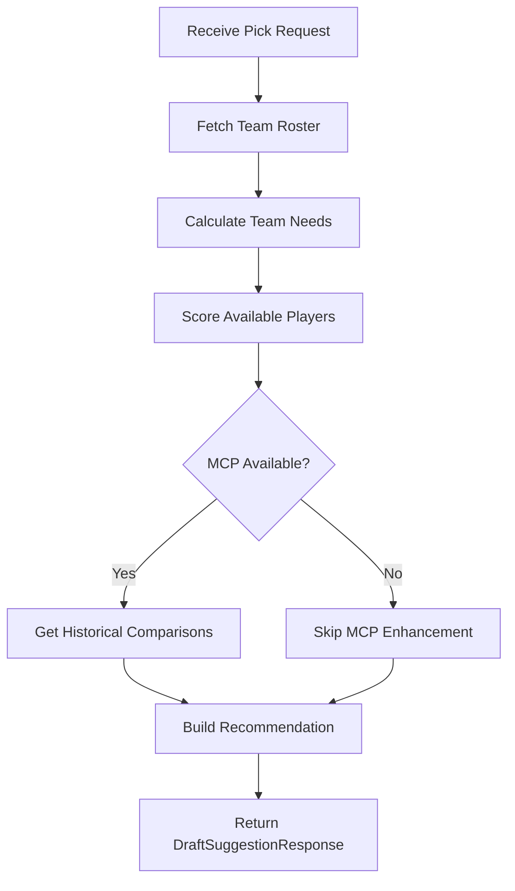

# Draft Assistant Algorithm Specification

**Source:** `backend/app/services/draft_assistant.py`
**Status:** Reverse-Engineered / Current Implementation

## 1. Overview

The Draft Assistant is an AI-powered recommendation system that suggests optimal draft picks based on team needs, player talent, and draft position value. It integrates with external MCP (Model Context Protocol) servers for historical player comparisons.

## 2. Input Parameters

| Parameter                 | Type      | Description                   |
| ------------------------- | --------- | ----------------------------- |
| `team_id`                 | int       | Team making the selection     |
| `pick_number`             | int       | Overall pick position (1-224) |
| `available_players`       | List[int] | Player IDs still on the board |
| `include_historical_data` | bool      | Enable MCP enrichment         |

## 3. Algorithm Flow



## 4. Team Needs Calculation

### 4.1 Target Roster Counts

```python
targets = {
    'QB': 3, 'RB': 4, 'WR': 6, 'TE': 3,
    'OL': 8, 'DL': 6, 'LB': 6, 'CB': 5, 'S': 4, 'K': 1, 'P': 1
}
```

### 4.2 Need Score Formula

```python
if current < target:
    need_score = 1.0 - (current / target)
else:
    need_score = 0.1  # Minimal need

# Quality adjustment
if avg_rating < 70:
    need_score = min(1.0, need_score + 0.2)
```

### 4.3 Priority Classification

| Need Score | Priority Level |
| ---------- | -------------- |
| > 0.7      | CRITICAL       |
| > 0.5      | HIGH           |
| > 0.3      | MODERATE       |
| ≤ 0.3      | LOW            |

## 5. Player Scoring

### 5.1 Draft Value Multiplier

Awards bonus for picking talent early:

| Pick Range | Multiplier |
| ---------- | ---------- |
| 1-10       | 1.3x       |
| 11-32      | 1.2x       |
| 33-64      | 1.1x       |
| 65-100     | 1.0x       |
| 101+       | 0.9x       |

### 5.2 Combined Score Formula

```python
talent_score = overall_rating / 100.0
value_score = talent_score * draft_value_multiplier
combined_score = (talent_score * 0.5) + (need_score * 0.3) + (value_score * 0.2)
```

**Weight Distribution:**

- 50% Talent (raw ability)
- 30% Team Need (roster gaps)
- 20% Draft Value (pick position efficiency)

### 5.3 Draft Value Score (1-10 Scale)

```python
# Expected rating by pick position
expected_rating = {
    1-10: 85,
    11-32: 80,
    33-64: 75,
    65-100: 70,
    101+: 65
}

talent_value = (overall_rating / expected_rating) * 5
need_value = need_score * 5
total_score = min(10.0, talent_value + need_value)
```

## 6. MCP Integration

### 6.1 Historical Comparison

Calls the `nfl_stats` MCP server:

```python
result = await client.call_tool(
    "get_player_career_stats",
    arguments={
        "player_name": player_name,
        "position": position
    }
)
```

**Response Structure:**

```python
HistoricalComparison(
    comparable_player_name: str,
    seasons_active: str,
    career_highlights: str,
    similarity_score: float
)
```

### 6.2 Caching Strategy

- Cache key pattern: `historical_comp_{position}_{overall_rating}`
- Cache namespace: `historical_comparisons`
- Reduces redundant MCP calls for similar archetypes

### 6.3 Fallback Behavior

If MCP is unavailable:

- Returns `mcp_data_used = False`
- Continues with local-only scoring
- Uses generic reasoning templates

## 7. Output Schema

```python
DraftSuggestionResponse(
    recommended_player_id: int,
    player_name: str,
    position: str,
    overall_rating: int,
    reasoning: str,              # Full analysis text
    team_needs: Dict[str, float],
    alternative_picks: List[AlternativePick],  # Top 3 alternatives
    confidence_score: float,
    historical_comparison: Optional[HistoricalComparison],
    roster_gap_analysis: List[RosterGapAnalysis],
    draft_value_score: float,    # 1-10 scale
    mcp_data_used: bool
)
```

## 8. Reasoning Template

```text
**Draft Analysis: {player_name}**
*Position: {position} | Overall: {overall_rating}*

**Team Fit:** {team_fit_analysis}
**Market Value:** {market_value_analysis}
**Historical Context:** {historical_context}
**Recommendation:** {recommendation}
```

## 9. Performance Considerations

- Selects only required columns to avoid lazy loading
- Limits alternatives to top 3 picks
- Uses async operations for MCP calls
- Implements request-level caching
