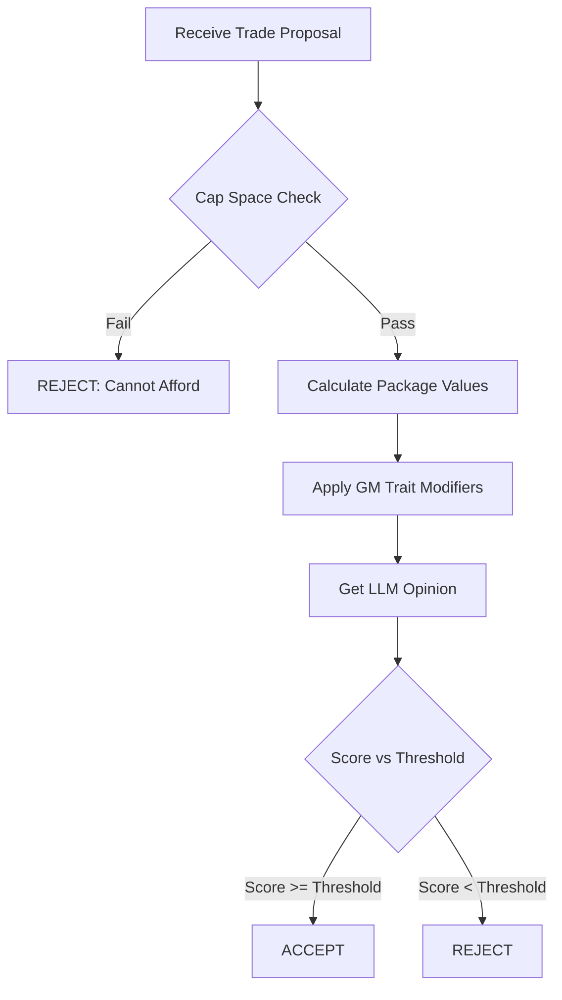

# Trade Evaluation Specification

**Source:** `backend/app/services/gm_agent.py`
**Status:** Reverse-Engineered / Current Implementation

## 1. Overview

The Trade Evaluation system simulates AI General Manager decision-making for trades. It considers player value, draft pick value, team needs, salary cap constraints, and GM personality traits to determine whether to accept or reject trade proposals.

## 2. GM Agent Architecture

### 2.1 Initialization

```python
GMAgent(db: Session, team_id: int, seed: int = None)
```

Each GM has personality traits that influence decisions:

| Trait         | Range                        | Effect                        |
| ------------- | ---------------------------- | ----------------------------- |
| `philosophy`  | WIN_NOW / BALANCED / REBUILD | Trade preference direction    |
| `aggression`  | 0-100                        | Lowers acceptance threshold   |
| `patience`    | 0-100                        | Affects future pick valuation |
| `negotiation` | 0-100                        | Contract offer reduction      |
| `scouting`    | 0-100                        | Player evaluation accuracy    |

## 3. Trade Evaluation Flow



## 4. Value Calculation

### 4.1 Player Value Formula

```python
if overall < 50:
    value = 1.0
else:
    value = ((overall - 50) ** 1.6) / 2.0
```

**Modifiers Applied:**

| Factor        | Condition                      | Multiplier        |
| ------------- | ------------------------------ | ----------------- |
| Young Talent  | age < 24                       | 1.3x              |
| Age Decline   | age > 32                       | 0.7x              |
| Overpaid      | salary > $20M AND overall < 85 | 0.8x              |
| Position Need | When acquiring                 | × need_multiplier |

### 4.2 Draft Pick Value Formula

```python
base_value = 3000 * (0.5 ** (round_num - 1))

# Future pick discount
year_offset = pick_year - 2025
if year_offset > 0:
    discount_rate = 0.8 + (patience / 500)
    pick_value = base_value * (discount_rate ** year_offset)

# Normalize to player-comparable scale
final_value = pick_value / 30.0
```

**Round Values (Base):**

| Round | Base Value |
| ----- | ---------- |
| 1     | 3000       |
| 2     | 1500       |
| 3     | 750        |
| 4     | 375        |
| 5     | 187        |
| 6     | 94         |
| 7     | 47         |

### 4.3 Position Need Multiplier

```python
def get_position_need(position):
    if no_players_at_position:
        return 2.0  # Critical need

    multiplier = 1.0

    # Depth adjustments
    if position == "QB" and count < 2: multiplier += 0.2
    if position in ["WR", "CB"] and count < 5: multiplier += 0.1
    if position in ["OL", "DL"] and count < 7: multiplier += 0.1

    # Quality adjustments
    if avg_rating < 70: multiplier += 0.2
    if avg_rating > 85: multiplier -= 0.1

    return multiplier
```

## 5. GM Personality Impact

### 5.1 Philosophy Modifiers

| Philosophy   | Effect                                                  |
| ------------ | ------------------------------------------------------- |
| **WIN_NOW**  | +5 for acquiring proven players, -5 for draft picks     |
| **REBUILD**  | +10 for acquiring picks, +3 per young player (age < 25) |
| **BALANCED** | No adjustment                                           |

### 5.2 Acceptance Threshold

```python
acceptance_threshold = 0 - (aggression - 50) * 0.5
```

- Aggression 0 = Threshold +25 (very conservative)
- Aggression 50 = Threshold 0 (neutral)
- Aggression 100 = Threshold -25 (accepts slight losses)

## 6. MCP/LLM Enhancement

### 6.1 LLM Trade Opinion

```python
async def _get_llm_trade_opinion(offered, requested):
    stars_offered = [p for p in offered if p.overall > 90]
    if stars_offered:
        return {
            "score_modifier": +5,
            "reasoning": f"Acquiring a superstar like {name} is franchise-altering."
        }
    return {"score_modifier": 0, "reasoning": ""}
```

Currently mocked but structured for future LLM integration.

## 7. Decision Logging

All GM decisions are persisted to `GMDecision` table:

```python
GMDecision(
    gm_id: int,
    decision_type: str,  # TRADE_EVALUATION, TRADE_PROPOSAL, CONTRACT_NEGOTIATION
    outcome: str,        # ACCEPT, REJECT, GENERATED
    details: Dict        # Full context
)
```

## 8. Trade Proposal Generation

The AI can also initiate trades:

1. Identify highest-need position
2. Query other teams for players at that position
3. Calculate target player value
4. Propose roughly equivalent draft pick
5. Log proposal for consistency tracking

## 9. Contract Negotiation

### 9.1 Counter-Offer Formula

```python
skill_factor = 1.2 - (negotiation / 250)  # 0.8 to 1.2
counter_offer = demand * skill_factor * random(0.95, 1.05)
```

**Negotiation Skill Impact:**

- Skill 0 → 1.2x (20% overpay)
- Skill 50 → 1.0x (fair market)
- Skill 100 → 0.8x (20% discount)

### 9.2 Acceptance Criteria

```python
accepted = counter_offer >= (demand * 0.9)  # Within 10% of demand
```

## 10. Output Schema

```python
{
    "decision": "ACCEPT" | "REJECT",
    "score": float,  # Modified value differential
    "reasoning": str  # Explanation of decision factors
}
```
