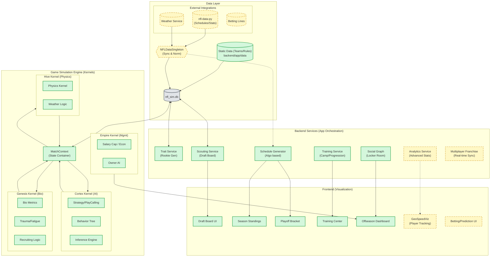

# System Architecture Flowchart

## Legend
*   **Green Box (Solid)**: **Implemented / Concrete**. Code exists and is functional (Verified Dec 2024).
*   **Orange Box (Dashed)**: **Planned / Future**. Stubs, documentation, or gap analysis items only.

## Component Details

### 1. Game Engine (Kernels)
*   **MatchContext**: The central nervous system of a live game. It holds the state of every player, ball position, and clock.
*   **Cortex (AI)**: Handles decision making. Currently uses `Strategy` and `BehaviorTree` modules. *Planned: Deep Learning integration for play prediction.*
*   **Genesis (Bio)**: Manages player physical state. `BioMetrics` and `TraumaCenter` track fatigue and injury probability during a game.
*   **Hive (Physics)**: Determines outcomes based on physical interactions (Weather, Turf).

### 2. Backend Services
*   **TraitService**: Generates rookies and manages player attributes. Currently purely generative. *Planned: Import real prospect data.*
*   **ScoutingService**: Manages the Draft Board and Combine data.
*   **SocialGraph**: Models relationships between players (Chemistry).

### 3. Data Flow
*   **Current**: `ScheduleGenerator` creates a synthetic schedule -> saved to `nfl_sim.db` -> Read by `SeasonStandings`.
*   **Planned**: `NFLDataSingleton` fetches real schedule from `nfl-data-py` -> Updates `nfl_sim.db` -> `ScheduleGenerator` becomes a wrapper for real data.
