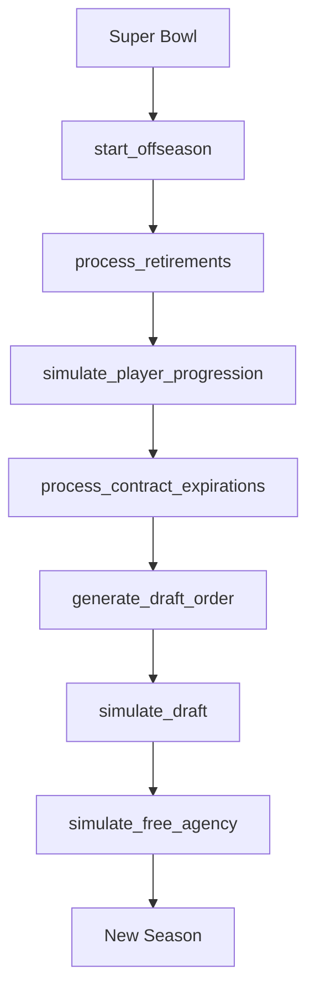
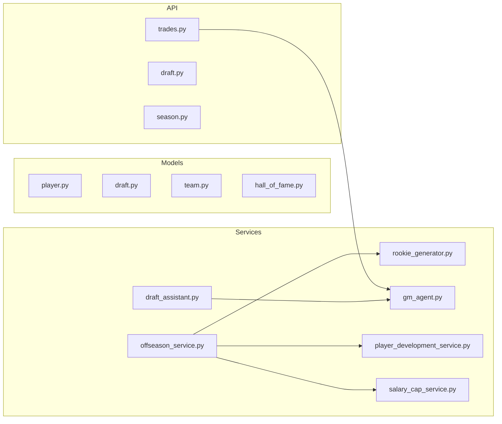

# Draft & Offseason Dossier

**Last Updated:** 2025-12-11
**Status:** Living Document
**Maintainer:** Update when modifying draft/offseason/trade systems.

---

## 1. Offseason Flow



---

## 2. OffseasonService

**File:** [offseason_service.py](file:///c:/Users/cweir/Documents/GitHub/THE%20NFL%20SIM/backend/app/services/offseason_service.py)
**Lines:** 495

| Method                           | Purpose                                 |
| -------------------------------- | --------------------------------------- |
| `start_offseason()`              | Transition from Super Bowl to offseason |
| `simulate_player_progression()`  | Age-based progression/regression        |
| `process_contract_expirations()` | Release expired contracts               |
| `generate_draft_order()`         | 7 rounds based on reverse standings     |
| `make_pick()`                    | Execute a draft pick                    |
| `simulate_next_pick()`           | AI simulates single pick                |
| `simulate_draft()`               | Complete remaining draft                |
| `simulate_free_agency()`         | Fill rosters with FAs                   |
| `process_retirements()`          | Age/rating based retirements            |
| `_check_hall_of_fame()`          | HOF eligibility check                   |

### Progression Formula

```python
# Age-based modifiers
if age < 26: age_mod = +1 to +3
if age 26-29: age_mod = 0
if age >= 30: age_mod = -1 to -3

# Development trait multipliers
SUPERSTAR: 1.5x, STAR: 1.25x, NORMAL: 1.0x

# Coach influence
+1 bonus if coach rating > 80
```

---

## 3. Draft System

### 3.1 RookieGenerator

**File:** [rookie_generator.py](file:///c:/Users/cweir/Documents/GitHub/THE%20NFL%20SIM/backend/app/services/rookie_generator.py)
**Lines:** 131

#### Position Weights (Draft Class Distribution)

| Position   | Weight | % of Class |
| ---------- | ------ | ---------- |
| WR         | 35     | 13.5%      |
| LB         | 30     | 11.5%      |
| CB         | 30     | 11.5%      |
| OT         | 25     | 9.6%       |
| RB         | 20     | 7.7%       |
| OG/DE/DT/S | 20     | 7.7% each  |
| QB/TE      | 15     | 5.8% each  |
| C          | 10     | 3.8%       |
| K/P        | 5      | 1.9% each  |

#### Rookie Generation

```python
# Overall rating distribution
mean_rating = 68  # Base
if MCP league_avgs passing_yards > 3000: mean += 2  # Strong class

overall = gauss(mean_rating, std=8)
overall = clamp(50, 99)

# Combine metrics
forty_yard_dash = gauss(4.6, 0.2)
bench_press = randint(15, 35)
vertical_jump = gauss(32.0, 4.0)

# Genesis data (hidden)
power_clean_max = randint(285, 385)
gps_speed_max = uniform(18.0, 23.5)
s2_cognition_score = randint(45, 99)
medical_flags = 10% chance of prior injury
```

### 3.2 DraftAssistant

**File:** [draft_assistant.py](file:///c:/Users/cweir/Documents/GitHub/THE%20NFL%20SIM/backend/app/services/draft_assistant.py)
**Lines:** 433

AI-powered draft recommendations using MCP for historical comparisons.

| Method                           | Purpose                   |
| -------------------------------- | ------------------------- |
| `suggest_pick()`                 | Recommend player for team |
| `_calculate_needs_and_gaps()`    | Roster gap analysis       |
| `_calculate_draft_value_score()` | Pick value (1-10)         |
| `_get_historical_comparison()`   | MCP-based player comps    |
| `_build_reasoning_from_data()`   | Generate explanation      |

---

## 4. Trade System

### 4.1 GMAgent

**File:** [gm_agent.py](file:///c:/Users/cweir/Documents/GitHub/THE%20NFL%20SIM/backend/app/services/gm_agent.py)
**Lines:** 281

| Method                       | Purpose                             |
| ---------------------------- | ----------------------------------- |
| `evaluate_trade()`           | Score trade proposal (-100 to +100) |
| `generate_trade_proposal()`  | AI proposes trades                  |
| `negotiate_contract()`       | FA contract negotiation             |
| `_calculate_package_value()` | Player + pick values                |
| `_get_position_need()`       | Need multiplier                     |
| `_apply_gm_traits()`         | GM personality adjustments          |

#### Trade Evaluation Formula

```python
# Base calculation
offered_value = sum(player.overall * position_multiplier)
             + sum(pick_value)  # From draft value chart

requested_value = same calculation

# Adjustments
need_multiplier = 1.0-1.5 based on roster gaps
gm_traits = risk_tolerance, rebuild_mode, win_now

# Final score
score = (offered_value * need_multiplier) - requested_value
score = _apply_gm_traits(score)

# Decision thresholds
ACCEPT: score >= 10
CONSIDER: score >= -5
REJECT: score < -5
```

### 4.2 Trade API

**File:** [trades.py](file:///c:/Users/cweir/Documents/GitHub/THE%20NFL%20SIM/backend/app/api/endpoints/trades.py)
**Lines:** ~400

| Endpoint           | Method | Purpose                 |
| ------------------ | ------ | ----------------------- |
| `/trades/evaluate` | POST   | Evaluate trade fairness |
| `/trades/offer`    | POST   | Submit formal offer     |
| `/trades/pending`  | GET    | List pending offers     |
| `/trades/respond`  | POST   | Accept/reject offer     |
| `/trades/counter`  | POST   | Counter-offer           |
| `/trades/players`  | GET    | Get tradeable players   |

---

## 5. Free Agency

### Signing Logic

```python
# Priority: Teams with cap space and position need
for position_need in team_needs:
    eligible_fas = [p for p in free_agents if p.position == need]
    eligible_fas.sort(by=overall_rating)

    # Offer contract
    years = 1-4 based on age
    salary = overall * multiplier

    if salary <= cap_space:
        sign_player()
```

---

## 6. Hall of Fame

**Eligibility Criteria:**

- Career games > 150
- Career passing yards > 40,000 OR
- Career rushing yards > 10,000 OR
- Career receiving yards > 12,000 OR
- Career sacks > 100 OR
- Career interceptions > 50

---

## 7. File Linkage Map



---

## 8. Multi-Lens Scouting Fog of War & Dynamic Draft AI (SUBSYS-001)

**Files:**
- [`backend/app/services/draft/scouting_lens_service.py`](file:///c:/Users/cweir/OneDrive/Desktop/DevOps/THE-NFL-SIM-V2/backend/app/services/draft/scouting_lens_service.py)
- [`backend/app/schemas/deep_dive.py`](file:///c:/Users/cweir/OneDrive/Desktop/DevOps/THE-NFL-SIM-V2/backend/app/schemas/deep_dive.py)
- [`frontend/src/components/offseason/ScoutIntelligenceLens.tsx`](file:///c:/Users/cweir/OneDrive/Desktop/DevOps/THE-NFL-SIM-V2/frontend/src/components/offseason/ScoutIntelligenceLens.tsx)

### Evaluation Lenses:
1. `CONSENSUS`: National media consensus draft board composite.
2. `FILM_TRADITIONALIST`: Weights S2 cognition scores, technique, and pre-snap processing.
3. `ANALYTICS_METRICS`: Weights peak GPS tracking speed (mph) and burst acceleration index.
4. `REGIONAL_SCOUT`: High-variance subjective evaluations with upside conviction bias.

### Dynamic Trade Urgency Formula:
```python
urgency_score = 0.5 + (0.5 * (target_prospect_tier / 4.0)) + (0.3 * position_run_pressure)
should_trade_up = urgency_score >= 0.70
```

---

## 9. Changelog

| Date       | Change                   | Files |
| ---------- | ------------------------ | ----- |
| 2025-12-11 | Initial dossier creation | N/A   |
| 2026-08-22 | SUBSYS-001 Multi-Lens Scouting & Dynamic Draft AI | `scouting_lens_service.py`, `ScoutIntelligenceLens.tsx` |

