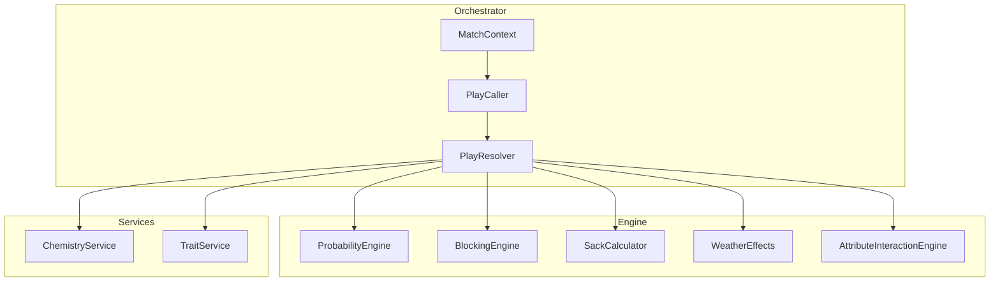
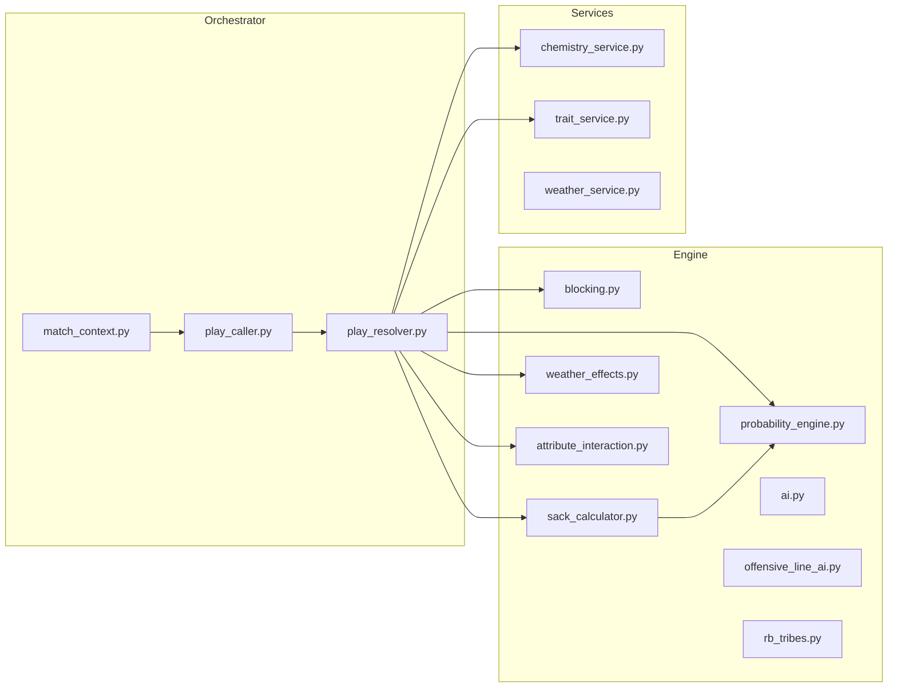

# Game Engine Dossier

**Last Updated:** 2025-12-11
**Status:** Living Document
**Maintainer:** When updating game engine files, update this dossier.

---

## 1. Architecture Overview



---

## 2. Core Components

### 2.1 PlayResolver

**File:** [play_resolver.py](file:///c:/Users/cweir/Documents/GitHub/THE%20NFL%20SIM/backend/app/orchestrator/play_resolver.py)
**Lines:** 742 | **Purpose:** Central play execution

| Method                            | Purpose           | Key Logic                                 |
| --------------------------------- | ----------------- | ----------------------------------------- |
| `resolve_play()`                  | Entry point       | Routes to pass/run/special teams          |
| `_resolve_pass_play()`            | Pass execution    | Line battle → Sack check → Target → Catch |
| `_resolve_run_play()`             | Run execution     | Blocking → Gap analysis → Yards           |
| `_resolve_line_battle()`          | OL vs DL          | Per-matchup blocking resolution           |
| `_apply_pass_play_interactions()` | Attribute bonuses | Uses AttributeInteractionEngine           |
| `_apply_run_play_interactions()`  | Run bonuses       | RB tribes, blocking chemistry             |

### 2.2 ProbabilityEngine

**File:** [probability_engine.py](file:///c:/Users/cweir/Documents/GitHub/THE%20NFL%20SIM/backend/app/engine/probability_engine.py)
**Lines:** 140 | **Purpose:** Attribute-driven probability calculations

| Method                       | Return           | Usage                                             |
| ---------------------------- | ---------------- | ------------------------------------------------- |
| `compare_attributes()`       | ±0.30 modifier   | Generic comparison                                |
| `compare_speed()`            | -0.10 to +0.20   | Separation bonus                                  |
| `compare_skill()`            | ±0.25            | Route vs Coverage                                 |
| `calculate_success_chance()` | 0.05-0.95        | Final probability                                 |
| `resolve_tiered_outcome()`   | OutcomeType enum | CRITICAL_SUCCESS/SUCCESS/FAILURE/CRITICAL_FAILURE |

#### OutcomeType Enum

```python
CRITICAL_FAILURE = "critical_failure"  # Bottom 10% of fail range
FAILURE = "failure"
SUCCESS = "success"
CRITICAL_SUCCESS = "critical_success"  # Top 10% of success range
```

### 2.3 BlockingEngine

**File:** [blocking.py](file:///c:/Users/cweir/Documents/GitHub/THE%20NFL%20SIM/backend/app/engine/blocking.py)
**Lines:** 56 | **Purpose:** OL vs DL matchup resolution

| Method                 | Returns        | Thresholds                                      |
| ---------------------- | -------------- | ----------------------------------------------- |
| `resolve_pass_block()` | BlockingResult | WIN (>80), STALEMATE (>40), LOSS (>10), PANCAKE |
| `resolve_run_block()`  | dict           | `{displacement, gap_integrity}`                 |

### 2.4 SackCalculator

**File:** [sack_calculator.py](file:///c:/Users/cweir/Documents/GitHub/THE%20NFL%20SIM/backend/app/engine/sack_calculator.py)
**Lines:** 105 | **Purpose:** Sack probability with QB pocket presence

**Formula:**

```python
initial_prob = 0.15 * pressure_level
presence_factor = qb.pocket_presence * 0.005  # 99 PP → 49.5% reduction
chemistry_factor = ol_chemistry_bonus * 0.3
escape_factor = (qb.speed + qb.agility + qb.acceleration) / 300 * 0.15
final_prob = initial_prob * (1 - presence_factor) * (1 - chemistry_factor) * (1 - escape_factor)
```

### 2.5 WeatherEffects

**File:** [weather_effects.py](file:///c:/Users/cweir/Documents/GitHub/THE%20NFL%20SIM/backend/app/engine/weather_effects.py)
**Lines:** 89 | **Purpose:** Environmental modifiers

| Method                              | Factors                             | Range   |
| ----------------------------------- | ----------------------------------- | ------- |
| `get_passing_modifiers()`           | Wind >10mph, Rain/Snow, Cold <32°F  | 0.5-1.0 |
| `get_kicking_modifiers()`           | Wind >5mph, Cold <40°F              | 0.4-1.0 |
| `get_fumble_probability_modifier()` | Wet/Muddy/Snowy field, Cold <20°F   | 1.0-1.5 |
| `get_fatigue_multiplier()`          | Heat >85°F, Humidity >70%, Mud/Snow | 1.0-2.0 |

---

## 3. Play Calling AI

### 3.1 PlayCaller

**File:** [play_caller.py](file:///c:/Users/cweir/Documents/GitHub/THE%20NFL%20SIM/backend/app/orchestrator/play_caller.py)
**Lines:** 173 | **Purpose:** Situation-aware play selection

#### Constructor Parameters

| Parameter        | Range   | Effect                                  |
| ---------------- | ------- | --------------------------------------- |
| `aggression`     | 0.0-1.0 | 4th down decisions, deep pass frequency |
| `run_pass_ratio` | 0.0-1.0 | Base tendency (0.45 default = 55% pass) |

#### Situational Adjustments

```python
# 3rd Down
if distance > 6: pass_prob += 0.3   # 3rd and long
if distance <= 2: pass_prob -= 0.2  # 3rd and short

# Catch-up / Kill clock
if losing by 8+ with <10 min: pass_prob += 0.3
if winning by 8+ with <10 min: pass_prob -= 0.3
```

#### 4th Down Logic

1. **Desperation**: Losing late → Go for it
2. **FG Range**: ≤38 yards to goal → Kick
3. **Aggressive Coach**: >0.7 aggression + ≤2 yards → Go for it
4. **Goal Line**: <3 yards to goal → Go for it
5. **Default**: Punt

---

## 4. Attribute Interaction Engine

**File:** [attribute_interaction.py](file:///c:/Users/cweir/Documents/GitHub/THE%20NFL%20SIM/backend/app/engine/attribute_interaction.py)
**Lines:** 38,457 | **Purpose:** Inter-positional attribute effects

### Sample Interactions

| Interaction                | Formula                            | Context             |
| -------------------------- | ---------------------------------- | ------------------- |
| `qb_arm_vs_wind`           | `(arm_strength - 70) / 100 * 0.15` | Deep passes in wind |
| `rb_vision_vs_linebackers` | `vision / 100 * awareness_penalty` | Gap identification  |
| `wr_route_vs_man`          | `route_running - man_coverage`     | Separation          |
| `ol_chemistry_boost`       | Uses ChemistryService              | Team cohesion       |

---

## 5. File Linkage Map



---

## 6. Changelog

| Date       | Change                   | Files |
| ---------- | ------------------------ | ----- |
| 2025-12-11 | Initial dossier creation | N/A   |
