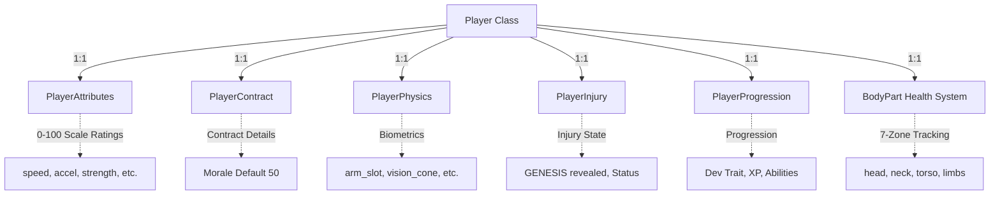
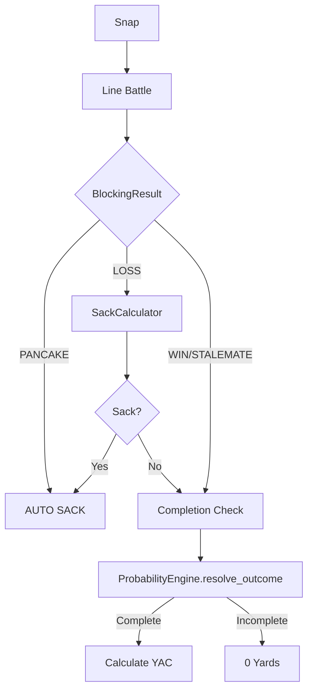

# NFL SIM Engine: Player System Master Dossier

> **Living Document** - This comprehensive reference is updated whenever player-related systems change.
>
> **Last Updated:** 2026-08-15
> **Maintainer:** Auto-updated via workflow `/update-player-dossier`

---

## Document Purpose

This is the **single source of truth** for all player mechanics in the NFL SIM Engine. It maps:

- All 14 player positions (Offense, Defense, Special Teams)
- 60+ player attributes across 6 satellite models
- Cross-attribute interaction engine with 12+ matchup types
- Play resolution triggers and deterministic RNG
- Progression, regression, age curves, and Skyrim-style use-based XP
- 50+ position-specific training drills with coaching philosophy modifiers
- 25+ traits with rarity tiers, 7 RPG abilities, and 7 player archetypes
- Contracts, free agency market valuation, and salary cap mechanics
- Multi-body-part injury system with GENESIS biometrics
- Rookie generation with hidden scouting data

**When to Update This Document:**

- Adding/modifying attributes in `player.py` or `player_attributes.py`
- Changing play resolution logic in `play_resolver.py`
- Updating training drills in `drills.py`
- Modifying progression curves in `offseason_service.py` or `age_curves.py`
- Adding new traits to `trait.py` or `trait_service.py`
- Changing salary cap logic in `salary_cap_service.py` or `free_agency_engine.py`
- Adding abilities in `abilities.py` or archetypes in `player_archetypes.py`

---

## Table of Contents

1. [Core Player Model](#1-core-player-model)
2. [Offense Positions](#2-offense-positions)
3. [Defense Positions](#3-defense-positions)
4. [Special Teams Positions](#4-special-teams-positions)
5. [Play Triggers & Attribute Interaction Engine](#5-play-triggers--attribute-interaction-engine)
6. [Progression & Regression](#6-progression--regression)
7. [Training System](#7-training-system)
8. [Trait System](#8-trait-system)
9. [RPG Abilities & Player Archetypes](#9-rpg-abilities--player-archetypes)
10. [Contracts & Salary Cap](#10-contracts--salary-cap)
11. [Injury System & GENESIS Biometrics](#11-injury-system--genesis-biometrics)
12. [Rookie Generation](#12-rookie-generation)
13. [File Linkage Map](#13-file-linkage-map)
14. [Changelog](#14-changelog)

---

## 1. Core Player Model

**Source:** `player.py`, `player_attributes.py`, `player_contract.py`, `player_physics.py`, `player_injury.py`, `player_progression.py`, `medical.py`

The NFL SIM Engine uses a decomposed `Player` model architecture, leveraging SQLAlchemy 2.0 `Mapped` syntax for type-safe relational mapping. 

The core `Player` class utilizes 14 distinct positions defined by the `Position` enum:
`QB`, `RB`, `WR`, `TE`, `OT`, `OG`, `C`, `DE`, `DT`, `LB`, `CB`, `S`, `K`, `P`

The player state is further managed by specific enumerations:
- **InjuryStatus:** `ACTIVE`, `QUESTIONABLE`, `DOUBTFUL`, `OUT`, `IR`
- **DevelopmentTrait:** `NORMAL`, `STAR`, `SUPERSTAR`, `XFACTOR`

### Satellite Model Architecture

The `Player` model contains 6 satellite models connected via 1:1 relationships (all `lazy="joined"` for eager loading):

1. **PlayerAttributes** (`player_attributes.py`) - Contains all skill ratings & combine metrics.
2. **PlayerContract** (`player_contract.py`) - Tracks contract details, morale, and retirement status.
3. **PlayerPhysics** (`player_physics.py`) - Captures biomechanical data such as `arm_slot`, `release_point_height`, `vision_cone_angle`, `break_tackle_threshold`.
4. **PlayerInjury** (`player_injury.py`) - Stores injury state, medical flags, and the `genesis_revealed` property.
5. **PlayerProgression** (`player_progression.py`) - Handles progression state including `xp`, `level`, `skill_points`, `development_trait`, `abilities` (JSON), and `attribute_xp` (JSON).
6. **BodyPart** (`medical.py`) - Implements 7-zone body health tracking (`head`, `neck`, `torso`, `right_arm`, `left_arm`, `right_leg`, `left_leg`) plus `general_wear`.

### Global Attributes

All players share a set of core attributes (stored in `PlayerAttributes`, on a 0-100 scale):
- `speed`
- `acceleration`
- `strength`
- `agility`
- `awareness`
- `stamina` (default 80)
- `injury_resistance` (default 80)

**Note:** `morale` is tracked on the `PlayerContract` model (default 50).

### Development Traits and XP Multipliers

A player's progression rate is significantly influenced by their development trait:
- **NORMAL:** 1.0x XP multiplier
- **STAR:** 1.25x XP multiplier
- **SUPERSTAR:** 1.5x XP multiplier
- **XFACTOR:** 2.0x XP multiplier

### Satellite Architecture Diagram



---

## 2. Offense Positions

### Quarterback (QB)

#### Attributes & Physics
- **Attributes** (`PlayerAttributes`): `throw_power`, `throw_accuracy_short`, `throw_accuracy_mid`, `throw_accuracy_deep`, `pocket_presence`, `quick_release`, `scramble_willingness`, `throw_on_run`
- **PlayerPhysics:** `arm_slot` (default "OverTop"), `release_point_height` (default 6.0)
- **Position Physics** (`QuarterbackPhysics`):
  - **ThrowType:** `SCREEN`, `SLANT`, `BULLET`, `TOUCH`, `DEEP`, `LOB`, `THROW_AWAY`
  - **PocketState:** `CLEAN`, `CLOSING`, `COLLAPSED`, `SCRAMBLING`
  - **QBPhysicsConfig:** 
    - `clean_pocket_threshold` = 2500ms
    - `collapse_threshold` = 3500ms
    - `min_throw_power` = 25yd
    - `max_throw_power` = 70yd
    - `release_time` = 300ms
    - `base_accuracy_radius` = 0.5yd
    - `fov` = 120°
    - `read_time` = 250ms/read
  - **QBState Tracks:** `pocket_state`, `time_in_pocket`, `pressure_level` (0-100), `current_read`, `reads_available` (default 4)

#### Play Triggers (`play_resolver.py`)
1. **Line Battle** → Initiates via `BlockingEngine.resolve_pass_block()`
2. **If PANCAKE:** Results in Automatic SACK
3. **If LOSS:** Passed to `SackCalculator.calculate_sack_probability()`
   - `pocket_presence` rating reduces sack chance by `(rating * 0.005)`
   - OL chemistry bonus reduces chance by `(bonus * 0.02)`
   - Mobility escape factor = `(speed + accel + agility) / 300 * 0.25`
   - Base sack probability = `0.065` (reflects 6.5% NFL average)
   - Final probability is clamped to `[0.02, 0.25]`
4. **If not sacked:** Defers to `ProbabilityEngine.calculate_success_chance()`
5. Weather and Fatigue penalties are subsequently applied.

#### Progression & Training
**Use-Based XP Events:**
- Passing TD: +50 XP
- Passing Yards: +0.5 XP / yd
- Interception: -20 XP
- `PASS_COMPLETION_SHORT`: `throw_accuracy_short` +3, `awareness` +1
- `PASS_COMPLETION_MID`: `throw_accuracy_mid` +4, `awareness` +1
- `PASS_COMPLETION_DEEP`: `throw_accuracy_deep` +5, `throw_power` +2, `awareness` +1
- `PASS_UNDER_PRESSURE`: `throw_on_the_run` +4, `pocket_presence` +3
- `TOUCHDOWN_PASS`: `awareness` +3, `throw_accuracy_mid` +2

**QB Training Drills:**

| Drill | Target Stat | XP Mult | Injury Risk | Category |
| :--- | :--- | :--- | :--- | :--- |
| Footwork Mechanics | throw_on_run | 1.2x | 2% | TECHNIQUE |
| Weighted Ball Throws | throw_power | 1.5x | 15% | STRENGTH |
| 7-on-7 Passing | throw_accuracy_mid | 1.3x | 3% | TECHNIQUE |
| Film Study | play_recognition | 0.8x | 0% | MENTAL |
| Pocket Presence Drill | pocket_presence | 1.4x | 4% | TECHNIQUE |
| Two-Minute Drill | clutch | 1.6x | 5% | TECHNIQUE |
| Arm Care | throw_power | 0.5x | 1% | RECOVERY |

---

### Running Back (RB)

#### Attributes & Physics
- **Attributes** (`PlayerAttributes`): `patience`, `pass_pro_rating`, `juke_efficiency`
- **PlayerPhysics:** `vision_cone_angle` (default 45°), `break_tackle_threshold` (default 100.0)
- **Position Physics** (`RunningBackPhysics`):
  - **CutType:** `JUKE`, `SPIN`, `HURDLE`, `STIFF_ARM`, `TRUCK`, `DEAD_LEG`
  - **ContactType:** `WRAP_UP`, `DIVING`, `SHOULDER`, `HEAD_ON`, `ARM_TACKLE`, `PURSUIT`
  - **RBPhysicsConfig:** `base_balance`=50, `contact_balance_loss`=20, `juke_speed_retention`=0.8, `spin_speed_retention`=0.6, `hurdle_success_threshold`=0.7, `max_yac`=15yd
  - **RBState Tracks:** `balance` (0-100), `contacts_absorbed`, `yards_after_contact`, `cut_cooldown` (500ms)

#### RB Three Tribes (`rb_tribes.py`)
Provides fundamental baseline stats based on archetype:

| Tribe | Base Yards | Std Dev | Breakaway Mult | Fumble Mult |
| :--- | :--- | :--- | :--- | :--- |
| Power | 4.0 | 1.5 | 0.8x | 0.8x |
| Scat | 3.0 | 2.5 | 1.5x | 1.2x |
| Balanced | 3.5 | 2.0 | 1.0x | 1.0x |

#### Play Triggers
1. Identify running back and primary defender.
2. Calculate and apply fatigue penalty.
3. Apply RB Tribe modifiers.
4. Calculate `power_diff` = `ProbabilityEngine.compare_strength(rb.strength, defender.tackle)`.
5. If play is an outside run, apply `speed_diff`.
6. Roll normal distribution outcome with established variance.
7. Perform Breakaway check (tiered outcome evaluation).
8. Perform Fumble check (base 1%, modified by tribe, fatigue, and defender `hit_power`).

#### Progression & Training
**Use-Based XP Events:**
- `RUSHING_GAIN`: `agility` +1, `acceleration` +1
- `RUSHING_TD`: `agility` +3, `awareness` +2
- `BROKEN_TACKLE`: `break_tackle` +4, `trucking` +2, `strength` +1
- `BIG_RUN`: `speed` +3, `acceleration` +2, `agility` +2

**RB Training Drills:**

| Drill | Target Stat | XP Mult | Injury Risk | Category |
| :--- | :--- | :--- | :--- | :--- |
| Cone Agility | agility | 1.2x | 3% | SPEED |
| Sled Push | trucking | 1.4x | 8% | STRENGTH |
| Ball Security Gauntlet | ball_carrier_vision | 1.1x | 2% | TECHNIQUE |
| Vision Drills | ball_carrier_vision | 1.0x | 1% | MENTAL |
| Zone Blocking Reads | awareness | 1.3x | 4% | TECHNIQUE |
| Pass Protection | pass_block | 1.2x | 6% | TECHNIQUE |
| Route Running - RB | route_running | 1.1x | 2% | TECHNIQUE |

---

### Wide Receiver & Tight End (WR/TE)

#### Attributes & Physics
- **Attributes** (`PlayerAttributes`): `catching`, `route_running`, `release`, `blocking_tenacity`
- **Position Physics** (`WideReceiverPhysics`):
  - **RouteType:** `SLANT`, `OUT`, `IN`, `CORNER`, `POST`, `GO`, `CURL`, `COMEBACK`, `SCREEN`, `WHEEL`
  - **CatchType:** `WIDE_OPEN`, `CONTESTED`, `IN_TRAFFIC`, `DIVING`, `JUMPING`, `SIDELINE`, `RAC`
  - **WRPhysicsConfig:** `open_separation`=3.0yd, `contested_threshold`=1.5yd, `optimal_timing_window`=250ms, `break_speed_retention`=0.7
  - **WRState Tracks:** `route_type`, `route_depth`, `route_phase` (0=stem, 1=break, 2=separation), `separation`, `hands_ready`

#### Play Triggers
1. Set `target` = `_get_player_by_position(offense, "WR")`
2. `matchup_factor` = `compare_skill(target.route_running, defender.man_coverage)`
3. `speed_diff` = `compare_speed(target.speed, defender.speed)`
4. If **Possession Receiver** trait is active: apply `+15` `contested_catch_bonus`.
5. YAC bonus calculated as: `speed_diff * 50.0`

#### Progression & Training
**Use-Based XP Events:**
- `RECEPTION`: `catching` +2, `route_running` +2
- `CONTESTED_CATCH`: `catching` +4, `catch_in_traffic` +5, `awareness` +2
- `YAC_GAIN`: `speed` +2, `juke_move` +2, `stiff_arm` +1
- `RECEIVING_TD`: `catching` +3, `route_running` +2

**WR/TE Training Drills:**

| Drill | Target Stat | XP Mult | Injury Risk | Category |
| :--- | :--- | :--- | :--- | :--- |
| Route Tree Mastery | route_running | 1.3x | 2% | TECHNIQUE |
| Contested Catch | spectacular_catch | 1.4x | 5% | TECHNIQUE |
| Timing Routes | medium_route_running | 1.2x | 3% | TECHNIQUE |
| Release vs Press | release | 1.3x | 4% | TECHNIQUE |
| Deep Ball Tracking | deep_route_running | 1.5x | 3% | TECHNIQUE |
| YAC Drills | juke_move | 1.2x | 4% | SPEED |
| Hand Fighting | release | 1.1x | 6% | TECHNIQUE |

---

### Offensive Line (OT, OG, C)

#### Attributes & Physics
- **Attributes** (`PlayerAttributes`): `pass_block`, `run_block`, `pull_speed`, `anchor`, `discipline`
- **Position Physics** (`OffensiveLinePhysics`):
  - **BlockType:** `PASS_SET`, `DRIVE_BLOCK`, `REACH_BLOCK`, `DOUBLE_TEAM`, `PULL`, `CUT_BLOCK`, `CHIP`
  - **GapResponsibility:** `A_GAP_LEFT/RIGHT`, `B_GAP_LEFT/RIGHT`, `C_GAP_LEFT/RIGHT`, `EDGE`
  - **OLPhysicsConfig:** `engagement_range`=1.5yd, `win_threshold`=0.5, `loss_threshold`=-0.5, `holding_threshold`=-0.9, `ideal_pocket_width`=4.0yd, `ideal_pocket_depth`=5.0yd
  - **BlockerState Tracks:** `block_type`, `win_score` (-1 to 1), `hand_placement` (inside=good), `holding_risk` (>0.9=penalty)

#### Chemistry System & Blocking Resolution
- **OL Chemistry:** Tracked in `chemistry_service.py` & `player_game_starts.py`. Consecutive starts together grant a chemistry bonus. Used in `SackCalculator`: `chem_factor = ol_chemistry_bonus * 0.02` (each point reduces sacks by 2%).
- **Blocking Resolution** (`blocking.py`):
  - `resolve_pass_block(rng, ol_rating, dl_rating, technique)`
  - `leverage = ol_rating - dl_rating + technique_bonus` (e.g., KickStep=+5)
  - `roll = rng.randint(0, 100) + leverage`
  - Results: **>80** WIN, **>40** STALEMATE, **>10** LOSS, **<=10** PANCAKE

#### Progression & Training
**Use-Based XP Events:**
- `PANCAKE_BLOCK`: `run_block` +5, `strength` +3
- `SUSTAINED_BLOCK`: `run_block` +2, `pass_block` +2
- `PASS_PRO_WIN`: `pass_block` +4, `awareness` +1

**OL Training Drills:**

| Drill | Target Stat | XP Mult | Injury Risk | Category |
| :--- | :--- | :--- | :--- | :--- |
| Pass Protection Sets | pass_block | 1.3x | 4% | TECHNIQUE |
| Run Blocking - Drive | run_block | 1.4x | 6% | TECHNIQUE |
| Pull and Lead | run_block_finesse | 1.2x | 5% | SPEED |
| Combo Blocks | awareness | 1.3x | 4% | MENTAL |
| Anchor Drill | pass_block_power | 1.5x | 8% | STRENGTH |
| Hand Placement | pass_block_finesse | 1.1x | 2% | TECHNIQUE |
| Communication Drills | awareness | 0.8x | 0% | MENTAL |

---

## 3. Defense Positions

### Defensive Line (DE, DT)

#### Attributes & Physics
- **Attributes** (`PlayerAttributes`): `pass_rush_power`, `pass_rush_finesse`, `block_shed`, `tackle`, `hit_power`, `first_step`, `gap_integrity`
- **Position Physics** (`PassRushPhysics`):
  - **RushMove:** `BULL_RUSH`, `SPEED_RUSH`, `SPIN_MOVE`, `RIP_MOVE`, `SWIM_MOVE`, `CLUB_SWIPE`, `STUNT`
  - **BlockerStance:** `SET`, `LUNGING`, `RECOVERING`
  - **PassRushConfig:** `typical_pass_time`=2500ms, `first_step_window`=200ms, `speed_rush_angle`=45°, `bull_rush_threshold`=0.3
  - **PassRushRep Tracks:** `leverage_score` (-1 to 1), `pressure_generated`, `sack_achieved`

#### Trait Interactions
- **Intimidation Trait** (`play_resolver.py` L347-353): Following a sack, checks trait. If active: `intimidation_factor = 1.5`, which applies a debuff to the Offensive Line via the EventBus for subsequent plays.

#### Progression & Training
**Use-Based XP Events:**
- Sack: +100 XP
- TFL: +30 XP
- `SACK`: `tackle` +3, `pass_rush` +5, `power_moves` +2, `finesse_moves` +2
- `QB_HIT`: `pass_rush` +3, `pursuit` +2
- `TACKLE_FOR_LOSS`: `tackle` +4, `pursuit` +3, `play_recognition` +2

**DL Training Drills:**

| Drill | Target Stat | XP Mult | Injury Risk | Category |
| :--- | :--- | :--- | :--- | :--- |
| Pass Rush Moves | finesse_moves | 1.4x | 5% | TECHNIQUE |
| Gap Control | block_shedding | 1.3x | 6% | TECHNIQUE |
| Get-Off Drills | acceleration | 1.2x | 3% | SPEED |
| Hand Combat | power_moves | 1.4x | 7% | STRENGTH |
| Pursuit Angles | pursuit | 1.0x | 2% | MENTAL |
| Bull Rush Power | power_moves | 1.6x | 10% | STRENGTH |

---

### Linebacker (LB)

#### Attributes & Trait Modifiers
- **Attributes** (`PlayerAttributes`): `play_recognition`, `man_coverage`, `zone_coverage`, `tackle`, `hit_power`, `run_fit`, `blitz_timing`, `coverage_disguise`
- **Green Dot (Defensive Captain) Trait** (`trait_service.py`):
  - Requires `TEAM_DESIGNATION`
  - **Effects:** `team_play_recognition_boost` +5, `blown_assignment_reduction` 20%, `blitz_effectiveness_boost` 15%, `team_coverage_boost` +5
  - Handled by `TraitEffectResolver`: applies Play Recognition boost dynamically across the defense.

#### Progression & Training
**LB Training Drills:**

| Drill | Target Stat | XP Mult | Injury Risk | Category |
| :--- | :--- | :--- | :--- | :--- |
| Coverage Drops | zone_coverage | 1.2x | 2% | TECHNIQUE |
| Blitz Timing | acceleration | 1.4x | 5% | SPEED |
| Shed and Tackle | block_shedding | 1.3x | 6% | TECHNIQUE |
| Read and React | play_recognition | 1.0x | 1% | MENTAL |
| Man Coverage - RB/TE | man_coverage | 1.3x | 3% | TECHNIQUE |
| Downhill Run Fits | tackling | 1.5x | 8% | STRENGTH |

---

### Defensive Back (CB, S)

#### Attributes & Physics
- **Attributes** (`PlayerAttributes`): `man_coverage`, `zone_coverage`, `press`, `ball_tracking`, `catching`, `run_support`
- **Position Physics** (`DefensiveBackPhysics`):
  - **CoverageType:** `MAN_PRESS`, `MAN_OFF`, `ZONE_DEEP`, `ZONE_FLAT`, `ZONE_HOOK`, `SPY`
  - **BreakType:** `SLANT`, `OUT`, `IN`, `CORNER`, `POST`, `CURL`, `COMEBACK`
  - **DBPhysicsConfig:** `jam_window`=5.0yd, `jam_success_base`=0.5, `break_recognition_min`=50ms, `break_recognition_max`=300ms, `int_window`=200ms
  - **DBState Tracks:** `coverage_type`, `receiver_distance`, `facing_receiver`, `hip_turned`, `break_recognized`

#### Play Triggers
- `defender` = `_get_player_by_position(defense, "CB")`
- `matchup_factor` = `compare_skill(target.route_running, defender.man_coverage)`
- If `matchup_factor` < 0: defender successfully wins coverage interaction.

#### Progression & Training
**Use-Based XP Events:**
- `PASS_DEFENDED`: `man_coverage` +3, `zone_coverage` +3, `awareness` +2
- `INTERCEPTION`: `catching` +4, `zone_coverage` +5, `man_coverage` +3, `awareness` +3
- `TACKLE`: `tackle` +2, `pursuit` +1

**DB Training Drills:**

| Drill | Target Stat | XP Mult | Injury Risk | Category |
| :--- | :--- | :--- | :--- | :--- |
| Backpedal Technique | man_coverage | 1.2x | 3% | TECHNIQUE |
| Ball Tracking | play_ball | 1.3x | 2% | TECHNIQUE |
| Press Coverage | press | 1.4x | 5% | TECHNIQUE |
| Zone Coverage Drops | zone_coverage | 1.1x | 1% | TECHNIQUE |
| Tackling - Open Field | tackling | 1.3x | 8% | STRENGTH |
| Hip Turn Drill | agility | 1.2x | 4% | SPEED |

---

## 4. Special Teams Positions

### Attributes & Traits
- **Attributes** (`PlayerAttributes`): `kick_power`, `kick_accuracy`, `hang_time`, `coffin_corner`, `return_vision`
- **Clutch Kicker (K):** `clutch_accuracy_boost` +15, `ice_the_kicker_immunity` 1.0, `clutch_kick_power_boost` +5
- **Coffin Corner (P):** `punt_accuracy_boost` +15, `backspin_chance` 30%, `touchback_reduction` 20%

### Progression & Training
**Use-Based XP Events:**
- `FIELD_GOAL_MADE`: `kick_power` +2, `kick_accuracy` +3
- `LONG_FG_MADE`: `kick_power` +5, `kick_accuracy` +4
- `PUNT_INSIDE_20`: `kick_power` +2, `kick_accuracy` +3

**ST Training Drills:**

| Drill | Target Stat | XP Mult | Injury Risk | Category |
| :--- | :--- | :--- | :--- | :--- |
| Field Goal Timing | kick_accuracy | 1.3x | 2% | TECHNIQUE |
| Leg Strength | kick_power | 1.4x | 8% | STRENGTH |
| Punt Hang Time | kick_power | 1.2x | 3% | TECHNIQUE |
| Kickoff Coverage | speed | 1.2x | 10% | SPEED |
| Punt Protection | awareness | 1.0x | 4% | MENTAL |
| Return Blocking | run_block | 1.1x | 6% | TECHNIQUE |

---

## 5. Play Triggers & Attribute Interaction Engine

### Pass Play Flow



### Sack Calculator Formula (`sack_calculator.py`)
- `BASE_SACK_PROBABILITY` = 0.065
- `presence_factor` = `pocket_presence * 0.005`
- `chemistry_factor` = `ol_chemistry_bonus * 0.02`
- `escape_factor` = `(speed + accel + agility) / 300 * 0.25`
- `initial_prob` = `BASE_SACK_PROBABILITY * (1 + pressure_level)`
- `final_prob` = `initial_prob * (1 - presence_factor) * (1 - chemistry_factor) * (1 - escape_factor)`
- Outcome clamped to `[0.02, 0.25]`

### Attribute Interaction Engine (`attribute_interaction.py`)
The engine handles 12 primary interaction types defining individual matchups on the field:

| Interaction | Type | Attacker Attr | Defender Attr | Importance | Key Situational Modifiers |
| :--- | :--- | :--- | :--- | :--- | :--- |
| Hard Count vs Discipline | PRE_SNAP | awareness (QB) | discipline (DL/LB) | 1.5 | HOME +10%, LOUD_STADIUM +15%, PLAYOFF -10% |
| Coverage Disguise vs Pre-Snap Read | PRE_SNAP | coverage_disguise (LB/S) | awareness (QB) | 1.3 | 3RD_DOWN +20%, RED_ZONE +15% |
| WR Release vs CB Press | LOS | release (WR/TE) | press (CB/S) | 1.4 | RAIN -15%, MAN_COVERAGE +20% |
| TE Block-Release vs LB Coverage | LOS | blocking_tenacity (TE) | play_recognition (LB) | 1.2 | PLAY_ACTION +25% |
| OL Anchor vs DL First Step | PASS_PROT | first_step (DE/DT) | anchor (OL) | 1.8 | 4TH_QUARTER +10%, LONG_DRIVE +15% |
| OL Discipline vs DL Inside Counter | PASS_PROT | pass_rush_finesse (DE/DT) | discipline (OL) | 1.5 | 3RD_AND_LONG +15%, QUICK_PASS -20% |
| RB Chip vs LB Blitz Timing | PASS_PROT | blitz_timing (LB) | pass_pro_rating (RB/TE) | 1.3 | MAX_PROTECT +25% |
| Route Running vs Man Coverage | ROUTE_COV | route_running (WR/TE/RB) | man_coverage (CB/S/LB) | 1.6 | CONCEPT_DEEP +10%, PRESS -15% |
| DB Ball Tracking vs QB Throw Placement | ROUTE_COV | throw_accuracy_mid (QB) | ball_tracking (CB/S) | 1.4 | SUN_IN_EYES +15%, WIND +20% |
| RB Patience vs LB Run Fit | RUN_GAME | patience (RB) | run_fit (LB) | 1.5 | INSIDE_RUN +10%, GOAL_LINE -20% |
| OL Pull Speed vs DL Gap Integrity | RUN_GAME | pull_speed (OG/C) | gap_integrity (DE/DT/LB) | 1.4 | POWER_SCHEME +15%, TRAP +20% |
| Ball Carrier Juke vs Tackle | BALL_CARRIER | juke_efficiency (RB/WR) | tackle (CB/S/LB) | 1.3 | OPEN_FIELD +20%, FATIGUE_HIGH +15% |
| Field General Leadership | LEADERSHIP | awareness (QB) | awareness (LB) | 1.0 | HOME +10%, LEAD +15% |

**Interaction Outcomes:** `DOMINANT_WIN` (>15 diff), `WIN` (5-15), `SLIGHT_WIN` (1-5), `NEUTRAL` (0), `SLIGHT_LOSS`, `LOSS`, `DOMINANT_LOSS`

### Randomness Sources

| System | RNG Usage | Source File |
| :--- | :--- | :--- |
| DeterministicRNG | Seeded for reproducibility | `deterministic_rng.py` |
| rng.randint() | Yard gains, injury occurrences | Various |
| rng.gauss() | Bell curve outcomes | `rookie_generator.py` |
| rng.random() | Binary checks (0.0-1.0) | Various |
| Normal Distribution | Run play yards variation | `play_resolver.py` |

---

## 6. Progression & Regression

### Career Phases
| Phase | Condition | Description |
| :--- | :--- | :--- |
| ROOKIE | age < peak_start | Rapid growth (1.25x learning rate) |
| PRIME | peak_start <= age <= peak_end | Peak performance (1.0x learning rate) |
| POST_PRIME | peak_end < age <= peak_end + 2 | Mental growth, physical plateau (0.8x rate) |
| DECLINE | age > peak_end + 2 | Physical regression (0.5x rate) |

### Peak Ages by Position (`age_curves.py` POSITION_CURVES)
| Position | Peak Start | Peak End | Decline Rate/Year |
| :--- | :--- | :--- | :--- |
| QB | 26 | 30 | 0.02 |
| RB | 23 | 27 | 0.06 |
| WR | 25 | 29 | 0.04 |
| TE | 26 | 30 | 0.03 |
| OT/OG | 26 | 32 | 0.03 |
| C | 26 | 32 | 0.02 |
| DE | 25 | 29 | 0.04 |
| DT | 25 | 30 | 0.035 |
| LB | 25 | 29 | 0.04 |
| CB | 24 | 28 | 0.05 |
| S | 25 | 30 | 0.035 |
| K/P | 28 | 38 | 0.015 |

### Age Modifier Formula (`age_curves.py`)
- **Rising (age < peak_start):**
  - `growth_per_year = 0.15 / (peak_start - 20)`
  - `modifier = min(1.0, 0.85 + (age - 21) * growth_per_year)`
- **Peak:**
  - `modifier = 1.0`
- **Decline (age > peak_end):**
  - `decline = (age - peak_end) * decline_rate`
  - `modifier = max(0.70, 1.0 - decline)`

### Annual Offseason Progression (`offseason_service.py`)
**Age-Based Rating Change:**
- `age < peak_start - 2`: randint(+1, +3)
- `age < peak_start`: randint(0, +2)
- `age <= decline_age`: randint(-1, +1)
- `age <= decline_age + 3`: randint(-2, 0)
- `age > decline_age + 3`: randint(-3, -1)

**Experience Modifier:**
- `experience <= 2`: randint(0, +2)
- `experience >= 8`: randint(-2, 0)
- otherwise: 0

**Development Trait Modifier:**
`NORMAL`: 0, `STAR`: +1, `SUPERSTAR`: +2, `XFACTOR`: +3

**Coach Impact:**
- `development_rating > 70`: +1
- `development_rating < 30`: -1

**Final Calculation:**
`total = age_change + exp_modifier + variance(-1, +1) + dev_trait_mod + coach_mod`
`new_rating = clamp(old + total, 40, 99)`

### Physical Attribute Decay (`progression.py`)
- **Physical** (speed, acceleration, agility, jumping): Evaluated against `loss_chance = 0.5 * decline_factor`. Drop by `randint(1, 1 + years_past_prime)`
- **Power** (strength, throw_power): `loss_chance * 0.6`. Drop by `randint(1, 2)`
- **Mental** (awareness, play_recognition): Preserved (no regression)
- **RB Exception:** `decline_factor` is multiplied by `1.5x` when `years_past_prime > 1`

### Skyrim-Style Use-Based Progression (`use_based_progression.py`)
The engine features dynamic in-game skill progression. Successful actions award XP to relevant attributes. Higher difficulty actions award more XP, scaling with age and dev trait multipliers. 
**Exponential XP Threshold:** `XP_Threshold = int(50 * 1.15^current_rating)`

### Experience Bonus Formula (`age_curves.py`)
- **QB:** `min(1.15, 1.0 + years * 0.015)`
- **OL/TE:** `min(1.10, 1.0 + years * 0.012)`
- **S/LB:** `min(1.08, 1.0 + years * 0.010)`
- **Others:** `min(1.05, 1.0 + years * 0.008)`

---

## 7. Training System

### Drill Structure (`drills.py`)
```python
class Drill(BaseModel):
    name: str
    target_stat: str
    secondary_stats: List[str]
    injury_risk: float  # 0.0-1.0
    xp_multiplier: float  # 0.1-3.0
    fatigue_cost: float  # 0.0-50.0
    season_filter: List[SeasonPhase]  # OFFSEASON/PRESEASON/REGULAR
    category: DrillCategory  # STRENGTH/SPEED/TECHNIQUE/MENTAL/ENDURANCE/RECOVERY
```

### Weekly Training Effects (`player_development_service.py`)
- **Base XP / week:** 50
- **Modifiers:** Dev Trait (1.0x-2.0x), Coach Bonus (-0.5 to +0.5), Age (0.8x if 30+, 1.2x if <24)
- **Level Up:** 1000 XP = 1 Skill Point → Auto-upgrades a random relevant stat by +1.

### Coaching Philosophy System (`coaching_philosophy.py`)
| Style | XP Mult | Injury Mult | Fatigue Mult | Recovery Mult | Young (<26) | Veteran (>30) | Chemistry |
| :--- | :--- | :--- | :--- | :--- | :--- | :--- | :--- |
| Volume | 0.90x | 0.70x | 1.30x | 0.90x | +15% | -10% | +0.05 |
| Intensity | 1.50x | 2.00x | 1.50x | 0.80x | 0% | +20% | -0.10 |
| Smart | 1.10x | 0.80x | 0.90x | 1.20x | +10% | +10% | 0.00 |
| Old School | 1.20x | 1.50x | 1.20x | 0.85x | -10% | +15% | +0.10 |

**Seasonal Intensity Caps:** `offseason`=0.85, `preseason`=0.70, `regular`=0.50, `playoffs`=0.30, `bye_week`=0.20

### Coach Expertise & Tiers (`coach_expertise.py`)
- **Tiers:** `LEGEND` (1.5x, score>=270), `ELITE` (1.3x, score>=230), `VETERAN` (1.1x, score>=180), `DEVELOPING` (1.0x, score>=140), `ROOKIE` (0.9x)
- **Archetypes:** `GENERALIST`, `QB_GURU`, `OL_MASTER`, `RUN_GAME_SPECIALIST`, `RECEIVING_COACH`, `DB_WHISPERER`, `PASS_RUSH_SPECIALIST`, `LB_GURU`, `SPECIAL_TEAMS_ACE`
- **Total Bonus Formula:** `min(Tier_Mult * (1.0 + max(off_scheme, def_scheme) + archetype_bonus), 2.0)`

### Coaching Tree & Staff Progression (`coaching_tree.py`)
- **Roles:** `HEAD_COACH`, `OFFENSIVE_COORD`, `DEFENSIVE_COORD`, `SPECIAL_TEAMS`, `POSITION_COACH`
- **Skills:** `max_rank`=3. Each rank = +5% multiplier
- **Progression:** 1000 XP (scales 10% per level) = 1 Level = 1 Skill Point.
- Staff bonuses stack additively across coordinators and the HC.

### Training Camp (`camp.py`)
- **Drill Types:** `OKLAHOMA`, `7_ON_7`, `INDIVIDUAL`, `FILM_STUDY`, `SCRIMMAGE`, `CONDITIONING`
- **Intensity Levels:** `WALKTHROUGH` (0.5x), `STANDARD` (1.0x), `FULL_PADS` (1.5x)
- **7-Day Schedule Format:**
  - Day 1: Acclimation
  - Day 2: Install
  - Day 3: Pads
  - Day 4: Recovery
  - Day 5: Specifics
  - Day 6: Final Scrimmage
  - Day 7: Rest

---

## 8. Trait System

**Source:** `trait.py` (model), `trait_service.py` (catalog), `trait_effects.py` (resolver)

## Database Model (trait.py):

Trait model (table 'traits'):
- id, name (String(100), unique), description (Text), effect_type (TraitEffectType), effect_value (Float), position_groups (JSON), tier (TraitTier), is_badge (Bool, default True), icon_url (String(255))

PlayerTrait model (table 'player_traits'):
- player_id (FK player.id, PK), trait_id (FK traits.id, PK), acquired_date (date, default today), source (TraitSource)

Enums:
- TraitEffectType: BOOST, SITUATIONAL, PASSIVE
- TraitTier: GOLD (max 1/player), SILVER (max 2/player), BRONZE (max 3/player), COMMON (no cap)
- TraitSource: DRAFT, DEVELOPMENT, MILESTONE

## Rarity System (trait_service.py):
- LEGENDARY: 1-5 players league-wide
- RARE: 5-15 players league-wide
- UNCOMMON: ~50-100 players
- COMMON: No cap

Legendary trait soft caps:
- ragknow: 3, rocket_arm: 5, elite_speed: 10, generational: 2

## Complete Trait Catalog (25 traits from trait_service.py TRAIT_CATALOG):

Format each in a table grouped by position group:

### QB Traits (3)
| Key | Name | Tier | Acquisition | Effects |
| :--- | :--- | :--- | :--- | :--- |
| field_general | Field General | ELITE | AUTO_UNLOCK (awareness>=90, exp>=3) | team_awareness_boost +5, team_penalty_reduction 15%, audible_effectiveness 20% |
| gunslinger | Gunslinger | GOLD | STAT_THRESHOLD | throw_power_boost +5, release_time_reduction 10%, interception_risk_increase 5% |
| escape_artist | Escape Artist | GOLD | STAT_THRESHOLD | scramble_speed_boost +10, agility_boost +10, sack_break_chance 15% |

### RB Traits (3)
| Key | Name | Tier | Acquisition | Effects |
| :--- | :--- | :--- | :--- | :--- |
| chip_block_specialist | Chip Block Specialist | SILVER | COACHING_UNLOCK | chip_block_success 40%, pass_protection_boost +10, route_timing_after_chip 15% |
| bruiser | Bruiser | GOLD | STAT_THRESHOLD | trucking_boost +10, stiff_arm_boost +10, fall_forward_chance 25% |
| satellite | Satellite | SILVER | STAT_THRESHOLD | route_running_boost +10, catching_boost +5, mismatch_bonus_vs_lb 15% |

### WR/TE Traits (5)
| Key | Name | Tier | Acquisition | Effects |
| :--- | :--- | :--- | :--- | :--- |
| possession_receiver | Possession Receiver | GOLD | STAT_THRESHOLD (100+ receptions, <5% drop rate) | catching_in_traffic +15, drop_rate_reduction 30%, fumble_after_catch_reduction 25% |
| deep_threat | Deep Threat | GOLD | STAT_THRESHOLD | deep_route_speed +5, deep_ball_tracking +10, deep_route_separation 10% |
| route_technician | Route Technician | GOLD | STAT_THRESHOLD | route_running +10, cut_separation 15%, release +5 |
| yac_monster | YAC Monster | SILVER | STAT_THRESHOLD | break_tackle +10, elusiveness +10, juke_move +5 |
| red_zone_threat | Red Zone Threat | GOLD | STAT_THRESHOLD | red_zone_catching +10, red_zone_contested_catch +10, endzone_awareness +10 |

### OL Traits (2)
| Key | Name | Tier | Acquisition | Effects |
| :--- | :--- | :--- | :--- | :--- |
| anchor | Anchor | GOLD | STAT_THRESHOLD | strength_blocking +10, balance +10, pancake_resistance 50% |
| pull_specialist | Pull Specialist | SILVER | COACHING_UNLOCK | pull_speed +10, blocking_in_space +10, pull_awareness +5 |

### DL Traits (2)
| Key | Name | Tier | Acquisition | Effects |
| :--- | :--- | :--- | :--- | :--- |
| edge_threat | Edge Threat | GOLD | STAT_THRESHOLD | acceleration +10, finesse_move +5, pressure_chance 15% |
| run_stuffer | Run Stuffer | GOLD | STAT_THRESHOLD | block_shedding_vs_run +10, run_strength +5, run_tackle +5 |

### LB Traits (3)
| Key | Name | Tier | Acquisition | Effects |
| :--- | :--- | :--- | :--- | :--- |
| green_dot | Green Dot (Defensive Captain) | ELITE | TEAM_DESIGNATION | team_play_recognition +5, blown_assignment_reduction 20%, blitz_effectiveness 15%, team_coverage +5 |
| coverage_linebacker | Coverage Linebacker | GOLD | STAT_THRESHOLD | zone_coverage +10, man_coverage +5, reaction_time_reduction 10% |
| enforcer | Enforcer | SILVER | STAT_THRESHOLD | hit_power +10, forced_fumble_chance 15%, fatigue_damage_to_carrier 20% |

### DB Traits (3)
| Key | Name | Tier | Acquisition | Effects |
| :--- | :--- | :--- | :--- | :--- |
| pick_artist | Pick Artist | GOLD | STAT_THRESHOLD (5+ INTs) | interception_rate 1.5x, catch_radius +30%, ball_tracking +15 |
| shutdown_corner | Shutdown Corner | ELITE | STAT_THRESHOLD | man_coverage +10, press +10, receiver_separation_reduction 20% |
| zone_hawk | Zone Hawk | GOLD | STAT_THRESHOLD | zone_coverage +10, zone_reaction_time 15%, zone_int_chance 10% |

### Special Teams Traits (2)
| Key | Name | Tier | Acquisition | Effects |
| :--- | :--- | :--- | :--- | :--- |
| clutch_kicker | Clutch Kicker | SILVER | STAT_THRESHOLD | clutch_accuracy +15, ice_kicker_immunity 100%, clutch_kick_power +5 |
| coffin_corner | Coffin Corner | SILVER | STAT_THRESHOLD | punt_accuracy +15, backspin_chance 30%, touchback_reduction 20% |

### General Traits (2)
| Key | Name | Tier | Acquisition | Effects |
| :--- | :--- | :--- | :--- | :--- |
| iron_man | Iron Man | SILVER | PROGRESSION | fatigue_recovery 20%, injury_resistance 15%, stamina_drain_reduction 10% |
| mentor | Mentor | SILVER | PROGRESSION (8+ years exp) | position_group_xp 10%, regression_delay +1 year |

### Legendary Traits (4)
| Key | Name | Tier | Acquisition | Effects | League cap |
| :--- | :--- | :--- | :--- | :--- | :--- |
| ragknow | Ragknow | ELITE | RPG_UNLOCK (5+ years exp) | ignore_injury_penalties, max_playable_severity 7, block_injury_degradation, recovery_time 0.90x | 3 |
| rocket_arm | Rocket Arm | ELITE | STAT_THRESHOLD (throw_power>=95) | throw_power +8, deep_throw_accuracy +5, off_platform_throw 20%, tight_window_velocity 15% | 5 |
| elite_speed | Elite Speed | ELITE | STAT_THRESHOLD (speed>=96) | speed +3, breakaway_chance 15%, closing_speed 20% | 10 |
| generational | Generational Talent | ELITE | DRAFT only | all_ratings +3, development_speed 25%, clutch_performance 15%, highlight_play 10% | 2 |

## Trait Acquisition Sources:
| Source | Trigger |
| :--- | :--- |
| DRAFT | Assigned at generation |
| DEVELOPMENT | XP milestones |
| MILESTONE | Career achievements |
| AUTO_UNLOCK | Stat thresholds met |
| STAT_THRESHOLD | Specific rating requirements |
| COACHING_UNLOCK | Coach-initiated |
| TEAM_DESIGNATION | Team assigns (e.g., Green Dot) |
| RPG_UNLOCK | RPG event or rare draft |
| PROGRESSION | Career experience milestones |

## TraitEffectResolver (trait_effects.py):
Document the key resolver methods:
- `resolve_team_wide_traits`: Scans offense/defense for team-wide buffs
- `apply_field_general_boost`: +5 awareness to all offensive players, -15% penalty rate
- `apply_green_dot_effects`: +5 play_recognition to all defenders, -20% blown coverage
- `apply_pick_artist_effects`: 1.5x interception chance, +30% catch radius when ball_in_air
- `apply_chip_block_effects`: +10 pass_pro_rating, 15% edge_rusher_slow_effect
- `apply_possession_receiver_effects`: +15 catch_in_traffic on 3rd/4th down, -30% drop chance
- `cleanup_boosts`: Removes temporary boosts after play resolution

---

## 9. RPG Abilities & Player Archetypes

## RPG Abilities System (abilities.py)

Abilities are distinct from Traits:
- Traits: Earned through stats/progression, always passive
- Abilities: Purchased with XP at level thresholds, active mechanics

AbilityStatus: LOCKED, AVAILABLE, UNLOCKED

### Ability Catalog (7 abilities):

| Key | Name | Positions | Level Req | XP Cost | Key Effects |
| :--- | :--- | :--- | :--- | :--- | :--- |
| pre_snap_diagnostician | Pre-Snap Diagnostician | QB | 10 | 5000 | awareness_boost +15, pre_snap_read_accuracy 90%, audible_time_reduction 2s |
| audible_master | Audible Master | QB | 8 | 3000 | audible_time 2s (vs 8s normal), false_start_immunity, hot_route_count 2 |
| red_zone_assassin | Red Zone Assassin | QB | 12 | 6000 | red_zone_accuracy +10, red_zone_td_chance +15%, red_zone_int_reduction 20% |
| vision_master | Vision Master | RB | 8 | 3500 | vision_boost +15, pre_snap_hole_detection, backfield_evasion 20% |
| route_tree_genius | Route Tree Genius | WR/TE | 10 | 4500 | route_running +10, route_adjustment (on-the-fly), option_route_success 25% |
| film_junkie | Film Junkie | LB/S/CB | 8 | 3000 | play_prediction_accuracy 75%, play_recognition +10, reaction_time 10% |
| coverage_chameleon | Coverage Chameleon | CB/S | 10 | 5000 | man_coverage +8, zone_coverage +8, coverage_switch_reaction 15% |

Eligibility: `check_ability_eligibility()` validates position, level, XP.

## Player Archetypes (player_archetypes.py)

7 Core Archetypes:

| Archetype | Display Name | Icon | Primary Positions | Stat Bonuses | Dev Rate | Special Abilities |
| :--- | :--- | :--- | :--- | :--- | :--- | :--- |
| FIELD_GENERAL | The Field General | 🎖️ | QB | awareness +5, play_recognition +8, leadership +10, poise +5, acc_short +3, acc_mid +3 | 1.1x | pre_snap_read, protection_audible, morale_boost |
| SORCERER | The Sorcerer | 🪄 | QB | throw_power +5, acc_deep +5, throw_on_run +8, agility +5, elusiveness +5 | 1.0x | off_platform_magic, scramble_wizard |
| ALPHA_DOG | The Alpha Dog | 🐺 | WR/CB | catching +5, aggressive_catch +10, press +5, man_coverage +5, confidence +10 | 1.05x | demoralize, contested_catch_king, alpha_swagger |
| WEAPON | The Weapon | 🗡️ | RB/WR | catching +5, route_running +5, return_ability +10, versatility +15 | 1.15x | flex_position, mismatch_hunter, trick_play_master |
| FREAK | The Freak | 💪 | EDGE/LB | speed +5, acceleration +5, strength +5, jumping +8, block_shedding +5 | 1.25x | combine_warrior, splash_play_threat, wear_down |
| TECHNICIAN | The Technician | 🔧 | OL/DL | technique +10, pass_block +5, run_block +5, awareness +5, finesse +5, power +5 | 1.0x | zero_false_starts, perfect_set, ironclad_hands |
| WORKHORSE | The Workhorse | 🐎 | RB | stamina +10, carrying +5, toughness +8, break_tackle +5 | 0.9x | heavy_load, fourth_quarter_back, iron_legs |

Archetype Detection: Score based on stat_bonuses * 0.5 per matched stat. Position weight 1.0 (primary) or 0.7 (secondary). Threshold: score >= 150.
Archetype Evolution: Allowed after 3+ years in league.

## Archetype Effects Engine (archetype_effects.py)
4 combat archetypes with game impact:
| Archetype | Thresholds | Effects |
| :--- | :--- | :--- |
| Field General | acc_short>=90, acc_mid>=90, QB | +20% 3rd down conversion, audible_unlock |
| Trailer Park Terminator | strength>=85, tackle>=80, DT + Run Stopper/Blue Collar DNA | 1.5x intimidation |
| Speed Merchant | speed>=90, accel>=88, any pos | +25% breakaway chance |
| Trench Warlord | strength>=85, awareness>=80, OL/DL | 1.3x intimidation, +10% run game |

---

## 10. Contracts & Salary Cap

**Source:** `player_contract.py`, `salary_cap_service.py`, `free_agency_engine.py`

## PlayerContract Model:
Fields: contract_years (Int, default 1), contract_salary (Int, default 1,000,000), is_rookie (Bool), is_retired (Bool), retirement_year (Int, nullable), legacy_score (Int, default 0), morale (Int, default 50)

## Salary Cap Breakdown (salary_cap_service.py):
Position groups: QB, RB, WR/TE, OL (OT/OG/C), DL (DE/DT), LB, DB (CB/S), ST (K/P)

## Free Agency Market Valuation (free_agency_engine.py):

Constants:
- TOP_MARKET_CAP = $55,000,000
- MIN_SALARY = $950,000

Position Value Multipliers:
| Position | Multiplier |
| :--- | :--- |
| QB | 1.00 |
| DE | 0.82 |
| WR | 0.78 |
| OT | 0.72 |
| CB | 0.70 |
| DT | 0.65 |
| LB | 0.58 |
| S | 0.54 |
| OG | 0.50 |
| TE | 0.48 |
| C | 0.45 |
| RB | 0.42 |
| K | 0.18 |
| P | 0.16 |

Market Value Formula:
1. norm_rating = (ovr - 60) / 39.0
2. base_salary_scale = norm_rating^2.3 (non-linear)
3. max_pos_salary = TOP_MARKET_CAP * pos_mult
4. raw_aav = MIN_SALARY + floor(base_salary_scale * (max_pos - MIN_SALARY))
5. Age modifiers: <=25 (1.08x), 26-28 (1.00x), 29-31 (0.86x), 32+ (max(0.55, 0.75 - (age-32)*0.10))
6. Contract years by age/OVR brackets (1-4 years)
7. Guaranteed %: OVR>=88 (70%+), 80-87 (50%+), 72-79 (30%+), <72 (10%)
8. If age>=32: guaranteed * 0.75

Player Tiers:
- ELITE: OVR >= 86
- STARTER: OVR >= 78
- ROTATIONAL: OVR >= 71
- DEPTH: OVR < 71

Free Agency Waves:
- Wave 1: OVR >= 84 (interest threshold 35.0)
- Wave 2: 74 <= OVR < 84 (threshold 25.0)
- Wave 3: OVR < 74 (threshold 15.0)

Bid mechanics:
- bid_aav = max(MIN_SALARY, min(floor(aav * (1.0 + (interest - 50.0) * 0.004)), team_cap_space))
- bid_score = interest + uniform(-5.0, 5.0)
- Highest bid_score wins

Signing Grade:
- paid/market ratio: <=0.85 + need → A+, <=0.95 → A, <=1.10 → B+, <=1.20 → B, <=1.35 → C+, <=1.50 → C, else → D

Team Interest Score (0-100):
- Positional Need: 0-45 pts
- Cap Feasibility: 0-35 pts
- Player Quality: 0-20 pts
- Prestige bonus: (prestige - 50) * 0.1

## Value Factors:
| Factor | Effect |
| :--- | :--- |
| Overall Rating | Direct correlation (non-linear) |
| Age | Decreases past prime |
| Dev Trait | XFACTOR > SUPERSTAR > STAR > NORMAL |
| Injury History | Decreases value |

## Rookie Contract:
contract_years = 4, contract_salary = 500,000 + (overall * 10,000)

---

## 11. Injury System & GENESIS Biometrics

**Source:** `injury_system.py`, `medical.py`, `genesis/biometrics.py`, `genesis/cognition.py`, `genesis/fatigue.py`

## Injury Severity Scale:
| Severity Roll | Severity | Example Types | Status | Recovery |
| :--- | :--- | :--- | :--- | :--- |
| < 0.60 (60%) | 1-3 | Minor Sprain, Contusion, Muscle Strain | QUESTIONABLE | 1-3 weeks |
| 0.60-0.95 (35%) | 4-7 | Moderate Sprain, Muscle Tear, Hyperextension, Partial Ligament, Stress Fracture, High Ankle | OUT | 2-10 weeks |
| >= 0.95 (5%) | 8-10 | ACL Tear, Complete Ligament, Fracture, Spinal | IR | 8-52 weeks |

## Play Injury Probability Formula:
P(injury) = base * play_type_mult * position_mult * age_mult * durability_mult * fatigue_mult * medical_mult
Clamped to [0.0, 0.95]

## Recovery Calculation:
base_weeks by severity range → modified by:
- Age Factor: +10% per year over 30
- Durability: injury_resistance 100→0.5x, 50→1.0x, 0→1.5x
- Medical Staff: rating 100→0.8x, 50→1.0x, 0→1.2x

## Setback System:
- Setback probability = injury_recurrence_risk * risk_modifier
- On setback: +1-4 weeks, recurrence_risk += 0.05
- Medical rating reduces: risk_modifier = 1.0 - (medical_rating / 200.0)

## Permanent Damage:
Triggered if severity >= 7 (or 5 if age > 32)
Chance = (severity - threshold + 1) * 20%
Effect: Drop 1-3 physical stats by 1-3 points each, injury_resistance permanently -5

## Ragknow Trait Integration:
- ignore_injury_penalties: plays through severity 1-7 with no performance loss
- block_injury_degradation: no permanent attribute loss while injured
- recovery_time * RAGKNOW_RECOVERY_MULTIPLIER (0.90x, 10% faster)
- Escalation chance reduced by 50%
- League-wide cap: 3 players

## Toughness System:
- Base = injury_resistance (default 50)
- Age >= 30: base += min(10, (age - 28) * 2)
- Clamped [0, 100]

## Body Part Health Tracking (BodyPart in medical.py):
7 body zones, each 0-100 (100 = perfect health):
- head_health, neck_health, torso_health, right_arm_health, left_arm_health, right_leg_health, left_leg_health
- general_wear (temporary fatigue/bruising, recovers weekly)

InjuryEvent model tracks: player_id, season_id, week, injury_name, body_part, severity, duration_weeks, is_career_ending, treatment_chosen (REST/SURGERY/PLAY_THROUGH)

## GENESIS Biometrics (genesis/biometrics.py):
BiometricProfile:
- hand_size (inches, avg 9.5), wingspan (inches, avg 76.0), arm_length (inches, avg 32.0)
- Body types: LEAN, ATHLETIC, STOCKY, POWER, LANKY
- Muscle fiber types: FAST_TWITCH, BALANCED, SLOW_TWITCH

## S2 Cognition Engine (genesis/cognition.py):
- OODA Loop: Observe (100ms) → Orient (80ms) → Decide (120ms) → Act (100ms)
- CognitiveState: RELAXED, FOCUSED, STRESSED, PANICKED, FLOW
- ReadPhase: PRE_SNAP, POST_SNAP, FIRST_READ, SECOND_READ, SCRAMBLE, PANIC

## Fatigue System (genesis/fatigue.py):
4-Compartment Biological Energy Model:
| Compartment | Capacity | Recovery Rate | Depletion Threshold | Purpose |
| :--- | :--- | :--- | :--- | :--- |
| ATP-PC (Phosphocreatine) | 100 | 0.3/tick | 10% | Explosive bursts (6-10s max effort) |
| Glycolytic | 200 | 0.05/tick | 30% | Medium-term energy, builds lactate |
| Aerobic | 500 | 0.02/tick | 50% | Long-term baseline endurance |
| Neural | 100 | 0.02/tick | 40% | Mental fatigue, reaction time |

Activity Energy Costs per tick:
- REST: 0.0, WALK: 0.1, JOG: 0.5, RUN: 1.5, SPRINT: 4.0, EXPLOSIVE: 8.0

Fatigue Levels: FRESH, NORMAL, TIRED, EXHAUSTED, GASSED

---

## 12. Rookie Generation

**Source:** `rookie_generator.py`, `draft_narrative_service.py`

## Generation Parameters:
| Parameter | Value/Range |
| :--- | :--- |
| Age | 21-23 |
| Height | 68-80 inches |
| Weight | Line/DT: 280-350 lbs, Skill/DB: 180-220 lbs, Other: 180-350 lbs |
| Overall | Gaussian(68, 8), clamped [50, 99] |
| Awareness | overall - 10 (rookies penalized) |

## Position Weights (draft class composition):
| Position | Weight |
| :--- | :--- |
| QB | 15 |
| RB | 20 |
| WR | 35 |
| TE | 15 |
| OT | 25 |
| OG | 20 |
| C | 10 |
| DE | 20 |
| DT | 20 |
| LB | 30 |
| CB | 30 |
| S | 20 |
| K | 5 |
| P | 5 |

## Combine Metrics Generated:
| Metric | Distribution |
| :--- | :--- |
| forty_yard_dash | Gaussian(4.6, 0.2) |
| bench_press | randint(15, 35) |
| vertical_jump | Gaussian(32.0, 4.0) |
| broad_jump | randint(108, 132) |
| three_cone_drill | Gaussian(7.1, 0.25) |
| twenty_yard_shuttle | Gaussian(4.3, 0.15) |

## Genesis Data (Hidden Scouting):
| Field | Range | Reveal Mechanic |
| :--- | :--- | :--- |
| power_clean_max | 285-385 lbs | Scouting |
| gps_speed_max | 18.0-23.5 mph | Scouting |
| s2_cognition_score | 45-99 | Scouting |
| medical_flags | 10% chance ["Prior ACL"] | Scouting |
| genesis_revealed | False by default | User action |

## Rookie Contract:
contract_years = 4, contract_salary = 500,000 + (overall * 10,000)

## Draft Narrative Generation (draft_narrative_service.py):

Consensus EDP mapping:
| OVR Range | Expected Draft Position |
| :--- | :--- |
| >= 90 | Picks 1-5 |
| >= 85 | Picks 6-16 |
| >= 80 | Picks 17-36 |
| >= 76 | Picks 37-70 |
| >= 72 | Picks 71-120 |
| >= 68 | Picks 121-180 |
| < 68 | Picks 181-224 |

Narrative types by slot_diff (pick - projected):
- Top 5 Selection: importance 1.0, breaking news
- Massive Steal (diff >= 22, OVR >= 78): importance 0.85
- High-Profile Reach (diff <= -25, round <= 2): importance 0.80
- Day 3 Gem (round >= 5, OVR >= 74): importance 0.70
- Standard Pick: importance 0.50

## Retirement Logic (offseason_service.py):
- age >= 40: 100% retirement
- 35-39: OVR < 75 → 50% chance, else 10%
- 30-34: OVR < 65 → 20% chance
- Hall of Fame: OVR >= 90 or legacy_score >= 1000

---

## 13. File Linkage Map

Write a comprehensive Mermaid graph and file paths table.

```mermaid
graph TD
    subgraph "Player Models (Satellite Architecture)"
        A["player.py"] --> B["player_attributes.py"]
        A --> C["player_contract.py"]
        A --> D["player_physics.py"]
        A --> E["player_injury.py"]
        A --> F["player_progression.py"]
        A --> G["medical.py (BodyPart)"]
        A --> H["trait.py"]
        A --> I["team.py"]
        A --> J["coach.py"]
        A --> K["player_game_starts.py"]
    end

    subgraph "Services"
        L["player_development_service.py"] --> A
        M["offseason_service.py"] --> A
        N["salary_cap_service.py"] --> A
        O["rookie_generator.py"] --> A
        P["chemistry_service.py"] --> K
        Q["free_agency_engine.py"] --> A
        R["trait_service.py"] --> H
        S["ability_service.py"] --> F
        T["use_based_progression.py"] --> F
        U["draft_narrative_service.py"] --> O
        V["trait_acquisition_service.py"] --> R
        W["trait_evolution_service.py"] --> R
    end

    subgraph "Engine"
        X["play_resolver.py"] --> A
        X --> Y["blocking.py"]
        X --> Z["sack_calculator.py"]
        X --> AA["probability_engine.py"]
        X --> AB["attribute_interaction.py"]
        X --> AC["rb_tribes.py"]
        X --> AD["weather_effects.py"]
        X --> AE["trait_effects.py"]
        X --> AF["archetype_effects.py"]
    end

    subgraph "Position Physics"
        AG["position_physics/quarterback.py"]
        AH["position_physics/running_back.py"]
        AI["position_physics/wide_receiver.py"]
        AJ["position_physics/defensive_back.py"]
        AK["position_physics/pass_rush.py"]
        AL["position_physics/offensive_line.py"]
    end

    subgraph "Training"
        AM["training/drills.py"] --> L
        AN["training/coaching_philosophy.py"] --> L
        AO["training/coach_expertise.py"] --> L
        AP["training/coaching_tree.py"] --> L
        AQ["training/camp.py"] --> L
        AR["training/progression.py"] --> M
        AS["training/training_programs.py"] --> L
    end

    subgraph "RPG"
        AT["rpg/injury_system.py"] --> A
        AU["rpg/abilities.py"] --> S
        AV["rpg/player_archetypes.py"] --> AF
        AW["rpg/progression.py"] --> M
    end

    subgraph "GENESIS"
        AX["genesis/biometrics.py"]
        AY["genesis/cognition.py"]
        AZ["genesis/fatigue.py"]
    end

    subgraph "Documentation"
        BA["docs/player-system/PLAYER_SYSTEM_DOSSIER.md"]
        BB["docs/player-system/attributes.md"]
        BC["docs/player-system/offensive-positions.md"]
        BD["docs/player-system/defensive-positions.md"]
        BE["docs/player-system/special-teams.md"]
        BF["docs/player-system/rpg-progression.md"]
        BG["docs/player-system/progression-curves.md"]
        BH["docs/player-system/proposed-features.md"]
    end
```



### Key File Paths Table:
Include ALL files:
| System | File Path |
| :--- | :--- |
| Player Model | backend/app/models/player.py |
| Player Attributes | backend/app/models/player_attributes.py |
| Player Contract | backend/app/models/player_contract.py |
| Player Physics | backend/app/models/player_physics.py |
| Player Injury | backend/app/models/player_injury.py |
| Player Progression | backend/app/models/player_progression.py |
| Body Health | backend/app/models/medical.py |
| Trait Model | backend/app/models/trait.py |
| Play Resolution | backend/app/orchestrator/play_resolver.py |
| Sack Calculator | backend/app/engine/sack_calculator.py |
| Blocking Engine | backend/app/engine/blocking.py |
| Attribute Interactions | backend/app/engine/attribute_interaction.py |
| RB Tribes | backend/app/engine/rb_tribes.py |
| Trait Effects | backend/app/engine/trait_effects.py |
| Archetype Effects | backend/app/engine/archetype_effects.py |
| QB Physics | backend/app/engine/position_physics/quarterback.py |
| RB Physics | backend/app/engine/position_physics/running_back.py |
| WR Physics | backend/app/engine/position_physics/wide_receiver.py |
| DB Physics | backend/app/engine/position_physics/defensive_back.py |
| Pass Rush Physics | backend/app/engine/position_physics/pass_rush.py |
| OL Physics | backend/app/engine/position_physics/offensive_line.py |
| GENESIS Biometrics | backend/app/engine/genesis/biometrics.py |
| S2 Cognition | backend/app/engine/genesis/cognition.py |
| Fatigue System | backend/app/engine/genesis/fatigue.py |
| Training Drills | backend/app/services/training/drills.py |
| Coaching Philosophy | backend/app/services/training/coaching_philosophy.py |
| Coach Expertise | backend/app/services/training/coach_expertise.py |
| Coaching Tree | backend/app/services/training/coaching_tree.py |
| Training Camp | backend/app/services/training/camp.py |
| Training Progression | backend/app/services/training/progression.py |
| Training Programs | backend/app/services/training/training_programs.py |
| Player Development | backend/app/services/player_development_service.py |
| Offseason Service | backend/app/services/offseason_service.py |
| Rookie Generator | backend/app/services/rookie_generator.py |
| Salary Cap | backend/app/services/salary_cap_service.py |
| Free Agency | backend/app/services/free_agency_engine.py |
| Draft Narratives | backend/app/services/draft_narrative_service.py |
| Age Curves | backend/app/services/age_curves.py |
| Use-Based Progression | backend/app/services/use_based_progression.py |
| Trait Service | backend/app/services/trait_service.py |
| Ability Service | backend/app/services/ability_service.py |
| Chemistry Service | backend/app/services/chemistry_service.py |
| Injury System | backend/app/rpg/injury_system.py |
| RPG Abilities | backend/app/rpg/abilities.py |
| Player Archetypes | backend/app/rpg/player_archetypes.py |
| RPG Progression | backend/app/rpg/progression.py |

---

---

## 15. Deep-Dive Subsystems (SUBSYS-002 & SUBSYS-003)

### 15.1 Coaching Dynasty Skill Tree & Staff Synergy (SUBSYS-002)
- **Files:** [`backend/app/services/coaching/coaching_dynasty_service.py`](file:///c:/Users/cweir/OneDrive/Desktop/DevOps/THE-NFL-SIM-V2/backend/app/services/coaching/coaching_dynasty_service.py), [`frontend/src/components/coaching/CoachingDynastyTree.tsx`](file:///c:/Users/cweir/OneDrive/Desktop/DevOps/THE-NFL-SIM-V2/frontend/src/components/coaching/CoachingDynastyTree.tsx)
- **Progression Branches:**
  1. `SCHEME_TACTICS`: *Pre-Snap Disguise* → *Iso-Mismatches* → *Analytics 4th-Down Edge* → *Master Playbook Architect (Tier 4)*.
  2. `DEVELOPMENT`: *Rookie Fast-Track* → *Trench Whisperer* → *X-Factor Catalyst* → *Age Defier (Tier 4)*.
  3. `PROGRAM_CULTURE`: *Brotherhood Culture* → *Hometown Loyalty Discount* → *Big Game Mentality* → *Dynasty Magnet (Tier 4)*.
- **Staff Synergy Engine:** HC/OC/DC scheme compatibility matrix unlocking *Apex Staff Synergy* (+15% XP gain) and *Play-Caller Telepathy* (+10% audible accuracy).

### 15.2 Clinical Orthopedic Trauma Triage (SUBSYS-003)
- **Files:** [`backend/app/services/medical/orthopedic_triage_service.py`](file:///c:/Users/cweir/OneDrive/Desktop/DevOps/THE-NFL-SIM-V2/backend/app/services/medical/orthopedic_triage_service.py), [`frontend/src/components/medical/OrthopedicTriageModal.tsx`](file:///c:/Users/cweir/OneDrive/Desktop/DevOps/THE-NFL-SIM-V2/frontend/src/components/medical/OrthopedicTriageModal.tsx)
- **5 Clinical Pathways:**
  - `REST`: Conservative rest (0% complication, 100% integrity restoration).
  - `PRP_THERAPY`: Platelet-rich plasma autologous biotherapy (-30% recovery time, 5% complication).
  - `ARTHROSCOPIC_SURGERY`: Minimally invasive scope debridement (-50% recovery time, 12% complication).
  - `RECONSTRUCTIVE_SURGERY`: Full graft reconstruction for long-term multi-year joint longevity.
  - `CORTISONE_STABILIZATION`: Field joint bracing allowing players to suit up immediately under 2.5x hazard risk.

---

## 16. Changelog

| Date | Change | Files Affected |
| :--- | :--- | :--- |
| 2025-12-11 | Initial comprehensive dossier created | All player files |
| 2026-08-15 | Major update: Documented satellite model decomposition | player models & services |
| 2026-08-22 | SUBSYS-002 Coaching Dynasty Tree & SUBSYS-003 Orthopedic Trauma Triage | `coaching_dynasty_service.py`, `orthopedic_triage_service.py`, `CoachingDynastyTree.tsx`, `OrthopedicTriageModal.tsx` |

