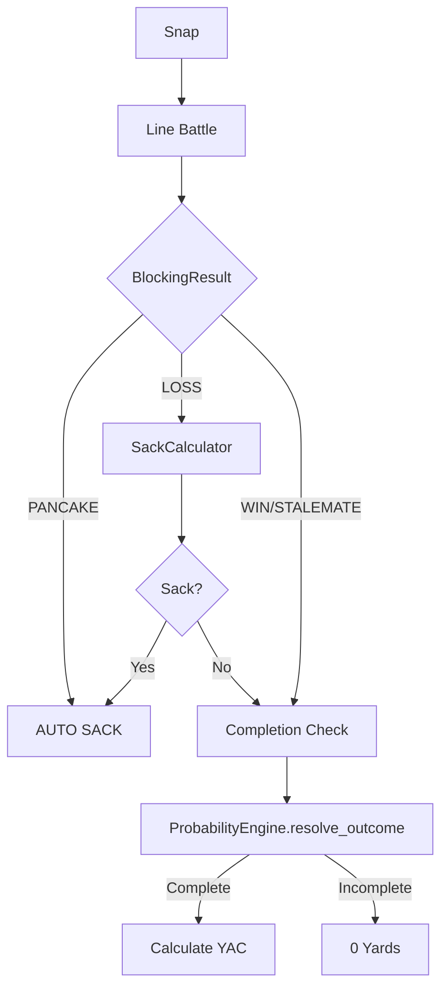
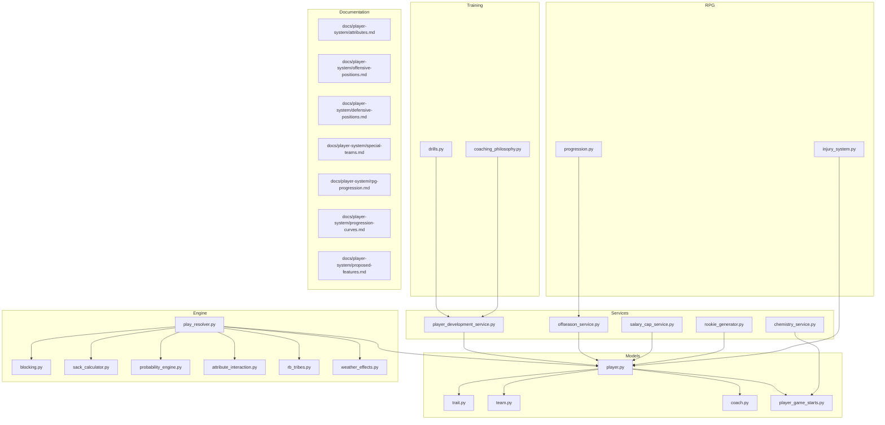

# NFL SIM Engine: Player System Master Dossier

> **Living Document** - This comprehensive reference is updated whenever player-related systems change.
>
> **Last Updated:** 2025-12-11
> **Maintainer:** Auto-updated via workflow `/update-player-dossier`

---

## Document Purpose

This is the **single source of truth** for all player mechanics in the NFL SIM Engine. It maps:

- All 14 player positions (Offense, Defense, Special Teams)
- 50+ player attributes and their usage in code
- Play resolution triggers and randomness
- Progression, regression, and age effects
- Training drills and XP systems
- Traits and development paths
- Contracts and salary cap mechanics
- Injury system and recovery
- Rookie generation parameters

**When to Update This Document:**

- Adding/modifying attributes in `player.py`
- Changing play resolution logic in `play_resolver.py`
- Updating training drills in `drills.py`
- Modifying progression curves in `offseason_service.py`
- Adding new traits to `trait.py`
- Changing salary cap logic in `salary_cap_service.py`

---

## Table of Contents

1. [Core Player Model](#1-core-player-model)
2. [Offense Positions](#2-offense-positions)
3. [Defense Positions](#3-defense-positions)
4. [Special Teams Positions](#4-special-teams-positions)
5. [Play Triggers & Randomness](#5-play-triggers--randomness)
6. [Progression & Regression](#6-progression--regression)
7. [Training System](#7-training-system)
8. [Trait System](#8-trait-system)
9. [Contracts & Salary Cap](#9-contracts--salary-cap)
10. [Injury System](#10-injury-system)
11. [Rookie Generation](#11-rookie-generation)
12. [File Linkage Map](#12-file-linkage-map)
13. [Changelog](#13-changelog)

---

## 1. Core Player Model

**Source:** [player.py](file:///c:/Users/cweir/Documents/GitHub/THE%20NFL%20SIM/backend/app/models/player.py)

### Global Attributes (All Positions)

| Attribute           | Range | Description        | System Usage                      |
| ------------------- | ----- | ------------------ | --------------------------------- |
| `speed`             | 0-100 | Top speed          | Movement, pursuit angles          |
| `acceleration`      | 0-100 | Burst/close speed  | Line of scrimmage, closing        |
| `strength`          | 0-100 | Physical power     | Blocking, tackling, shed block    |
| `agility`           | 0-100 | Direction change   | Juking, route cuts, coverage      |
| `awareness`         | 0-100 | AI decision making | Reaction time, reading plays      |
| `stamina`           | 0-100 | Energy pool        | Fatigue accumulation, subs        |
| `injury_resistance` | 0-100 | Durability         | Injury probability post-contact   |
| `morale`            | 0-100 | Happiness          | Team chemistry, "Mutiny Cascades" |

### Development Traits

| Trait       | XP Multiplier | Description          |
| ----------- | ------------- | -------------------- |
| `NORMAL`    | 1.0x          | Standard progression |
| `STAR`      | 1.25x         | Above-average growth |
| `SUPERSTAR` | 1.5x          | Elite potential      |
| `XFACTOR`   | 2.0x          | Generational talent  |

---

## 2. Offense Positions

### Quarterback (QB)

**Primary Role:** Decision maker, passer

#### Key Attributes

| Attribute              | Usage in Code         | Linked File                 |
| ---------------------- | --------------------- | --------------------------- |
| `throw_power`          | Max throw distance    | `play_resolver.py` L392-397 |
| `throw_accuracy_short` | Short pass success    | `play_resolver.py`          |
| `throw_accuracy_mid`   | Medium pass success   | `play_resolver.py`          |
| `throw_accuracy_deep`  | Deep pass success     | `play_resolver.py`          |
| `pocket_presence`      | **SACK MITIGATION**   | `sack_calculator.py` L37-41 |
| `quick_release`        | Throw animation speed | Proposed                    |
| `scramble_willingness` | Run vs stay tendency  | Proposed                    |
| `throw_on_run`         | Accuracy while moving | Drills target               |

#### Play Triggers

```python
# From play_resolver.py L262-369
1. Line Battle → BlockingEngine.resolve_pass_block()
2. If PANCAKE: Automatic SACK
3. If LOSS: SackCalculator.calculate_sack_probability()
   - pocket_presence reduces sack chance by (rating * 0.005)
4. If not sacked: ProbabilityEngine.calculate_success_chance()
5. Weather/Fatigue penalties applied
```

#### XP Events

| Event         | XP Gain   |
| ------------- | --------- |
| Passing TD    | +50       |
| Passing Yards | +0.5/yard |
| Interception  | -20       |

#### Training Drills

| Drill                 | Target Stat        | XP Mult | Injury Risk |
| --------------------- | ------------------ | ------- | ----------- |
| Footwork Mechanics    | throw_on_run       | 1.2x    | 2%          |
| Weighted Ball Throws  | throw_power        | 1.5x    | **15%**     |
| 7-on-7 Passing        | throw_accuracy_mid | 1.3x    | 3%          |
| Film Study            | play_recognition   | 0.8x    | 0%          |
| Pocket Presence Drill | pocket_presence    | 1.4x    | 4%          |
| Two-Minute Drill      | clutch             | 1.6x    | 5%          |

---

### Running Back (RB)

**Primary Role:** Ball carrier, pass blocker

#### Key Attributes

| Attribute                | Usage                 | Linked File            |
| ------------------------ | --------------------- | ---------------------- |
| `vision_cone_angle`      | AI sight range        | `player.py` L164       |
| `break_tackle_threshold` | Force to bring down   | `player.py` L165       |
| `patience`               | Wait behind blockers  | `proposed-features.md` |
| `pass_pro_rating`        | Blitz pickup          | `proposed-features.md` |
| `juke_efficiency`        | Momentum loss on juke | `proposed-features.md` |

#### RB "Three Tribes" System

**Source:** [rb_tribes.py](file:///c:/Users/cweir/Documents/GitHub/THE%20NFL%20SIM/backend/app/engine/rb_tribes.py)

| Tribe    | Base Yards | Std Dev | Breakaway Mult | Fumble Mult |
| -------- | ---------- | ------- | -------------- | ----------- |
| Power    | 4.0        | 1.5     | 0.8x           | 0.8x        |
| Scat     | 3.0        | 2.5     | 1.5x           | 1.2x        |
| Balanced | 3.5        | 2.0     | 1.0x           | 1.0x        |

#### Play Triggers (Run Play)

```python
# From play_resolver.py L558-721
1. Identify RB and defender
2. Calculate fatigue penalty
3. Apply RB Tribe modifiers
4. power_diff = ProbabilityEngine.compare_strength(rb.strength, defender.tackle)
5. If outside run: speed_diff applies
6. Normal distribution outcome with variance
7. Breakaway check (tiered outcome)
8. Fumble check (base 1%, modified by tribe, fatigue, hit_power)
```

#### Training Drills

| Drill                  | Target Stat         | XP Mult |
| ---------------------- | ------------------- | ------- |
| Cone Agility           | agility             | 1.2x    |
| Sled Push              | trucking            | 1.4x    |
| Ball Security Gauntlet | ball_carrier_vision | 1.1x    |
| Zone Blocking Reads    | awareness           | 1.3x    |
| Pass Protection        | pass_block          | 1.2x    |

---

### Wide Receiver (WR) / Tight End (TE)

**Primary Role:** Pass catching, blocking (TE)

#### Key Attributes

| Attribute                  | Usage                    | Linked File                 |
| -------------------------- | ------------------------ | --------------------------- |
| `catching`                 | Catch probability        | `play_resolver.py`          |
| `route_running`            | Separation vs coverage   | `play_resolver.py` L405-408 |
| `release`                  | Beat press coverage      | `proposed-features.md`      |
| `blocking_tenacity`        | Downfield block duration | `proposed-features.md`      |
| `pass_block` / `run_block` | TE blocking              | `offensive-positions.md`    |

#### Play Triggers (Pass Play)

```python
# WR in play_resolver.py L271-277, L399-408
1. target = _get_player_by_position(offense, "WR")
2. matchup_factor = compare_skill(target.route_running, defender.man_coverage)
3. speed_diff = compare_speed(target.speed, defender.speed)
4. If Possession Receiver trait active: +15 contested_catch_bonus
5. YAC bonus = speed_diff * 50.0
```

#### Trait: Possession Receiver

```python
# From play_resolver.py L448-456
if "contested_catch_bonus" in target.trait_effects:
    if speed_diff < 0.05 or matchup_factor < 0:  # Contested situation
        trait_bonus = contested_catch_bonus / 100.0
```

#### Training Drills

| Drill                  | Target Stat        | XP Mult |
| ---------------------- | ------------------ | ------- |
| Route Tree Mastery     | route_running      | 1.3x    |
| Contested Catch Drills | spectacular_catch  | 1.4x    |
| Release vs Press       | release            | 1.3x    |
| Deep Ball Tracking     | deep_route_running | 1.5x    |
| YAC Drills             | juke_move          | 1.2x    |

---

### Offensive Line (OT, OG, C)

**Primary Role:** Protection, run blocking

#### Key Attributes

| Attribute    | Usage                | Linked File                            |
| ------------ | -------------------- | -------------------------------------- |
| `pass_block` | vs Pass Rush         | `blocking.py`, `play_resolver.py` L134 |
| `run_block`  | vs Block Shed        | `offensive-positions.md`               |
| `anchor`     | Bull Rush resistance | `proposed-features.md`                 |
| `pull_speed` | Trap/Pull blocking   | `proposed-features.md`                 |
| `discipline` | Penalty reduction    | `proposed-features.md`                 |

#### OL Chemistry System

**Source:** [chemistry_service.py](file:///c:/Users/cweir/Documents/GitHub/THE%20NFL%20SIM/backend/app/services/chemistry_service.py)

```python
# Consecutive starts together = chemistry bonus
# Used in SackCalculator.calculate_sack_probability() as ol_chemistry_bonus
chem_factor = ol_chemistry_bonus * 0.02  # Each point = 2% sack reduction
```

#### Play Triggers (Pass Pro)

```python
# From play_resolver.py L109-147
matchups = [("LT", "RE"), ("RT", "LE"), ("C", "DT"), ("LG", "DT"), ("RG", "DT")]
for ol_pos, dl_pos in matchups:
    ol_rating = ol.pass_block + offensive_line_ai.get_player_modifier(ol.id)
    result = BlockingEngine.resolve_pass_block(rng, ol_rating, dl_rating)
    # Results: WIN, STALEMATE, LOSS, PANCAKE
```

#### Training Drills

| Drill                | Target Stat       | XP Mult | Injury Risk |
| -------------------- | ----------------- | ------- | ----------- |
| Pass Protection Sets | pass_block        | 1.3x    | 4%          |
| Run Blocking - Drive | run_block         | 1.4x    | 6%          |
| Pull and Lead        | run_block_finesse | 1.2x    | 5%          |
| Anchor Drill         | pass_block_power  | 1.5x    | **8%**      |
| Communication Drills | awareness         | 0.8x    | 0%          |

---

## 3. Defense Positions

### Defensive Line (DE, DT)

**Primary Role:** Pass rush, run stuffing

#### Key Attributes

| Attribute           | Usage                | Linked File              |
| ------------------- | -------------------- | ------------------------ |
| `pass_rush_power`   | Bull rush            | `blocking.py`            |
| `pass_rush_finesse` | Swim/spin            | `blocking.py`            |
| `block_shed`        | Disengage for tackle | `defensive-positions.md` |
| `tackle`            | Wrap up carrier      | `defensive-positions.md` |
| `first_step`        | Snap reaction        | `proposed-features.md`   |
| `gap_integrity`     | Run lane discipline  | `proposed-features.md`   |

#### Trait: Intimidation

```python
# From play_resolver.py L347-353
# After a sack, check for Intimidation trait
for trait in sacker.traits:
    if trait.name == "Intimidation":
        intimidation_factor = 1.5  # 50% more impactful
        # Published via EventBus -> debuffs OL for subsequent plays
```

#### XP Events

| Event | XP Gain |
| ----- | ------- |
| Sack  | +100    |
| TFL   | +30     |

#### Training Drills

| Drill           | Target Stat    | XP Mult | Injury Risk |
| --------------- | -------------- | ------- | ----------- |
| Pass Rush Moves | finesse_moves  | 1.4x    | 5%          |
| Gap Control     | block_shedding | 1.3x    | 6%          |
| Get-Off Drills  | acceleration   | 1.2x    | 3%          |
| Bull Rush Power | power_moves    | 1.6x    | **10%**     |

---

### Linebacker (LB)

**Primary Role:** Hybrid run/pass defense

#### Key Attributes

| Attribute           | Usage               | Linked File              |
| ------------------- | ------------------- | ------------------------ |
| `play_recognition`  | Run vs Pass read    | `defensive-positions.md` |
| `man_coverage`      | 1-on-1 coverage     | `defensive-positions.md` |
| `zone_coverage`     | Area coverage       | `defensive-positions.md` |
| `tackle`            | Stopping power      | `defensive-positions.md` |
| `hit_power`         | Fumble chance       | `defensive-positions.md` |
| `run_fit`           | Spill/Box read      | `proposed-features.md`   |
| `blitz_timing`      | Delayed blitz speed | `proposed-features.md`   |
| `coverage_disguise` | Deceive QB pre-snap | `proposed-features.md`   |

#### Trait: Green Dot

```python
# From rpg-progression.md
# MLB with Green Dot trait:
# - Relays defensive calls
# - Reduces DB miscommunication chance
# - Prevents blown coverage TDs
```

#### Training Drills

| Drill             | Target Stat      | XP Mult |
| ----------------- | ---------------- | ------- |
| Coverage Drops    | zone_coverage    | 1.2x    |
| Blitz Timing      | acceleration     | 1.4x    |
| Shed and Tackle   | block_shedding   | 1.3x    |
| Read and React    | play_recognition | 1.0x    |
| Downhill Run Fits | tackling         | 1.5x    |

---

### Defensive Back (CB, S)

**Primary Role:** Pass coverage, run support

#### Key Attributes

| Attribute       | Usage                     | Linked File              |
| --------------- | ------------------------- | ------------------------ |
| `man_coverage`  | 1-on-1 coverage           | `play_resolver.py` L407  |
| `zone_coverage` | Area effectiveness        | `defensive-positions.md` |
| `press`         | Jam at LOS                | `proposed-features.md`   |
| `ball_tracking` | Play ball vs faceguard    | `proposed-features.md`   |
| `catching`      | Interception ability      | `defensive-positions.md` |
| `run_support`   | Abandon coverage tendency | `proposed-features.md`   |

#### Play Triggers

```python
# From play_resolver.py L275-277, L405-408
defender = _get_player_by_position(defense, "CB")
matchup_factor = compare_skill(target.route_running, defender.man_coverage)
# Negative matchup_factor = defender wins
```

#### Training Drills

| Drill               | Target Stat   | XP Mult |
| ------------------- | ------------- | ------- |
| Backpedal Technique | man_coverage  | 1.2x    |
| Ball Tracking       | play_ball     | 1.3x    |
| Press Coverage      | press         | 1.4x    |
| Zone Coverage Drops | zone_coverage | 1.1x    |
| Hip Turn Drill      | agility       | 1.2x    |

---

## 4. Special Teams Positions

### Kicker (K) / Punter (P)

#### Key Attributes

| Attribute       | Usage                       | Linked File        |
| --------------- | --------------------------- | ------------------ |
| `kick_power`    | Max distance                | `special-teams.md` |
| `kick_accuracy` | Straight flight probability | `special-teams.md` |
| `hang_time`     | Time in air                 | `special-teams.md` |
| `coffin_corner` | Inside-20 accuracy          | `special-teams.md` |

#### Traits

| Trait         | Effect                              |
| ------------- | ----------------------------------- |
| Ice in Veins  | Negates "icing the kicker" mechanic |
| Clutch Kicker | Accuracy zone unchanged in 4Q/OT    |

#### Training Drills

| Drill             | Target Stat   | XP Mult |
| ----------------- | ------------- | ------- |
| Field Goal Timing | kick_accuracy | 1.3x    |
| Leg Strength      | kick_power    | 1.4x    |
| Punt Hang Time    | kick_power    | 1.2x    |

---

## 5. Play Triggers & Randomness

### Pass Play Flow



### Randomness Sources

| System              | RNG Usage                  | File                    |
| ------------------- | -------------------------- | ----------------------- |
| DeterministicRNG    | Seeded for reproducibility | `random_utils.py`       |
| `rng.randint()`     | Yard gains, injuries       | Various                 |
| `rng.gauss()`       | Bell curve outcomes        | `rookie_generator.py`   |
| `rng.random()`      | Binary checks (0.0-1.0)    | Various                 |
| Normal Distribution | Run play yards             | `play_resolver.py` L646 |

---

## 6. Progression & Regression

### Career Phases

| Phase      | Age Range      | Description                     |
| ---------- | -------------- | ------------------------------- |
| ROOKIE     | < Peak Start   | Rapid growth                    |
| PRIME      | Peak Range     | Peak performance                |
| POST_PRIME | Peak End + 1-3 | Mental growth, physical plateau |
| DECLINE    | Peak End + 4+  | Physical regression             |

### Peak Ages by Position

| Position | Peak Start | Peak End |
| -------- | ---------- | -------- |
| QB       | 26         | 32       |
| RB       | 23         | 27       |
| WR       | 25         | 29       |
| TE       | 26         | 30       |
| OL       | 26         | 31       |
| DL       | 25         | 29       |
| LB       | 24         | 28       |
| DB       | 24         | 28       |
| K/P      | 27         | 35       |

### Annual Progression Logic

**Source:** [offseason_service.py](file:///c:/Users/cweir/Documents/GitHub/THE%20NFL%20SIM/backend/app/services/offseason_service.py) L58-141

```python
# Age-Based Changes
if age <= 24:
    change = randint(+1, +3)
elif age 25-28:
    change = randint(-1, +2)
elif age 29-32:
    change = randint(-2, +1)
else:  # 33+
    change = randint(-3, -1)

# Experience Modifier
if experience <= 2:
    modifier = randint(0, +2)
elif experience >= 8:
    modifier = randint(-2, 0)

# Coach Impact
if coach.development_rating > 70:
    bonus = +1
elif coach.development_rating < 30:
    bonus = -1

# Final Formula
total_change = age_change + exp_modifier + variance + dev_trait_mod + coach_mod
new_rating = clamp(old_rating + total_change, 40, 99)
```

### Physical Attribute Decay (Decline Phase)

| Attribute Type     | Attributes                   | Decay Rate                  |
| ------------------ | ---------------------------- | --------------------------- |
| Physical (Fast)    | speed, acceleration, agility | 50% + 10%/year past prime   |
| Power (Moderate)   | strength, throw_power        | 30% base                    |
| Mental (Protected) | awareness, play_recognition  | Rarely regress, may improve |

---

## 7. Training System

**Source:** [drills.py](file:///c:/Users/cweir/Documents/GitHub/THE%20NFL%20SIM/backend/app/services/training/drills.py)

### Training Structure

```python
class Drill:
    name: str
    target_stat: str           # Primary attribute improved
    secondary_stats: List[str] # Secondary effects
    injury_risk: float         # 0.0-1.0
    xp_multiplier: float       # 0.1-3.0
    fatigue_cost: float        # 0.0-50.0
    season_filter: List[SeasonPhase]  # When available
    category: DrillCategory    # STRENGTH/SPEED/TECHNIQUE/MENTAL/RECOVERY
```

### Position Drill Map

| Position | Available Drills                                                           |
| -------- | -------------------------------------------------------------------------- |
| QB       | 7 drills (Footwork, Weighted Throws, 7on7, Film, Arm Care, Pocket, 2-min)  |
| RB       | 7 drills (Cone, Sled, Ball Security, Vision, Zone Reads, Pass Pro, Routes) |
| WR       | 7 drills (Routes, Contested Catch, Timing, Release, Deep Ball, YAC, Hands) |
| OL       | 7 drills (Pass Sets, Run Drive, Pull, Combo, Anchor, Hands, Communication) |
| DL       | 6 drills (Pass Rush, Gap, Get-Off, Hand Combat, Pursuit, Bull Rush)        |
| LB       | 6 drills (Coverage, Blitz, Shed, Read, Man RB/TE, Downhill)                |
| DB       | 6 drills (Backpedal, Ball Track, Press, Zone, Tackle, Hip Turn)            |
| K/P      | 3-4 drills (FG Timing, Leg Strength, Hang Time)                            |

### Weekly Training Effects

**Source:** [player_development_service.py](file:///c:/Users/cweir/Documents/GitHub/THE%20NFL%20SIM/backend/app/services/player_development_service.py)

```python
# Base XP gain per week: 50
# Modifiers:
#   Dev Trait: 1.0x - 2.0x
#   Coach Bonus: -0.5 to +0.5
#   Age: 0.8x (30+) or 1.2x (<24)

# Level Up: Every 1000 XP = 1 Skill Point
# Auto-upgrade: Random relevant stat +1
```

---

## 8. Trait System

**Source:** [trait.py](file:///c:/Users/cweir/Documents/GitHub/THE%20NFL%20SIM/backend/app/models/trait.py)

### Trait Structure

```python
class Trait:
    name: str
    description: str
    effect_type: TraitEffectType  # BOOST, SITUATIONAL, PASSIVE
    effect_value: float
    position_groups: List[str]  # JSON, e.g., ["QB", "WR"]

class PlayerTrait:
    player_id: int
    trait_id: int
    acquired_date: date
    source: TraitSource  # DRAFT, DEVELOPMENT, MILESTONE
```

### Key Implemented Traits

| Trait               | Position | Effect                          |
| ------------------- | -------- | ------------------------------- |
| Possession Receiver | WR/TE    | +15 contested catch on 3rd down |
| Intimidation        | DL       | Sacks debuff OL for next play   |
| Ice in Veins        | K        | Negates icing mechanic          |
| Field General       | QB       | +Awareness to WR/OL pre-snap    |

### Trait Acquisition Sources

| Source      | Trigger                                        |
| ----------- | ---------------------------------------------- |
| DRAFT       | Assigned at generation                         |
| DEVELOPMENT | XP milestones                                  |
| MILESTONE   | Career achievements (e.g., 200 carries/season) |

---

## 9. Contracts & Salary Cap

**Source:** [salary_cap_service.py](file:///c:/Users/cweir/Documents/GitHub/THE%20NFL%20SIM/backend/app/services/salary_cap_service.py)

### Contract Fields

| Field             | Description        |
| ----------------- | ------------------ |
| `contract_salary` | Annual cost in USD |
| `contract_years`  | Remaining seasons  |

### Salary Cap Breakdown

```python
# Position group breakdown calculated as:
position_groups = {
    "QB": ["QB"],
    "RB": ["RB"],
    "WR/TE": ["WR", "TE"],
    "OL": ["OT", "OG", "C"],
    "DL": ["DE", "DT"],
    "LB": ["LB"],
    "DB": ["CB", "S"],
    "ST": ["K", "P"]
}
```

### Value Factors

| Factor         | Effect on Value                     |
| -------------- | ----------------------------------- |
| Overall Rating | Direct correlation                  |
| Age            | Decreases past prime                |
| Dev Trait      | XFACTOR > SUPERSTAR > STAR > NORMAL |
| Injury History | Decreases value                     |

---

## 10. Injury System

**Source:** [injury_system.py](file:///c:/Users/cweir/Documents/GitHub/THE%20NFL%20SIM/backend/app/rpg/injury_system.py)

### Injury Severity Scale

| Severity Roll | Severity | Type           | Status       |
| ------------- | -------- | -------------- | ------------ |
| 0-50          | 1-3      | Minor Sprain   | QUESTIONABLE |
| 51-80         | 4-7      | Muscle Tear    | OUT          |
| 81-100        | 8-10     | Major Fracture | IR           |

### Recovery Calculation

```python
# Base weeks by severity:
#   1-3: 1-4 weeks
#   4-7: 4-12 weeks
#   8-10: 12-52 weeks

# Modifiers:
#   Age Factor: +10% per year over 30
#   Durability: 0.5x (100 resist) to 1.5x (0 resist)
#   Medical Rating: 0.8x (100) to 1.2x (0)

final_weeks = base * age_factor * durability * medical_factor
```

### Permanent Damage

```python
# Triggered if:
#   - Severity >= 7 (or 5 if age > 32)
#   - Random chance based on severity

# Effect:
#   - Drop 1-3 physical stats by 1-3 points each
#   - Injury resistance permanently -5
```

---

## 11. Rookie Generation

**Source:** [rookie_generator.py](file:///c:/Users/cweir/Documents/GitHub/THE%20NFL%20SIM/backend/app/services/rookie_generator.py)

### Generation Parameters

| Parameter | Value/Range                     |
| --------- | ------------------------------- |
| Age       | 21-23                           |
| Height    | 68-80 inches                    |
| Weight    | 180-350 lbs (position-adjusted) |
| Overall   | Gaussian(68, 8), clamped 50-99  |
| Awareness | Overall - 10 (rookies lower)    |

### Combine Metrics Generated

| Metric                | Distribution        |
| --------------------- | ------------------- |
| `forty_yard_dash`     | Gaussian(4.6, 0.2)  |
| `bench_press`         | Uniform(15, 35)     |
| `vertical_jump`       | Gaussian(32.0, 4.0) |
| `broad_jump`          | Uniform(108, 132)   |
| `three_cone_drill`    | Gaussian(7.1, 0.25) |
| `twenty_yard_shuttle` | Gaussian(4.3, 0.15) |

### Genesis Data (Hidden)

| Field                | Range                    | Reveal Mechanic |
| -------------------- | ------------------------ | --------------- |
| `power_clean_max`    | 285-385 lbs              | Scouting        |
| `gps_speed_max`      | 18.0-23.5 mph            | Scouting        |
| `s2_cognition_score` | 45-99                    | Scouting        |
| `medical_flags`      | 10% chance ["Prior ACL"] | Scouting        |
| `genesis_revealed`   | False by default         | User action     |

### Rookie Contract

```python
contract_years = 4  # Standard rookie deal
contract_salary = 500000 + (overall * 10000)
```

---

## 12. File Linkage Map



### Key File Paths

| System             | File Path                                            |
| ------------------ | ---------------------------------------------------- |
| Player Model       | `backend/app/models/player.py`                       |
| Play Resolution    | `backend/app/orchestrator/play_resolver.py`          |
| Sack Calculator    | `backend/app/engine/sack_calculator.py`              |
| Blocking Engine    | `backend/app/engine/blocking.py`                     |
| Training Drills    | `backend/app/services/training/drills.py`            |
| Player Development | `backend/app/services/player_development_service.py` |
| Offseason Service  | `backend/app/services/offseason_service.py`          |
| Rookie Generator   | `backend/app/services/rookie_generator.py`           |
| Injury System      | `backend/app/rpg/injury_system.py`                   |
| Trait Model        | `backend/app/models/trait.py`                        |
| Salary Cap         | `backend/app/services/salary_cap_service.py`         |
| RB Tribes          | `backend/app/engine/rb_tribes.py`                    |
| Chemistry          | `backend/app/services/chemistry_service.py`          |

---

## 13. Changelog

| Date       | Change                                    | Files Affected   |
| ---------- | ----------------------------------------- | ---------------- |
| 2025-12-11 | Initial comprehensive dossier created     | All player files |
| -          | _Add entries when updating this document_ | -                |

---

**END OF DOSSIER**
